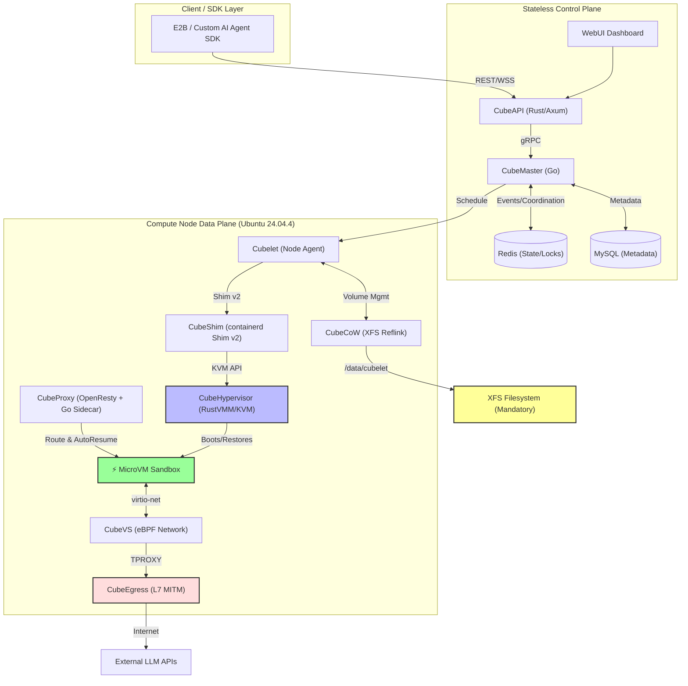

# 📘 The Ultimate Master Blueprint: CubeSandbox Architecture & Deployment Guide
**Target Environment:** Ubuntu Linux 24.04.4 LTS (x86_64 / ARM64)  
**Reference Version:** v0.5.0 (Latest Stable)  
**Date:** July 12, 2026  
**License:** Apache 2.0  

---

## 1. Executive Summary: Resolving the AI Agent Trilemma

AI Agents require execution environments that are **secure** (hardware isolation against kernel escapes), **fast** (sub-100ms interactive boot for conversational UX), and **stateful** (snapshot/rollback for RL training and error recovery). Traditional infrastructure forces a compromise:

*   **Docker / gVisor:** Fast and dense, but vulnerable to shared-kernel escapes.
*   **Traditional VMs:** Secure, but suffer from slow boot times (seconds) and heavy memory overhead (GBs).
*   **E2B (Firecracker):** Solves speed and security but is primarily a managed SaaS tied to AWS Nitro.

**CubeSandbox** (by TencentCloud) bridges this gap. It is a high-performance, hardware-isolated sandbox service built on **RustVMM** and **KVM**. It provisions MicroVMs in **<60ms** with **<5MB** memory overhead, supports **O(1) Copy-on-Write snapshots**, and offers a **drop-in E2B SDK compatible API**. 

This blueprint extracts the canonical architecture, validates the underlying mechanisms against the v0.5.0 source code, and provides a battle-tested deployment guide specifically adapted for **Ubuntu 24.04.4 LTS**.

---

## 2. Core Design Principles

| Principle | Manifestation in CubeSandbox |
| :--- | :--- |
| **Agent-First Lifecycle** | Beyond ephemeral code execution, it supports long-running stateful services, AutoPause/AutoResume, and millisecond clone/rollback. |
| **Hardware Isolation** | Each sandbox runs a dedicated Linux kernel inside a KVM MicroVM. Zero shared-kernel escape surface. |
| **Millisecond-Class Boot** | Pre-snapshotted templates + RustVMM memory restore path yield <60ms cold starts. |
| **Zero-Trust Egress** | All outbound traffic traverses `CubeEgress` (L7 MITM proxy). Domains must be explicitly allowed; secrets never enter the sandbox. |
| **Stateless Control Plane** | `CubeAPI` and `CubeMaster` hold no local state; coordination relies entirely on Redis, enabling trivial horizontal scaling. |
| **Efficient Storage (CubeCoW)** | Leverages the kernel `FICLONE` ioctl on XFS for O(1) snapshots and clones with zero data copying. |

---

## 3. High-Level System Architecture

The architecture is strictly divided into a **Stateless Control Plane** and a **Node-Local Data Plane**.



### Component Matrix

| Component | Language / Tech | Responsibility |
| :--- | :--- | :--- |
| **CubeAPI** | Rust (Axum) | E2B-compatible REST Gateway. Translates SDK calls to internal gRPC. |
| **CubeMaster** | Go | Cluster orchestrator. Schedules sandboxes, manages templates, pushes egress policies. |
| **Cubelet** | Go | Node-local daemon. Manages image pulling, volume lifecycle, and VM lifecycle. |
| **CubeShim** | Rust | Implements `containerd-shim-rs` (Shim v2), bridging OCI standards to KVM. |
| **CubeHypervisor** | Rust (RustVMM) | Lightweight VMM. Bypasses BIOS/UEFI, directly restoring pre-snapshotted memory states. |
| **CubeVS** | C / eBPF | Kernel-level virtual switch using TC (Traffic Control). Replaces iptables/OVS. |
| **CubeEgress** | OpenResty / Lua | Transparent L7 MITM proxy via TPROXY. Enforces domain allowlists and injects credentials. |
| **CubeCoW** | Rust / C | Storage engine utilizing XFS `FICLONE` ioctl and soft-dirty memory tracking. |
| **CubeProxy** | OpenResty + Go | Reverse proxy. The Go sidecar handles AutoPause/AutoResume logic and Redis coordination. |

---

## 4. Deep Dive: The "Magic" Mechanisms

### 4.1. Virtualization: RustVMM, KVM, and PVM
To achieve <60ms cold starts, CubeSandbox abandons traditional QEMU emulation.
*   **RustVMM & Direct Boot:** The hypervisor bypasses BIOS/UEFI, directly restoring a pre-snapshotted memory state and kernel (`vmlinux`).
*   **PVM (Pagetable-based Virtual Machine):** Standard cloud VMs often do not expose nested virtualization (VT-x/AMD-V). PVM is a Tencent-engineered framework that performs privilege-level switching and memory virtualization via **shadow page tables** within the guest kernel layer. It is completely transparent to the host hypervisor.
    *   *Constraint:* **PVM is strictly x86_64-only.** ARM64 (aarch64) hosts *must* be bare-metal with native KVM support.

### 4.2. Storage: CubeCoW & The XFS Mandate
CubeCoW provides hundred-millisecond snapshot, clone, and rollback capabilities.
*   **Filesystem Layer (XFS Reflink):** `Cubelet` clones sandbox writable layers using `cp --reflink=always`. This relies on the kernel-level `FICLONE` ioctl. **Ext4 does not implement `FICLONE`**, which is why Ubuntu's default filesystem will cause the installer to fail.
*   **Memory Layer (Soft-Dirty):** Incremental memory snapshots utilize Linux kernel soft-dirty page tracking. Only dirty pages are captured after the first full snapshot, drastically reducing snapshot time and write amplification.

### 4.3. Networking: CubeVS (eBPF) & CubeEgress (L7 MITM)
*   **CubeVS:** Replaces Linux Bridge/OVS with three eBPF programs attached to TC hooks:
    1.  `from_cube` (TAP ingress): SNAT, policy check, ARP proxy.
    2.  `from_world` (Host NIC ingress): Reverse NAT, port-mapping.
    3.  `from_envoy` (Proxy egress): DNAT to sandbox IP, preserving TPROXY source IP.
*   **CubeEgress:** Intercepts outbound HTTP/HTTPS via `iptables TPROXY`. It dynamically issues leaf certificates for SNI, matches L7 rules, and injects `Authorization` headers from a host-side vault. Secrets *never* enter the sandbox memory.

### 4.4. Lifecycle: AutoPause / AutoResume (v0.5.0)
Solves the "idle agent" cost problem.
*   **Mechanism:** A Go sidecar in `CubeProxy` tracks `last_active` timestamps. When idle > timeout, it snapshots the full VM state to `/data/cubelet/root/pausevm/` and kills the KVM process.
*   **Resume:** The next inbound HTTP request hits `CubeProxy`, which intercepts it, fires a resume RPC, and restores the VM in milliseconds. Concurrent resumes are coalesced using `singleflight` and Redis `SETNX` locks.

---

## 5. Ubuntu 24.04.4 Adaptation & Prerequisites

Ubuntu 24.04.4 ships with Kernel 6.8 (excellent for eBPF CO-RE) and `glibc 2.39`. CubeSandbox binaries are built against `glibc 2.31` (Ubuntu 20.04), which is fully backward compatible. However, **Ubuntu defaults to ext4**, which is fundamentally incompatible with CubeCoW.

### 5.1 The XFS Mandate (Critical)
You **must** format `/data/cubelet` as XFS with `reflink=1`.

**Option A: Dedicated Data Disk (Production Recommended)**
```bash
# Assume /dev/nvme1n1 is your dedicated data disk
sudo mkfs.xfs -f -m reflink=1 /dev/nvme1n1
sudo mkdir -p /data/cubelet
sudo mount /dev/nvme1n1 /data/cubelet
echo '/dev/nvme1n1 /data/cubelet xfs defaults 0 0' | sudo tee -a /etc/fstab
# Verify: xfs_info /data/cubelet | grep reflink
```

**Option B: Loopback File (Testing / Single-Disk VMs)**
```bash
sudo mkdir -p /var/lib/cubelet-loop
sudo truncate -s 100G /var/lib/cubelet-loop/cubelet.img
sudo mkfs.xfs -f -m reflink=1 /var/lib/cubelet-loop/cubelet.img
sudo mkdir -p /data/cubelet
sudo mount -o loop /var/lib/cubelet-loop/cubelet.img /data/cubelet
echo '/var/lib/cubelet-loop/cubelet.img /data/cubelet xfs loop 0 0' | sudo tee -a /etc/fstab
```

### 5.2 KVM & PVM Configuration
*   **Bare Metal / Nested-Virt VMs:** Ensure `/dev/kvm` exists.
*   **Standard Cloud VMs (x86_64 only):** If `/dev/kvm` is missing, you must install the PVM kernel.
    ```bash
    # Download PVM kernel from GitHub Releases (OpenCloudOS 9 based .deb)
    wget "<linux-image deb download link>"
    dpkg -i linux-image-*opencloudos9.cubesandbox.pvm.host*.deb
    # Set as default GRUB entry and configure boot parameters
    curl -sL https://github.com/tencentcloud/CubeSandbox/raw/master/deploy/pvm/grub/host_grub_config.sh | bash
    reboot
    # Post-reboot: modprobe kvm_pvm
    ```
*   **ARM64 (aarch64):** PVM is **not supported**. You must use bare-metal ARM64 with native KVM.

---

## 6. Step-by-Step Deployment Guide (v0.5.0)

### Step 1: Environment Preparation
```bash
sudo su -
apt update && apt install -y curl wget tar docker.io xfsprogs
systemctl enable --now docker
```

### Step 2: Download & Configure
```bash
wget https://github.com/TencentCloud/CubeSandbox/releases/download/v0.5.0/cube-sandbox-one-click-v0.5.0.tar.gz
tar -xzf cube-sandbox-one-click-v0.5.0.tar.gz
cd cube-sandbox-one-click-v0.5.0

cp env.example .env
nano .env
# CRITICAL: Set CUBE_SANDBOX_NODE_IP to your host's IP.
# If on standard cloud VM (x86_64), set CUBE_PVM_ENABLE=1.
# Ensure CUBE_SANDBOX_NETWORK_CIDR does not overlap with your VPC.
```

### Step 3: Execute Installer
```bash
chmod +x install.sh
./install.sh
```
*Note: The installer performs a fail-fast preflight check for XFS, glibc, and KVM. It uses `systemd` for service management and `docker compose` for middleware (Redis/MySQL).*

### Step 4: Create a Template
```bash
# Use the multi-arch international registry image
cubemastercli tpl create-from-image \
  --image cube-sandbox-int.tencentcloudcr.com/cube-sandbox/sandbox-code:latest \
  --writable-layer-size 1G \
  --expose-port 49999 \
  --probe 49999

# Monitor build progress (Daemonless skopeo/umoci pipeline)
cubemastercli tpl watch --job-id <job_id>
```

### Step 5: Test with E2B SDK
```bash
pip install e2b-code-interpreter
export E2B_API_URL="http://127.0.0.1:3000"
export E2B_API_KEY="e2b_000000"
export CUBE_TEMPLATE_ID="<your-template-id>"
export SSL_CERT_FILE="/root/.local/share/mkcert/rootCA.pem" # Required for HTTPS
```
```python
import os
from e2b_code_interpreter import Sandbox

with Sandbox.create(template=os.environ["CUBE_TEMPLATE_ID"]) as sandbox:
    result = sandbox.run_code("print('Hello from Hardware-Isolated CubeSandbox!')")
    print(result)
```

---

## 7. Security Hardening & Production Readiness

The one-click installer binds management endpoints to `0.0.0.0` for evaluation. **Before exposing to untrusted networks**, execute these hardening steps:

1.  **Restrict Bind Addresses:**
    Edit `.env` and `/etc/cubelet/config.toml` to bind `CubeAPI`, `CubeMaster`, and `Cubelet` to your private VPC IP (e.g., `10.0.0.11`).
2.  **Configure TLS:**
    Replace `mkcert` defaults with real CA certificates in `/etc/cube/certs/` and enable `CUBE_PROXY_TLS_ENABLE=1`.
3.  **Enforce Zero-Trust Egress:**
    By default, CubeVS denies private/link-local ranges. Use the SDK to define strict L7 allowlists:
    ```python
    from cubesandbox import Sandbox, Rule, Match, Action
    rules = [
        Rule(name="allow_openai", match=Match(scheme="https", sni="api.openai.com"), 
             action=Action(allow=True, inject_credentials=["openai-key"])),
        Rule(name="deny_all", match=Match(), action=Action(allow=False))
    ]
    # The sandbox code simply calls fetch(). CubeEgress intercepts and injects the token.
    ```
4.  **Traffic Access Tokens (v0.5.0):**
    Create sandboxes with `network.allow_public_traffic=false`. CubeProxy will enforce a per-sandbox UUID v4 token on every inbound request, preventing unauthorized lateral movement.

---

## 8. Operations & Customization

### 8.1 WebUI Dashboard
Access `http://<node-ip>:12088`.
*   **Versions Page:** Tracks the component version matrix (guest-image, kernel, agent) across all nodes. Flags stale templates that need rebuilding after an upgrade.
*   **AgentHub (Preview):** Visual console for managing OpenClaw digital assistants, snapshot timelines, and rollbacks.

### 8.2 Extending CubeEgress (Custom Lua)
You can inject custom DLP or rate-limiting logic into the L7 proxy:
```lua
-- /usr/local/services/cubetoolbox/cube-egress/conf/rules/custom_dlp.lua
local _M = {}
function _M.evaluate(req, ctx)
    if req.body and req.body:match("%d%d%d%d[%s-]?%d%d%d%d[%s-]?%d%d%d%d[%s-]?%d%d%d%d") then
        return { decision = "deny", reason = "potential_pii_exfiltration" }
    end
    return nil -- fall through
end
return _M
```

### 8.3 Upgrades (v0.5.0 Three-Way Merge)
Upgrading is safe and non-destructive:
```bash
./install.sh --mode=upgrade
```
This detects existing installations, performs a three-way `.env` config merge (new defaults + old customizations + explicit overrides), and backs up configurations before applying changes.

---

## 9. Troubleshooting & Edge Cases on Ubuntu 24.04

| Symptom | Root Cause | Validated Solution |
| :--- | :--- | :--- |
| `ERROR: The filesystem ... is not XFS` | `/data/cubelet` is on ext4. | Mount an XFS volume or use the loopback workaround (Section 5.1). |
| `systemd-executor 203/EXEC` | Systemd 255+ strict parsing on OpenCloudOS/Ubuntu. | Fixed in v0.3.1+. Ensure you are using the latest installer which prefixes `ExecStart` with `/usr/bin/bash`. |
| Network drops on agent restart | TAP FD race condition (`EBUSY`). | Fixed in v0.3.1 `restoreTap()` logic. Ensure `network-agent` is up to date. |
| ARM64 VM fails to boot | PVM mode attempted on ARM. | PVM is x86_64 only. Use native KVM on ARM64 bare metal. |
| Template build fails (glibc) | Host glibc mismatch. | v0.4.0+ downgraded the builder image to `ubuntu:20.04` (glibc 2.31) to ensure broad compatibility. |
| DNS deadlock on first install | Host `resolv.conf` rewritten before CoreDNS is ready. | Fixed in v0.3.1. Installer now waits for CoreDNS port binding. |

---

## 10. Competitive Landscape

| Feature | 🐳 Docker / gVisor | 💻 Traditional VMs | 🔥 E2B (Firecracker) | ⚡ CubeSandbox |
| :--- | :--- | :--- | :--- | :--- |
| **Isolation** | Shared Kernel (Escape risk) | Dedicated Kernel | Dedicated Kernel | **Dedicated Kernel + eBPF** |
| **Startup** | ~200ms | Seconds | ~150ms | **<60ms** (Pre-snapshotted) |
| **Memory** | Low (Shared) | High (GBs) | ~5MB | **<5MB** |
| **Snapshot/Clone** | Slow (Block copy) | Slow (VDI copy) | Fast (Snapshot pools) | **O(1) via FICLONE CoW** |
| **Egress Security** | Basic (IPTables) | Basic | L7 filtering (Managed) | **Self-hosted L7 MITM + Vault** |
| **Distribution** | Self-hosted | Self-hosted | Managed SaaS | **Self-hosted (Full Stack)** |

---

## 11. Appendix

### 11.1 Default Port Reference
| Process | Port | Purpose | Public? |
| :--- | :--- | :--- | :--- |
| **CubeAPI** | 3000 | Sandbox lifecycle REST API | ✅ (with auth) |
| **CubeMaster** | 8089 | Cluster gRPC | ❌ Internal |
| **Cubelet** | 9999 / 9998 | Node RPC / Metrics | ❌ Internal |
| **CubeProxy** | 80 / 443 | Public reverse proxy | ✅ |
| **WebUI** | 12088 | Dashboard | ❌ Internal |
| **CubeEgress** | 8080 / 8443 | TPROXY listeners | ❌ Internal |

### 11.2 Glossary
*   **PVM:** Pagetable-based Virtual Machine. Shadow page-table nested virtualization (x86_64 only).
*   **Reflink:** XFS feature enabling O(1) file cloning via the `FICLONE` ioctl.
*   **TPROXY:** Transparent proxy. Linux mechanism for intercepting traffic without NAT, used by CubeEgress.
*   **Soft-dirty:** Linux kernel PTE bit used to track page modifications for incremental memory snapshots.
*   **LPM Trie:** Longest Prefix Match trie. BPF map type for CIDR-based network policy lookups.

---
*This blueprint synthesizes the architectural design, deployment methodology, and security model of TencentCloud's CubeSandbox. For canonical implementation details, always refer to the [Official GitHub Repository](https://github.com/TencentCloud/CubeSandbox).*

https://chat.qwen.ai/s/a9248b8a-735f-407e-96a0-e10448c8aad7?fev=0.2.72 
