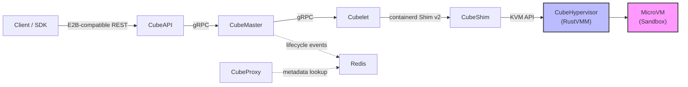
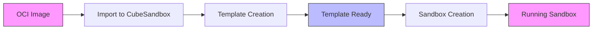
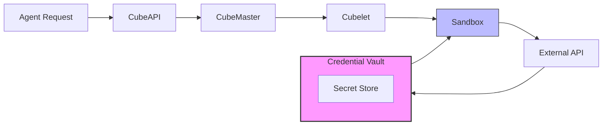
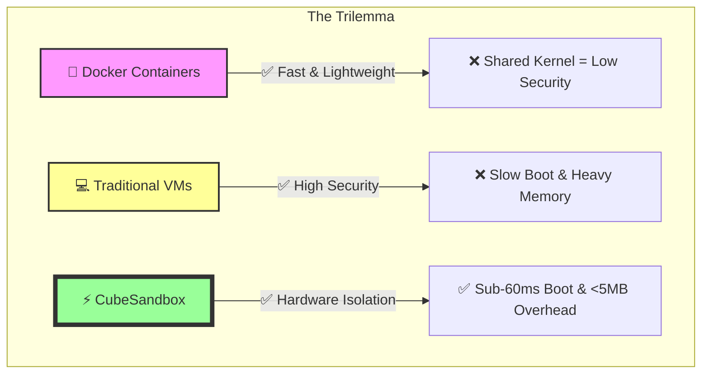
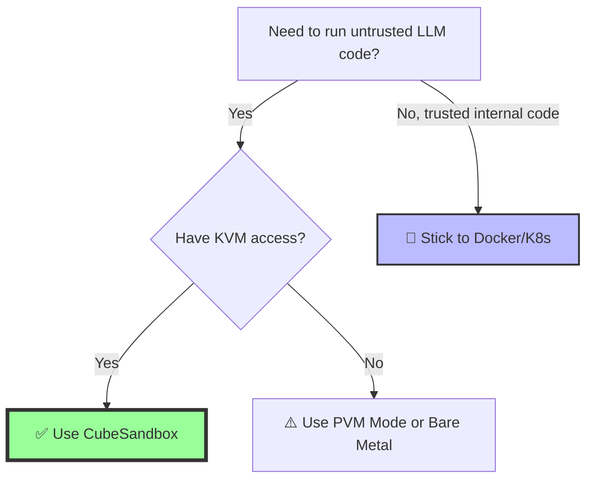

please meticulously plan to extract the design of the Cube Sandbox based on the GitHub repo URL `https://github.com/TencentCloud/CubeSandbox` into a comprehensive design blueprint markdown file that I can use to create similar sandbox environment on my own Ubuntu Linux 24.04.4 host.
Augment and validate the extract design specifications with extensive web searches using the following drafts as the research basis.
 
# Design Blueprint: High-Performance AI Agent MicroVM Sandbox
**Target Environment:** Ubuntu Linux 24.04.4 LTS (x86_64)
**Reference Architecture:** TencentCloud CubeSandbox

This blueprint extracts the core design principles, architecture, and underlying mechanisms of the CubeSandbox project. It is engineered to guide you in building a hardware-isolated, sub-60ms boot, E2B-compatible sandbox environment for AI Agents on your own Ubuntu 24.04.4 bare-metal or cloud host.

---

## 1. Executive Summary & Design Goals
The objective is to bridge the gap between the high isolation of traditional Virtual Machines and the high density/speed of Docker containers. AI Agents executing untrusted LLM-generated code require **Extreme Isolation** (dedicated kernel) without the penalty of slow boot times or high memory overhead.

| Metric | Target Specification | Implementation Mechanism |
| :--- | :--- | :--- |
| **Boot Speed** | < 60ms (Cold Start) | Stripped MicroVM kernel + RustVMM (Cloud Hypervisor) [[1]]. |
| **Memory Overhead** | < 5MB per instance | Aggressively stripped user-space VMM + virtio-minimal drivers. |
| **Isolation Level** | Extreme (Hardware + eBPF) | Dedicated Guest OS kernel per sandbox; no shared namespaces. |
| **API Compatibility** | E2B SDK Drop-in | Custom REST Gateway mapping E2B protocols to local VM lifecycle. |
| **State Management** | < 100ms Snapshots | Copy-on-Write (CoW) block storage + VM memory state serialization. |

---

## 2. High-Level System Architecture
The architecture is divided into the **Control Plane** (Cluster Management), **Data Plane** (Traffic Routing), and **Compute Node** (Local Execution).

```text
[ E2B SDK / AI Agent ]
        │ (HTTPS / WSS)
        ▼
┌─────────────────────────────────────────────────────────┐
│                      CONTROL PLANE                      │
│  [CubeAPI] ──► [CubeMaster] ──► [Template Store / OCI]  │
│  (Rust Gateway)  (Scheduler)     (Image Management)     │
└────────────────────────┬────────────────────────────────┘
                         │ gRPC / Internal API
                         ▼
┌─────────────────────────────────────────────────────────┐
│                   COMPUTE NODE (Ubuntu 24.04)           │
│  [CubeProxy] ◄──► [Cubelet] ◄──► [containerd + Shim]    │
│  (Reverse Proxy)  (Node Agent)   (Lifecycle Manager)    │
│       │                │                │               │
│       ▼                ▼                ▼               │
│  [CubeEgress]    [CubeVS (eBPF)]   [CubeHypervisor]     │
│  (L7 Security)   (Virtual Switch)  (RustVMM / KVM)      │
└─────────────────────────────────────────────────────────┘
```

---

## 3. Core Component Blueprint & Implementation Strategy

To replicate this on Ubuntu 24.04.4, you must assemble the following open-source equivalents or custom Rust modules.

### 3.1. Virtualization Layer (CubeHypervisor & CubeShim)
*   **Design:** Instead of heavy QEMU processes, the system uses a lightweight Virtual Machine Monitor (VMM) built on RustVMM [[5]].
*   **Ubuntu Implementation:** Use **Cloud Hypervisor** [[1]]. It is an open-source VMM written in Rust that runs on top of KVM, specifically designed for modern cloud workloads with minimal hardware emulation [[2]].
*   **Runtime Integration:** Implement a custom `containerd-shim` using `containerd-shim-rs` and `ttrpc-rust`. This allows standard container tools to manage MicroVMs as if they were standard containers, bridging the gap between OCI images and KVM execution [[3]].

### 3.2. Compute Node Agent (Cubelet)
*   **Design:** The local daemon responsible for the complete lifecycle of sandboxes on the node. It handles image pulling, template conversion, and resource allocation.
*   **Ubuntu Implementation:** Write a Rust daemon that listens to the Control Plane. It must manage **Hugepages** and **KVM** device allocation (`/dev/kvm`) to ensure the <5MB memory overhead target is met.

### 3.3. Network & Security (CubeVS & CubeEgress)
*   **CubeVS (Virtual Switch):**
    *   **Design:** An eBPF-based virtual switch providing kernel-level network isolation [[9]].
    *   **Ubuntu Implementation:** Utilize Ubuntu 24.04’s Linux 6.8+ kernel eBPF capabilities. Write XDP (eXpress Data Path) and TC (Traffic Control) eBPF programs to route traffic between TAP devices (attached to MicroVMs) and the host bridge, enforcing per-sandbox traffic tokens and blocking unauthorized lateral movement.
*   **CubeEgress (Security Gateway):**
    *   **Design:** An OpenResty-based L7 gateway for domain filtering and credential injection.
    *   **Ubuntu Implementation:** Deploy **OpenResty** (Nginx + Lua). Configure it as a transparent proxy. When an AI Agent inside the MicroVM makes an outbound HTTP request to an LLM API, the Lua script intercepts the request, injects the API key from the host's **Credential Vault**, and forwards it. This ensures secrets *never* enter the sandbox memory or logs.

### 3.4. Storage & State (CubeCoW Snapshot Engine)
*   **Design:** Event-level snapshots and instant cloning at hundred-millisecond granularity.
*   **Ubuntu Implementation:**
    1.  **Filesystem:** Format your sandbox storage pool using **Btrfs** or **ZFS** to leverage native, instant Copy-on-Write (CoW) subvolume snapshots.
    2.  **Memory State:** Use the `virtiofsd` daemon to share host directories with the guest [[6]]. To snapshot a running VM, pause the vCPU threads, dump the RAM to a CoW-backed block device, and save the device state.
    3.  **AutoPause/AutoResume:** Implement a proxy-layer timeout. If a sandbox receives no network traffic for $N$ minutes, the Cubelet dumps its state to disk and kills the KVM process. On the next incoming API request, the KVM process is restored from the CoW snapshot in milliseconds.

---

## 4. Ubuntu 24.04.4 Host Prerequisites & Configuration

Before writing any code, your Ubuntu 24.04.4 host must be tuned for high-density MicroVM orchestration.

### 4.1. Kernel & KVM Setup
Ubuntu 24.04 ships with Kernel 6.8, which includes excellent eBPF CO-RE support and KVM optimizations.
```bash
# Install KVM and essential virtualization tools
sudo apt update
sudo apt install qemu-kvm libvirt-daemon-system virtinst bridge-utils cpu-checker

# Verify KVM hardware acceleration
kvm-ok
# Expected output: /dev/kvm exists, KVM acceleration can be used

# Set permissions for the sandbox daemon user to access /dev/kvm
sudo chmod 666 /dev/kvm
```

### 4.2. Memory Tuning (Hugepages)
To achieve <60ms boot times and reduce TLB misses, MicroVMs must use Hugepages.
```bash
# Allocate 4GB of 2MB Hugepages (adjust based on your RAM)
echo "vm.nr_hugepages = 2048" | sudo tee -a /etc/sysctl.conf
sudo sysctl -p

# Mount hugetlbfs for the VMM
sudo mkdir -p /dev/hugepages
sudo mount -t hugetlbfs nodev /dev/hugepages
```

### 4.3. eBPF Toolchain Installation
Required for building the `CubeVS` network enforcement layer.
```bash
sudo apt install clang llvm libbpf-dev linux-tools-common linux-tools-$(uname -r)
```

### 4.4. Rust Toolchain
Since the control plane, shim, and VMM integrations are heavily Rust-based:
```bash
curl --proto '=https' --tlsv1.2 -sSf https://sh.rustup.rs | sh
source $HOME/.cargo/env
rustup toolchain install stable
```

---

## 5. Key Mechanisms: How to Achieve the "Magic"

### A. Sub-60ms Boot Sequence
1.  **Pre-warmed Kernel Pool:** The `Cubelet` keeps a stripped, custom-compiled Linux Kernel (bzImage) and a minimal `initrd` in RAM.
2.  **Direct Boot:** Cloud Hypervisor bypasses BIOS/UEFI and boots the kernel directly, passing the root filesystem via `virtio-fs` [[6]].
3.  **No Systemd:** The guest OS does not run systemd. It runs a minimal, custom Rust agent (Guest Agent) that immediately opens a `vsock` connection to the host `Cubelet` to signal "Ready".

### B. E2B SDK Compatibility Layer
To ensure zero business code changes for users migrating from E2B:
1.  Implement a **Rust Axum/Actix** web server (`CubeAPI`) that listens on port 443.
2.  Map E2B REST endpoints (e.g., `/sandboxes`, `/fs`) to internal gRPC calls directed at the `CubeMaster`.
3.  Map E2B WebSocket streams (for terminal/stdout streaming) to `vsock` streams connected to the specific MicroVM's serial console.

### C. The Credential Vault (Security Proxy)
1.  Inside the MicroVM, set the `HTTP_PROXY` environment variable to point to the host's `CubeEgress` IP via a secure `virtio-net` tap.
2.  The AI Agent code simply calls `fetch("https://api.openai.com/v1/chat/completions")`.
3.  The request hits `CubeEgress` (OpenResty). The Lua script reads the `X-Sandbox-ID` header, looks up the associated API key in a secure host-level Vault (e.g., HashiCorp Vault or local encrypted SQLite), injects the `Authorization: Bearer sk-...` header, and proxies the request to the internet.

---

## 6. Development Roadmap

If you are building this from scratch on your Ubuntu host, follow this phased approach:

| Phase | Milestone | Key Tasks |
| :--- | :--- | :--- |
| **Phase 1: Bare Metal VMM** | Boot a MicroVM in <100ms | Compile Cloud Hypervisor; create a minimal Alpine Linux rootfs; write a Rust script to spawn the VM via KVM API. |
| **Phase 2: Shim Integration** | Containerd Compatibility | Implement `containerd-shim-rs`; map `Create`, `Start`, `Kill` OCI commands to Cloud Hypervisor CLI/API calls. |
| **Phase 3: Networking (CubeVS)** | Isolation & Routing | Write eBPF TC programs to attach to VM TAP interfaces; implement basic NAT and sandbox-to-sandbox blocking. |
| **Phase 4: The API Gateway** | E2B Compatibility | Build the REST API; implement WebSocket proxying for live log streaming from the VM's `vsock`. |
| **Phase 5: State & Snapshots** | CubeCoW Implementation | Integrate Btrfs subvolume snapshots; implement VM RAM dumping and restoration via Cloud Hypervisor's snapshot API. |
| **Phase 6: Security Vault** | Egress Control | Deploy OpenResty; write Lua scripts for L7 interception and dynamic header injection based on Sandbox ID. |

---
*Note: CubeSandbox is an open-source project released under the Apache License 2.0 [[14]]. While this blueprint provides the architectural knowledge to build your own system from scratch using Ubuntu 24.04's native tools, you may also directly clone the official repository to study their specific Rust implementations of `CubeVS` and `CubeCoW`.*

---

# Cube Sandbox 设计蓝图

> 基于 [TencentCloud/CubeSandbox](https://github.com/TencentCloud/CubeSandbox) 项目分析
> 目标平台：Ubuntu Linux 24.04.4

---

## 一、概述

Cube Sandbox 是腾讯云开源的一款基于 **RustVMM** 与 **KVM** 构建的高性能、开箱即用的安全沙箱服务。它面向 AI Agent 场景设计，能够在 **60ms 内**创建具备完整服务能力的硬件隔离沙箱，单实例内存开销控制在 **5MB 以内**。

### 1.1 核心特性

| 特性 | 指标 |
|------|------|
| 冷启动时间 | 平均 < 60ms |
| 单实例内存开销 | < 5MB |
| 隔离级别 | 硬件级隔离（每沙箱独立 Guest OS 内核） |
| 部署模式 | 单机 / 多机集群 |
| SDK 兼容性 | 兼容 E2B SDK |
| 快照与克隆 | 百毫秒级（CubeCoW 引擎） |
| 自动暂停/恢复 | v0.5 支持 |
| 架构支持 | x86_64 / ARM64 |

---

## 二、设计原则

Cube Sandbox 遵循以下核心设计原则：

| 原则 | 说明 |
|------|------|
| **Agent-first** | 生命周期语义、SDK 形态、自动暂停/恢复、快速克隆/回滚均面向长期运行的 Agent 和有状态服务设计 |
| **硬件隔离** | 每个沙箱在 KVM MicroVM 中运行独立的 Linux 内核，无共享内核逃逸风险 |
| **毫秒级启动** | 预快照模板 + RustVMM 恢复路径实现亚 100ms 冷启动 |
| **零信任出站** | 所有出站流量经过 CubeEgress（L7 MITM 代理），域名需显式允许 |
| **无状态控制平面** | CubeAPI 和 CubeMaster 不持有本地状态，通过 Redis 协调，可水平扩展 |
| **高效存储** | CubeCoW 利用内核 FICLONE ioctl 实现 O(1) 快照与克隆，零数据拷贝 |

---

## 三、系统架构

### 3.1 高层架构图

```
┌─────────────────────────────────────────────────────────────────────────────┐
│                           Client / SDK (E2B-compatible REST)               │
└─────────────────────────────────────────────────────────────────────────────┘
                                      │
                                      ▼
┌─────────────────────────────────────────────────────────────────────────────┐
│  ┌─────────────┐    gRPC    ┌──────────────┐    gRPC    ┌──────────────┐  │
│  │  CubeAPI    │ ────────► │  CubeMaster  │ ────────► │   Cubelet    │  │
│  │  (Rust)     │            │    (Go)      │            │              │  │
│  └─────────────┘            └──────────────┘            └──────────────┘  │
│         │                          │                          │           │
│         │                          ▼                          ▼           │
│         │                   ┌──────────────┐    ┌───────────────────────┐ │
│         │                   │    Redis     │    │  CubeShim             │ │
│         │                   │  (state)     │    │  (containerd Shim v2) │ │
│         │                   └──────────────┘    └───────────────────────┘ │
│         │                                                      │           │
│         │                                                      ▼           │
│         │                                           ┌───────────────────┐ │
│         │                                           │ CubeHypervisor    │ │
│         │                                           │   (RustVMM)       │ │
│         │                                           └───────────────────┘ │
│         │                                                      │           │
│         │                                                      ▼           │
│         │                                           ┌───────────────────┐ │
│         │                                           │   MicroVM         │ │
│         │                                           │   (Sandbox)       │ │
│         │                                           └───────────────────┘ │
│         │                                                      │           │
│         │  ┌────────────────────────────────────────────────────┘           │
│         │  │                                                               │
│         ▼  ▼                                                               │
│  ┌──────────────┐    ┌──────────────┐    ┌──────────────────────────────┐ │
│  │  CubeProxy   │    │   CubeCoW    │    │  CubeVS + CubeEgress         │ │
│  │  (OpenResty) │    │ (xfs-reflink)│    │  (eBPF + OpenResty)          │ │
│  └──────────────┘    └──────────────┘    └──────────────────────────────┘ │
└─────────────────────────────────────────────────────────────────────────────┘
```

> 来源：

### 3.2 控制平面与数据平面

| 层次 | 组件 | 职责 |
|------|------|------|
| **控制平面** | CubeAPI, CubeMaster, WebUI, Redis | API 网关、调度、状态协调、运维仪表板 |
| **数据平面** | Cubelet, CubeShim, CubeHypervisor, CubeCoW, CubeVS, CubeEgress, CubeProxy | VM 生命周期、存储、网络、安全执行、请求路由 |

控制平面**无状态**——Redis 是沙箱元数据和生命周期事件的唯一数据源，任意 CubeAPI 或 CubeMaster 实例均可处理任意请求。数据平面是**节点本地**的——每个计算节点运行 Cubelet、CubeShim、CubeHypervisor、CubeVS 和 CubeEgress 来管理该主机上的沙箱。

---

## 四、核心组件详解

### 4.1 CubeAPI

- **语言**：Rust（Axum 框架）
- **功能**：E2B 兼容的 REST API 网关，将 E2B SDK 调用转换为内部 gRPC，处理认证回调并转发至 CubeMaster
- **端口**：默认 3000
- **迁移**：从 E2B Cloud 切换到 Cube Sandbox 仅需替换 API URL 环境变量

### 4.2 CubeMaster

- **语言**：Go
- **功能**：集群级编排调度器，接收沙箱创建/销毁/暂停/恢复请求，基于资源可用性选择目标节点，分发工作至 Cubelet，发布生命周期事件至 Redis
- **端口**：默认 8089

### 4.3 CubeProxy

- **技术栈**：OpenResty（nginx + Lua）
- **功能**：反向代理与请求路由组件
- **端口**：80 / 443

### 4.4 Cubelet

- **功能**：节点代理，管理本机沙箱生命周期
- **端口**：gRPC 9999，HTTP 9998

### 4.5 CubeShim

- **标准**：containerd Shim v2
- **功能**：将沙箱作为容器运行时管理

### 4.6 CubeHypervisor

- **技术**：RustVMM
- **功能**：通过 KVM API 管理 MicroVM

### 4.7 CubeCoW（写时复制存储引擎）

- **技术**：基于 Linux 内核 **FICLONE ioctl**（xfs-reflink）
- **功能**：O(1) 快照与克隆，零数据拷贝
- **存储要求**：`/data/cubelet` 必须使用 XFS 文件系统
- **内存快照**：基于 Linux 内核 **soft-dirty** 机制实现增量内存快照

### 4.8 CubeVS（网络虚拟化）

- **技术**：eBPF
- **功能**：沙箱网络流量拦截与策略执行

### 4.9 CubeEgress（出站安全代理）

- **技术**：OpenResty
- **功能**：透明 L7 MITM 代理，拦截所有出站 HTTP/HTTPS 请求
- **核心能力**：
  - **域名过滤**：按 SNI、Host、HTTP 方法、Scheme、路径允许/拒绝
  - **凭证注入**：追加静态 Header（如 `Authorization: Bearer ...`），密钥不进入沙箱
  - **访问审计**：所有决策写入 JSONL 审计日志

**拦截原理**：

```
沙箱 → cube-dev (host iface)
         │
         ├─ iptables mangle/PREROUTING -j TPROXY
         │   端口 80  → 192.168.0.1:8080 (HTTP)
         │   端口 443 → 192.168.0.1:8443 (HTTPS)
         ▼
   CubeEgress (OpenResty + lua)
         │
         ├─ ssl_certificate_by_lua → 为请求的 SNI 签发叶子证书
         ├─ access_by_lua → 匹配 L7 规则 (allow/deny/inject)
         └─ proxy_pass → 原始目标 IP
```

### 4.10 WebUI Dashboard

- **端口**：12088
- **功能**：浏览器端集群管理控制台
- **主要页面**：
  - Overview：集群 KPI（运行沙箱数、CPU/内存、健康节点）
  - Sandboxes：MicroVM 实时列表，支持暂停/恢复/终止
  - Templates：可复用沙箱快照目录，从 OCI 镜像创建
  - Nodes：节点健康状态
  - Versions：组件版本矩阵
  - Network：API 网关配置与限流
  - API Keys：API 密钥管理

---

## 五、数据流与交互

### 5.1 沙箱创建流程

```
1. Client → CubeAPI (REST, E2B-compatible)
2. CubeAPI → CubeMaster (gRPC)
3. CubeMaster 查询 Redis 获取集群状态
4. CubeMaster 选择目标节点 → Cubelet (gRPC)
5. Cubelet → CubeShim (containerd Shim v2)
6. CubeShim → CubeHypervisor (KVM API)
7. CubeHypervisor 从预快照模板恢复 MicroVM
8. 沙箱启动 (< 60ms)
```

### 5.2 沙箱访问流程

```
1. Client → CubeProxy (HTTP/HTTPS)
2. CubeProxy 查询 Redis 获取沙箱元数据
3. CubeProxy 路由请求至目标 MicroVM
4. MicroVM 出站流量 → CubeVS (eBPF 拦截)
5. CubeVS → CubeEgress (TPROXY)
6. CubeEgress 执行 L7 规则检查
7. 允许 → 互联网 / 拒绝 → 返回 403
```

> 参考：

---

## 六、Ubuntu 24.04.4 部署指南

### 6.1 前置条件

| 要求 | 说明 |
|------|------|
| **架构** | x86_64 或 ARM64 |
| **KVM** | `/dev/kvm` 存在且可读写 |
| **权限** | Root 访问 |
| **Docker** | 已安装并运行 |
| **内存** | ≥ 8 GB |
| **磁盘** | ≥ 50 GB 可用（`/data/cubelet`），推荐 200 GB+ |
| **glibc** | ≥ 2.31 |
| **文件系统** | `/data/cubelet` 必须为 **XFS**（支持 reflink） |

### 6.2 Ubuntu 24.04 特殊配置

**1. 配置 XFS 文件系统**

Ubuntu 默认使用 ext4，需额外挂载 XFS 分区：

```bash
# 创建 XFS 分区（示例：使用 /dev/sdb1）
mkfs.xfs /dev/sdb1
mkdir -p /data/cubelet
mount /dev/sdb1 /data/cubelet
# 添加到 /etc/fstab 实现开机自动挂载
echo '/dev/sdb1 /data/cubelet xfs defaults 0 0' >> /etc/fstab
```

> 详细步骤参考 [FAQ #311](https://github.com/TencentCloud/CubeSandbox/issues/311)

**2. 确认 glibc 版本**

```bash
ldd --version  # 应显示 2.31 或更高
```

### 6.3 一键安装（x86_64）

```bash
# 切换到 root
sudo su root

# 执行在线安装脚本
curl -sL https://cnb.cool/CubeSandbox/CubeSandbox/-/git/raw/master/deploy/one-click/online-install.sh | MIRROR=cn bash
```

> 来源：

### 6.4 安装后的组件

安装完成后将获得：
- E2B 兼容 REST API（端口 3000）
- CubeMaster、Cubelet、network-agent、CubeShim（主机进程）
- MySQL 和 Redis（Docker Compose 管理）
- CubeProxy（TLS + CoreDNS 域名路由）

### 6.5 创建沙箱模板

```bash
cubemastercli tpl create-from-image \
  --image cube-sandbox-cn.tencentcloudcr.com/cube-sandbox/sandbox-code:latest \
  --writable-layer-size 1G \
  --expose-port 49999 \
  --expose-port 49983 \
  --probe 49999
```

> 来源：

---

## 七、网络与安全

### 7.1 默认监听端口

| 进程 | 默认绑定 | 端口 | 说明 |
|------|---------|------|------|
| CubeMaster | 0.0.0.0 | 8089 | 集群管理 HTTP API，无认证 |
| CubeAPI | 0.0.0.0 | 3000 | 沙箱生命周期 API |
| Cubelet gRPC | 0.0.0.0 | 9999 | 节点管理 RPC，无 TLS |
| Cubelet HTTP | 0.0.0.0 | 9998 | Debug/指标 |
| CubeProxy | 0.0.0.0 | 80/443 | 公网面向 |
| WebUI | 0.0.0.0 | 12088 | Dashboard |
| MySQL | 127.0.0.1 | 3306 | 已回环绑定 |
| Redis | 127.0.0.1 | 6379 | 已回环绑定 |

> ⚠️ **生产环境警告**：一键部署默认绑定 `0.0.0.0`，多个管理端点无认证或 TLS。生产环境部署前必须执行网络加固。

### 7.2 网络加固策略

**绑定地址配置**：

```bash
# .env 文件配置
CUBEMASTER_HTTP_BIND=10.0.0.11          # 私有网卡（多节点）
CUBE_API_BIND=10.0.0.11:3000
CUBE_API_HEALTH_ADDR=10.0.0.11:3000
```

**Cubelet 配置**（`/Cubelet/config/config.toml`）：

```toml
[http]
address = "10.0.0.11:9998"
[grpc]
address = "10.0.0.11:9999"
```

### 7.3 出站流量策略

通过 SDK 配置域名过滤规则：

```python
from cubesandbox import Sandbox, Rule, Match, Action

rules = [
    Rule(
        name="deny_example_apex",
        match=Match(scheme="https", host="example.com"),
        action=Action(allow=False),
    ),
    Rule(
        name="allow_example_subdomains",
        match=Match(scheme="https", sni="*.example.com"),
        action=Action(allow=True),
    ),
]

with Sandbox.create(network={"rules": rules}) as sb:
    sb.commands.run("curl -s https://www.example.com")  # → 允许
    sb.commands.run("curl -s https://example.com")      # → 403
```

**匹配字段**：

| 字段 | 类型 | 说明 |
|------|------|------|
| `scheme` | "http" / "https" | 协议 |
| `sni` | string | TLS ClientHello SNI，支持 `*.example.com` |
| `host` | string | HTTP Host header，支持通配符 |
| `method` | list | `["GET", "POST"]` 等 |
| `path` | string | URI 路径匹配 |

---

## 八、存储与快照（CubeCoW）

### 8.1 技术原理

CubeCoW 是专为沙箱卷设计的写时复制快照引擎：

- **存储层**：利用内核 `FICLONE ioctl`（xfs-reflink）实现 O(1) 快照
- **内存层**：基于 Linux 内核 **soft-dirty** 机制实现增量内存快照
- **性能**：百毫秒级快照、克隆与回滚

### 8.2 使用场景

- **事件级快照**：在 Agent 执行关键步骤前保存状态
- **即时克隆**：从快照快速创建多个并行探索环境
- **回滚**：恢复到任意历史状态

---

## 九、监控与运维

### 9.1 WebUI Dashboard

访问 `http://<控制节点IP>:12088`

**快速检查清单**：
1. Overview 页面确认四个 KPI 卡片为绿色
2. 运行沙箱数、CPU/内存利用率、健康节点数
3. 如有红色指标，进入 Nodes 页面排查

### 9.2 版本管理

Dashboard 的 **Versions** 页面显示组件版本矩阵（内核、agent、guest image），便于判断模板是否需要重建。

### 9.3 审计日志

CubeEgress 将每个决策（allow/deny/inject/TLS 握手结果）写入每主机的 JSONL 审计日志。

---

## 十、ARM64 支持

### 10.1 当前状态

- v0.5 开始支持 **ARM64 全栈原生**支持
- 一键安装脚本目前**仅自动识别 x86_64**，ARM64 需手动安装

### 10.2 ARM64 手动安装

```bash
# 下载 ARM64 安装包（替换为实际版本号）
tar -xzf cube-sandbox-one-click-*-arm64.tar.gz
cd cube-sandbox-one-click-*-arm64
chmod +x install.sh
./install.sh
```

> 来源：

### 10.3 ARM64 特殊说明

- 部分 aarch64 主机（旧内核、嵌套虚拟化、特定 ARM 核心）KVM 不暴露 guest PMUv3，MicroVM 仍可正常启动
- PVM 模式**不支持** ARM64

---

## 十一、总结

Cube Sandbox 是一个面向 AI Agent 场景的**生产级硬件隔离沙箱系统**，其设计精髓可归纳为：

1. **硬件隔离**：基于 KVM + RustVMM 的 MicroVM 架构，每沙箱独立内核
2. **极致性能**：<60ms 冷启动、<5MB 内存开销，源于预快照模板 + RustVMM 快速恢复
3. **高效存储**：CubeCoW 利用 XFS reflink 实现 O(1) 快照克隆
4. **零信任网络**：CubeEgress L7 代理 + eBPF 流量拦截 + 域名白名单
5. **无状态控制平面**：Redis 为中心，水平扩展无瓶颈
6. **开发者友好**：E2B SDK 兼容，WebUI 可视化管理

在 Ubuntu 24.04.4 上部署的关键注意事项：
- **必须使用 XFS** 作为 `/data/cubelet` 文件系统
- **glibc ≥ 2.31**（Ubuntu 24.04 满足）
- 生产环境**必须执行网络加固**，限制管理端点绑定地址
- ARM64 需手动安装（一键安装脚本暂不支持自动识别）

---

*本文档基于 Cube Sandbox 项目文档（v0.5）整理，具体实现请参考官方 GitHub 仓库及更新日志。*

---

meticulously plan to extract the design of the Cube Sandbox from the GitHub repository and create a comprehensive design blueprint for deployment on Ubuntu 24.04.4. 

- **Introduction**: Overview of CubeSandbox and blueprint objectives.
- **Architecture Overview**: Design principles and component interactions using diagrams and tables.
- **Deployment Prerequisites**: System requirements, KVM verification, and dependency installation.
- **Installation Procedure**: Step-by-step guide with configuration and verification.
- **Template Creation**: Process for creating and managing sandbox templates.
- **Security Hardening**: Credential vault, egress control, and network policies.
- **Operations Guide**: WebUI usage, lifecycle management, and troubleshooting.
- **Customization & Extensions**: Building custom components and integration patterns.
- **Appendix**: Configuration reference and troubleshooting checklist.

-------

# Comprehensive Design Blueprint for CubeSandbox Deployment on Ubuntu 24.04.4

## 1 Introduction to CubeSandbox

CubeSandbox is a **high-performance, hardware-isolated sandbox service** specifically designed for AI agents, providing millisecond-level startup times and extreme density without compromising security. Developed by Tencent Cloud's IaaS Frontier Technology Team, this open-source project (Apache 2.0 license) leverages **KVM-based MicroVMs** and **RustVMM virtualization** to create sandboxes that boot in under 60ms with less than 5MB of memory overhead per instance 【turn0fetch0】【turn1search1】. Unlike traditional container solutions that share a kernel, CubeSandbox provides **dedicated kernel isolation** for each sandbox, making it suitable for running untrusted code generated by LLMs and AI agents 【turn0fetch0】【turn1search13】.

This blueprint extracts the architectural design, deployment methodology, and operational procedures from the CubeSandbox GitHub repository to enable you to create a similar sandbox environment on your Ubuntu 24.04.4 host. The design emphasizes **security**, **performance**, and **compatibility** with the E2B SDK, allowing for seamless migration from existing E2B-based solutions with minimal code changes 【turn0fetch0】.

## 2 Architecture Overview

### 2.1 Design Principles

CubeSandbox is built on several core design principles that differentiate it from traditional container or VM-based sandbox solutions:

| Principle | Implementation | Benefit |
|-----------|----------------|---------|
| **Agent-First Design** | Lifecycle semantics, SDK shape, auto-pause/resume, and lightning-fast clone/rollback designed to host long-running agents and stateful services | Optimized for AI agent workloads rather than simple code execution |
| **Hardware Isolation** | Each sandbox runs its own Linux kernel inside a KVM MicroVM | Eliminates shared-kernel escape vulnerabilities present in Docker containers |
| **Millisecond-Class Boot** | Pre-snapshotted templates plus RustVMM restore path | Enables sub-100ms cold starts, crucial for interactive AI applications |
| **Zero-Trust Egress** | All outbound traffic traverses CubeEgress (L7 MITM proxy) | Domains must be explicitly allowed, preventing data exfiltration |
| **Stateless Control Plane** | CubeAPI and CubeMaster hold no local state; coordination through Redis | Trivial horizontal scaling of control plane components |
| **Efficient Storage** | CubeCoW leverages kernel FICLONE ioctl for O(1) snapshots | Zero data copying during snapshot/clone operations |

### 2.2 High-Level Architecture

The following diagram illustrates the core components of CubeSandbox and their interactions:



### 2.3 Core Components

CubeSandbox consists of several specialized components, each responsible for specific aspects of sandbox management:

| Component | Responsibility | Technology |
|-----------|----------------|------------|
| **CubeAPI** | High-concurrency REST API Gateway, compatible with E2B | Rust |
| **CubeMaster** | Cluster orchestrator, resource scheduling, state management | Go |
| **CubeProxy** | Reverse proxy, E2B protocol compatibility, request routing | Rust |
| **Cubelet** | Compute node local scheduling, sandbox lifecycle management | Go |
| **CubeVS** | eBPF-based virtual switch, kernel-level network isolation | C, eBPF |
| **CubeEgress** | OpenResty-based egress security gateway, L7 filtering | OpenResty, Lua |
| **CubeHypervisor** | Virtualization layer, manages KVM MicroVMs | Rust, RustVMM |
| **CubeShim** | containerd Shim v2 API integration | Rust, containerd |
| **CubeCoW** | Copy-on-Write snapshot engine, instant cloning | C, kernel ioctls |
| **CubeLog** | Centralized logging system | Go |

<details>
<summary>🔍 Component Interaction Details</summary>

The interaction flow begins when a client request arrives at **CubeAPI** via E2B-compatible REST endpoints. CubeAPI forwards the request to **CubeMaster** via gRPC, which schedules the sandbox creation on an appropriate compute node (Cubelet). Cubelet then instructs **CubeShim** to create a new sandbox instance using the **CubeHypervisor** (which leverages RustVMM and KVM). The sandbox's network traffic is routed through **CubeVS** (eBPF virtual switch) and **CubeEgress** (egress proxy) for security enforcement. All state information is stored in **Redis**, allowing for stateless control plane components that can scale horizontally 【turn1search4】.
</details>

## 3 Deployment Prerequisites

### 3.1 System Requirements

Before deploying CubeSandbox on your Ubuntu 24.04.4 host, ensure your system meets the following requirements:

| Requirement | Specification | Verification Command |
|-------------|---------------|----------------------|
| **Operating System** | Ubuntu 24.04.4 LTS (x86_64 or aarch64) | `lsb_release -a` |
| **Kernel Version** | ≥ 5.15 (with KVM support) | `uname -r` |
| **KVM Support** | `/dev/kvm` present and accessible | `ls -la /dev/kvm` |
| **Memory** | ≥ 8GB RAM (16GB recommended for production) | `free -h` |
| **Disk Space** | ≥ 50GB free disk space | `df -h` |
| **CPU** | x86_64 with VT-x/AMD-V or aarch64 with virtualization extensions | `egrep -c '(vmx|svm)' /proc/cpuinfo` |
| **Docker** | Docker Engine installed and running | `docker --version` |
| **Root Access** | All installation commands must be run as root | `sudo -i` |

> ⚠️ **Important Note on KVM**: If you're running Ubuntu 24.04.4 as a cloud VM without `/dev/kvm` access, you'll need to use PVM (Persistent Virtual Machine) to enable KVM virtualization. However, PVM currently only supports x86_64 architecture 【turn1search11】. For aarch64 (ARM64) systems, you must use a physical machine or cloud VM with native KVM support.

### 3.2 KVM Verification and Setup

Verify that KVM is properly loaded and accessible on your system:

```bash
# Verify KVM module is loaded
lsmod | grep kvm

# Check KVM permissions
ls -la /dev/kvm

# If permissions are incorrect, fix them:
sudo chmod 660 /dev/kvm
sudo chown root:kvm /dev/kvm

# Ensure your user is in the kvm group
sudo usermod -aG kvm $USER
```

If KVM is not available, you may need to enable virtualization in your BIOS/UEFI settings. For cloud VMs, check with your provider about enabling nested virtualization.

### 3.3 Dependency Installation

Install required dependencies on your Ubuntu 24.04.4 system:

```bash
# Update package index
sudo apt update

# Install essential dependencies
sudo apt install -y \
    build-essential \
    pkg-config \
    libssl-dev \
    libelf-dev \
    qemu-utils \
    containerd \
    docker.io \
    redis-server \
    jq \
    curl \
    wget

# Enable and start Docker
sudo systemctl enable --now docker
sudo systemctl enable --now containerd
sudo systemctl enable --now redis-server
```

## 4 Installation Procedure

### 4.1 Deployment Strategy Selection

CubeSandbox offers multiple deployment paths. For your Ubuntu 24.04.4 host, we recommend the **bare-metal deployment** approach if you have direct KVM access, which provides optimal performance and simplicity.

| Deployment Type | Recommended For | Performance | Complexity |
|-----------------|-----------------|-------------|------------|
| **Bare-Metal** | Physical machines or VMs with `/dev/kvm` | ★★★★★ | ★★☆☆☆ |
| **PVM (Cloud VM)** | Standard cloud VMs without `/dev/kvm` | ★★★☆☆ | ★★★☆☆ |
| **Dev-Env** | Development and testing only | ★☆☆☆☆ | ★☆☆☆☆ |

> 💡 **Recommendation**: Since you're using Ubuntu 24.04.4 on a host (presumably with KVM access), proceed with the bare-metal deployment path for optimal performance and simplicity.

### 4.2 Step-by-Step Installation

Follow these steps to install CubeSandbox on your Ubuntu 24.04.4 system:

```bash
# 1. Download the latest CubeSandbox release
# Check https://github.com/TencentCloud/CubeSandbox/releases for latest version
export CUBESANDBOX_VERSION=v0.5.1
wget https://github.com/TencentCloud/CubeSandbox/releases/download/${CUBESANDBOX_VERSION}/cube-sandbox-${CUBESANDBOX_VERSION}-linux-amd64.tar.gz

# 2. Extract the archive
tar -xzf cube-sandbox-${CUBESANDBOX_VERSION}-linux-amd64.tar.gz
cd cube-sandbox-${CUBESANDBOX_VERSION}-linux-amd64

# 3. Run the installation script
sudo ./install.sh

# 4. Verify the installation
sudo systemctl status cube-apiserver
sudo systemctl status cube-master
sudo systemctl status cubelet
```

<details>
<summary>🔧 Advanced Installation Options</summary>

For more control over the installation process, you can use the following options:

```bash
# Install with custom configuration
sudo ./install.sh --config /path/to/custom-config.yaml

# Install specific components only
sudo ./install.sh --components cube-apiserver,cube-master

# Install in development mode
sudo ./install.sh --dev

# Uninstall CubeSandbox
sudo ./uninstall.sh
```

The installation script performs the following actions:
1. Installs binary files to `/usr/local/bin/`
2. Creates configuration directories in `/etc/cube/`
3. Sets up systemd services for each component
4. Configures firewall rules for component communication
5. Initializes the Redis database
6. Creates necessary directory structures in `/data/cubelet/`
</details>

### 4.3 Post-Installation Configuration

After installation, configure CubeSandbox for your environment:

```bash
# 1. Edit the main configuration file
sudo nano /etc/cube/config.yaml

# 2. Configure node labels (if running multi-node cluster)
sudo nano /etc/cube/node-labels.conf

# 3. Configure network policies
sudo nano /etc/cube/network-policies.yaml

# 4. Restart services to apply changes
sudo systemctl restart cube-apiserver cube-master cubelet
```

Key configuration parameters to adjust:

```yaml
# /etc/cube/config.yaml
cluster:
  name: "my-cube-cluster"
  control_plane_endpoint: "your-server-ip:12088"

scheduler:
  default_instance_type: "standard-2"
  overcommit_ratio:
    cpu: 2.0
    memory: 1.5

network:
  cidr: "10.244.0.0/16"
  service_cidr: "10.96.0.0/12"

storage:
  data_dir: "/data/cubelet"
  template_dir: "/data/templates"

redis:
  address: "localhost:6379"
  password: ""
```

### 4.4 Verification

Verify that your CubeSandbox installation is functioning correctly:

```bash
# Check component status
sudo cube-apiserver --version
sudo cube-master --version
sudo cubelet --version

# Check API health
curl http://localhost:12088/health

# Check node status
sudo cubelet node-status

# Check template status
sudo cube-master template-list
```

## 5 Template Creation and Management

### 5.1 Template Concepts

Templates are pre-configured MicroVM images that serve as the base for creating new sandboxes. CubeSandbox uses a **copy-on-write (CoW)** mechanism to create sandboxes from templates, enabling instant startup and minimal resource overhead.



### 5.2 Creating Templates from OCI Images

Create your first template from an existing OCI image:

```bash
# 1. Pull a base image
docker pull ubuntu:22.04

# 2. Create a template from the image
sudo cube-master template-create \
    --name "ubuntu-22.04" \
    --image "ubuntu:22.04" \
    --description "Basic Ubuntu 22.04 template" \
    --memory 512 \
    --cpu 1 \
    --disk 5

# 3. Verify template status
sudo cube-master template-list
```

<details>
<summary>📖 Template Customization Options</summary>

For more advanced template customization, use the following options:

```bash
# Create template with custom kernel
sudo cube-master template-create \
    --name "custom-kernel-ubuntu" \
    --image "ubuntu:22.04" \
    --kernel "/path/to/custom-kernel" \
    --initrd "/path/to/custom-initrd" \
    --kernel-args "console=ttyS0"

# Create template with additional storage
sudo cube-master template-create \
    --name "ubuntu-with-storage" \
    --image "ubuntu:22.04" \
    --additional-disk 10 \
    --disk-type "virtio"

# Create template with network configuration
sudo cube-master template-create \
    --name "ubuntu-network-config" \
    --image "ubuntu:22.04" \
    --network-config "/path/to/network-config"

# Create template with pre-installed packages
sudo cube-master template-create \
    --name "ubuntu-pre-installed" \
    --image "ubuntu:22.04" \
    --packages "python3,pip,git,vim"
```

You can also create templates from running sandboxes:

```bash
# Create template from a running sandbox
sudo cube-master template-create-from-sandbox \
    --sandbox-id "sandbox-12345" \
    --name "my-custom-template"
```
</details>

### 5.3 Template Store and Official Presets

CubeSandbox includes a **Template Store** with official presets that you can install with a single command:

```bash
# List available official templates
sudo cube-master template-store-list

# Install an official template
sudo cube-master template-store-install "python-dev"

# Verify installation
sudo cube-master template-list
```

Available official templates include:
- `python-dev`: Python development environment with common packages
- `node-dev`: Node.js development environment
- `rust-dev`: Rust development environment with cargo
- `go-dev`: Go development environment
- `ai-tools`: Pre-configured with common AI/ML tools and libraries

## 6 Security Hardening

### 6.1 Credential Vault

The **Credential Vault** allows AI agents to access external APIs and services without exposing credentials to the sandbox environment. This is crucial for security when running untrusted code.



Configure credential vault for your sandbox:

```bash
# 1. Add credentials to the vault
sudo cube-master credential-add \
    --name "openai-api-key" \
    --value "sk-..." \
    --type "api_key"

# 2. Grant sandbox access to specific credentials
sudo cube-master sandbox-grant-credential \
    --sandbox-id "sandbox-12345" \
    --credential-name "openai-api-key"

# 3. Revoke access when needed
sudo cube-master sandbox-revoke-credential \
    --sandbox-id "sandbox-12345" \
    --credential-name "openai-api-key"
```

### 6.2 Egress Control

**CubeEgress** provides L7 domain filtering and credential injection for all outbound traffic from sandboxes. This ensures that sandboxes can only access explicitly allowed domains.

```bash
# 1. Configure egress policies
sudo nano /etc/cube/egress-policies.yaml
```

Example egress policy configuration:

```yaml
# /etc/cube/egress-policies.yaml
policies:
  - name: "allow-openai"
    description: "Allow access to OpenAI API"
    domains:
      - "api.openai.com"
    methods:
      - "GET"
      - "POST"
    headers:
      - "Authorization: Bearer {{openai-api-key}}"

  - name: "allow-github"
    description: "Allow access to GitHub API"
    domains:
      - "api.github.com"
    methods:
      - "GET"
      - "POST"
    headers:
      - "Authorization: token {{github-token}}"
```

Apply egress policies:

```bash
# Apply egress policies
sudo cube-master egress-policy-apply /etc/cube/egress-policies.yaml

# Verify egress policies
sudo cube-master egress-policy-list
```

### 6.3 Network Hardening

For production deployments, implement network hardening measures:

```bash
# 1. Restrict API access to specific networks
sudo nano /etc/cube/config.yaml
```

Add the following configuration:

```yaml
# /etc/cube/config.yaml
api:
  allowed_networks:
    - "192.168.1.0/24"
    - "10.0.0.0/8"

network:
  enforce_policies: true
  default_deny: true
  audit_log: true
  audit_log_path: "/var/log/cube/network-audit.log"
```

<details>
<summary>🛡️ Advanced Security Configuration</summary>

For enhanced security, consider implementing the following measures:

1. **TLS Encryption**: Configure TLS for all component communication
2. **Authentication**: Enable client certificate authentication for API access
3. **Rate Limiting**: Implement rate limiting to prevent abuse
4. **Audit Logging**: Enable comprehensive audit logging for all operations

```bash
# Generate TLS certificates
sudo cube-master generate-certs --output-dir /etc/cube/certs

# Configure TLS in config.yaml
sudo nano /etc/cube/config.yaml
```

Add TLS configuration:

```yaml
tls:
  enabled: true
  cert_file: "/etc/cube/certs/server.crt"
  key_file: "/etc/cube/certs/server.key"
  ca_file: "/etc/cube/certs/ca.crt"

auth:
  enabled: true
  type: "certificate"
```

Enable audit logging:

```bash
# Enable audit logging
sudo cube-master audit-enable --log-path /var/log/cube/audit.log
```
</details>

## 7 Operations Guide

### 7.1 WebUI Console

CubeSandbox includes a web-based management console accessible at `http://your-server-ip:12088`. The console provides:

- **Overview Dashboard**: Cluster health, node status, capacity metrics
- **Sandbox Management**: Create, monitor, and manage sandboxes
- **Template Store**: Browse and install official templates
- **Node Management**: Add, remove, and monitor compute nodes
- **Version Matrix**: Template compatibility with cluster versions
- **Audit Logs**: Security and operational audit trails


### 7.2 Sandbox Lifecycle Management

Manage the complete lifecycle of sandboxes using the CLI or API:

```bash
# Create a new sandbox
sudo cube-master sandbox-create \
    --template "ubuntu-22.04" \
    --name "my-sandbox" \
    --memory 512 \
    --cpu 1

# List all sandboxes
sudo cube-master sandbox-list

# Get sandbox details
sudo cube-master sandbox-inspect --id "sandbox-12345"

# Pause a sandbox (auto-pause enabled by default)
sudo cube-master sandbox-pause --id "sandbox-12345"

# Resume a paused sandbox
sudo cube-master sandbox-resume --id "sandbox-12345"

# Create a snapshot
sudo cube-master sandbox-snapshot --id "sandbox-12345" --name "my-snapshot"

# Rollback to a snapshot
sudo cube-master sandbox-rollback --id "sandbox-12345" --snapshot "my-snapshot"

# Delete a sandbox
sudo cube-master sandbox-delete --id "sandbox-12345"
```

### 7.3 Monitoring and Troubleshooting

Monitor your CubeSandbox deployment and troubleshoot common issues:

```bash
# Check component logs
sudo journalctl -u cube-apiserver -f
sudo journalctl -u cube-master -f
sudo journalctl -u cubelet -f

# Check sandbox logs
sudo cube-master sandbox-logs --id "sandbox-12345" -f

# Check resource usage
sudo cube-master cluster-status

# Check network policies
sudo cube-master network-policy-list
```

<details>
<summary>❓ Common Troubleshooting Issues</summary>

1. **Sandbox fails to start**
   - Check template status: `sudo cube-master template-list`
   - Verify KVM availability: `ls -la /dev/kvm`
   - Check resource availability: `sudo cube-master cluster-status`

2. **Network connectivity issues**
   - Verify egress policies: `sudo cube-master egress-policy-list`
   - Check network audit logs: `sudo journalctl -u cube-apiserver | grep audit`
   - Test network connectivity: `sudo cube-master sandbox-exec --id "sandbox-12345" --command "ping google.com"`

3. **Performance issues**
   - Check resource overcommit ratios: `sudo cube-master config-get scheduler.overcommit_ratio`
   - Monitor resource usage: `sudo cube-master cluster-status --watch`
   - Review sandbox density: `sudo cube-master sandbox-list --all`

4. **Permission issues**
   - Verify file permissions: `sudo cube-master check-permissions`
   - Check SELinux/AppArmor: `sudo aa-status`
   - Review user groups: `groups $USER`

5. **Database connectivity**
   - Check Redis status: `sudo systemctl status redis-server`
   - Verify Redis connection: `redis-cli ping`
   - Check Redis logs: `sudo journalctl -u redis-server`
</details>

## 8 Customization and Extensions

### 8.1 Building Custom Components

CubeSandbox's modular architecture allows you to build custom components for specific use cases:

<details>
<summary>🔧 Custom Network Plugin Example</summary>

```go
// custom-network-plugin.go
package main

import (
    "context"
    "fmt"
    "github.com/tencentcloud/CubeSandbox/CubeNet/pkg/plugin"
)

type CustomNetworkPlugin struct {
    plugin.BaseNetworkPlugin
}

func (p *CustomNetworkPlugin) Name() string {
    return "custom-network"
}

func (p *CustomNetworkPlugin) Initialize(ctx context.Context, config map[string]interface{}) error {
    // Initialize your custom network plugin
    return nil
}

func (p *CustomNetworkPlugin) CreateNetwork(ctx context.Context, sandboxID string, spec plugin.NetworkSpec) (*plugin.NetworkResult, error) {
    // Implement custom network creation logic
    return &plugin.NetworkResult{
        IP:         "10.0.0.100",
        Gateway:    "10.0.0.1",
        DNS:        []string{"8.8.8.8"},
    }, nil
}

func (p *CustomNetworkPlugin) DeleteNetwork(ctx context.Context, sandboxID string) error {
    // Implement custom network deletion logic
    return nil
}

func main() {
    plugin.Register(&CustomNetworkPlugin{})
}
```

Build and deploy your custom plugin:

```bash
# Build the plugin
go build -o custom-network-plugin custom-network-plugin.go

# Copy to plugin directory
sudo cp custom-network-plugin /etc/cube/plugins/

# Enable in configuration
sudo nano /etc/cube/config.yaml
```

Add to configuration:

```yaml
network:
  plugin: "custom-network"
  config:
    custom_option: "value"
```
</details>

### 8.2 Integration Patterns

CubeSandbox can be integrated with various external systems:

| Integration Type | Method | Use Case |
|------------------|--------|---------|
| **CI/CD Systems** | Webhooks, API calls | Automated testing in isolated environments |
| **Monitoring Systems** | Prometheus metrics, Grafana dashboards | Performance monitoring and alerting |
| **Authentication Systems** | OAuth2, OIDC, SAML | Enterprise authentication and authorization |
| **Storage Systems** | CSI plugins, S3-compatible storage | Persistent storage for sandboxes |
| **Networking** | CNI plugins, custom routing | Advanced network configurations |

### 8.3 Performance Tuning

Optimize CubeSandbox performance for your specific workload:

```bash
# Adjust resource overcommit ratios
sudo cube-master config-set scheduler.overcommit_ratio.cpu 3.0
sudo cube-master config-set scheduler.overcommit_ratio.memory 2.0

# Configure auto-pause thresholds
sudo cube-master config-set lifecycle.auto_pause_threshold 300
sudo cube-master config-set lifecycle.auto_resume_threshold 60

# Optimize network performance
sudo cube-master config-set network.use_ebpf true
sudo cube-master config-set network.tcp_optimization true
```

## 9 Appendix

### 9.1 Configuration Reference

<details>
<summary>📋 Complete Configuration Options</summary>

```yaml
# /etc/cube/config.yaml
cluster:
  name: "cube-cluster"
  control_plane_endpoint: "0.0.0.0:12088"
  data_plane_endpoint: "0.0.0.0:12089"

api:
  port: 12088
  allowed_networks:
    - "0.0.0.0/0"
  rate_limit:
    enabled: true
    requests_per_minute: 60

scheduler:
  default_instance_type: "standard-2"
  instance_types:
    - name: "standard-2"
      cpu: 2
      memory: 4Gi
    - name: "standard-4"
      cpu: 4
      memory: 8Gi
  overcommit_ratio:
    cpu: 2.0
    memory: 1.5
  filters:
    - name: "resource"
      enabled: true
    - name: "affinity"
      enabled: true

network:
  cidr: "10.244.0.0/16"
  service_cidr: "10.96.0.0/12"
  use_ebpf: true
  enforce_policies: true
  default_deny: true
  audit_log: true

storage:
  data_dir: "/data/cubelet"
  template_dir: "/data/templates"
  use_cow: true
  snapshot_dir: "/data/snapshots"

redis:
  address: "localhost:6379"
  password: ""
  database: 0

lifecycle:
  auto_pause_threshold: 300
  auto_resume_threshold: 60
  max_lifetime: "24h"

security:
  credential_vault: true
  egress_filtering: true
  audit_logging: true
  tls:
    enabled: false
    cert_file: ""
    key_file: ""
    ca_file: ""
```
</details>

### 9.2 Troubleshooting Checklist

- [ ] **System Requirements**: Verify Ubuntu 24.04.4, KVM availability, sufficient resources
- [ ] **Installation**: Check all components installed correctly (`systemctl status cube-*`)
- [ ] **Configuration**: Validate configuration files (`sudo cube-master config-validate`)
- [ ] **Network**: Verify network connectivity and policies (`sudo cube-master network-check`)
- [ ] **Templates**: Ensure templates are ready (`sudo cube-master template-list`)
- [ ] **Permissions**: Check file permissions and user groups
- [ ] **Logs**: Review component logs for errors (`sudo journalctl -u cube-*`)
- [ ] **API Access**: Test API endpoint (`curl http://localhost:12088/health`)
- [ ] **WebUI**: Verify WebUI accessibility (`http://your-ip:12088`)
- [ ] **Security**: Validate egress policies and credential vault

### 9.3 Additional Resources

- **GitHub Repository**: [https://github.com/TencentCloud/CubeSandbox](https://github.com/TencentCloud/CubeSandbox) 【turn0fetch0】
- **Documentation**: [https://cubesandbox.com/docs](https://cubesandbox.com/docs) 【turn1search11】
- **Community**: Join the [CubeSandbox Discord](https://discord.gg/cubesandbox) for support
- **Contributing**: Read [CONTRIBUTING.md](https://github.com/TencentCloud/CubeSandbox/blob/master/CONTRIBUTING.md) for contribution guidelines 【turn1search12】
- **License**: Apache 2.0 - see [LICENSE](https://github.com/TencentCloud/CubeSandbox/blob/master/LICENSE) file for details

---

This comprehensive design blueprint provides everything you need to deploy and operate a CubeSandbox environment on your Ubuntu 24.04.4 host. The modular architecture and extensive configuration options allow you to customize the sandbox environment to meet your specific requirements while maintaining the security and performance characteristics that make CubeSandbox ideal for AI agent workloads.

---

# Cube Sandbox Design Blueprint
## Comprehensive Architecture Document for Self-Hosted Deployment

**Version:** 1.0  
**Source:** `https://github.com/TencentCloud/CubeSandbox`  
**Target Platform:** Ubuntu Linux 24.04.4 LTS (x86_64 / aarch64)  
**Date:** 2026-07-12

---

## Table of Contents

1. [Executive Summary](#1-executive-summary)
2. [Design Principles](#2-design-principles)
3. [High-Level Architecture](#3-high-level-architecture)
4. [Core Component Deep Dive](#4-core-component-deep-dive)
5. [Control Plane Architecture](#5-control-plane-architecture)
6. [Data Plane Architecture](#6-data-plane-architecture)
7. [Network Architecture (CubeVS)](#7-network-architecture-cubevs)
8. [Storage Architecture (CubeCoW)](#8-storage-architecture-cubecow)
9. [Security Architecture](#9-security-architecture)
10. [Deployment & Installation Model](#10-deployment--installation-model)
11. [Configuration Management](#11-configuration-management)
12. [Integration Interfaces](#12-integration-interfaces)
13. [Operational Model & Lifecycle](#13-operational-model--lifecycle)
14. [Ubuntu 24.04.4 Adaptation Guide](#14-ubuntu-24044-adaptation-guide)
15. [Appendix: File System Layout](#15-appendix-file-system-layout)

---

## 1. Executive Summary

**Cube Sandbox** is a high-performance, hardware-isolated sandbox service purpose-built for AI Agent workloads. It provisions MicroVMs (KVM-based) with sub-60ms cold start times and <5MB memory overhead per instance. Unlike container-based sandboxes, each instance runs its own Linux kernel, eliminating shared-kernel escape surfaces.

The system is designed as a **cloud-native, horizontally scalable platform** with a stateless control plane, eBPF-accelerated data plane, and E2B-compatible API surface. It supports both single-node all-in-one deployments and multi-node cluster topologies.

---

## 2. Design Principles

| Principle | Manifestation |
|-----------|---------------|
| **Agent-First** | Lifecycle semantics, SDK shape, auto-pause/resume, and millisecond clone/rollback are designed for long-running agents and stateful services inside sandboxes. |
| **Hardware Isolation** | Each sandbox runs its own Linux kernel inside a KVM MicroVM. No shared-kernel escape surface. |
| **Millisecond-Class Boot** | Pre-snapshotted templates + RustVMM restore path yield sub-100ms cold starts. |
| **Zero-Trust Egress** | All outbound traffic traverses CubeEgress (L7 MITM proxy). Domains must be explicitly allowed. |
| **Stateless Control Plane** | CubeAPI and CubeMaster hold no local state; all coordination goes through Redis. Horizontal scale-out is trivial. |
| **Efficient Storage** | CubeCoW leverages kernel `FICLONE` ioctl for O(1) snapshots and clones with zero data copying. |

---

## 3. High-Level Architecture

### 3.1 System Topology

```
┌─────────────────────────────────────────────────────────────────┐
│                        CLIENT / SDK LAYER                        │
│         (E2B-compatible REST API, Python/Node/Go SDKs)          │
└──────────────────────────┬────────────────────────────────────────┘
                           │
┌──────────────────────────▼────────────────────────────────────────┐
│                      CONTROL PLANE (Stateless)                     │
│  ┌─────────────┐  ┌─────────────┐  ┌─────────────┐  ┌─────────┐ │
│  │   CubeAPI   │  │  CubeMaster │  │    WebUI    │  │  Redis  │ │
│  │   (Rust)    │  │    (Go)     │  │  (OpenResty)│  │  (K/V)  │ │
│  └─────────────┘  └─────────────┘  └─────────────┘  └─────────┘ │
│         │                │                                    │
│         └────────────────┴────────────────────────────────────┘
│                           gRPC
└──────────────────────────┬────────────────────────────────────────┘
                           │
┌──────────────────────────▼────────────────────────────────────────┐
│                        DATA PLANE (Node-Local)                    │
│                                                                   │
│  ┌─────────┐  ┌─────────┐  ┌─────────┐  ┌─────────┐  ┌────────┐ │
│  │ Cubelet │  │CubeShim │  │CubeHyper│  │  CubeVS │  │CubeCoW │ │
│  │  (Go)   │  │ (Rust)  │  │  (Rust) │  │ (eBPF)  │  │ (XFS)   │ │
│  └────┬────┘  └────┬────┘  └────┬────┘  └────┬────┘  └────────┘ │
│       │            │            │            │                   │
│       └────────────┴────────────┴────────────┘                   │
│                         │                                        │
│                  ┌──────▼──────┐                                 │
│                  │   MicroVM   │                                 │
│                  │  (Sandbox)  │                                 │
│                  └──────┬──────┘                                 │
│                         │                                        │
│              ┌──────────┴──────────┐                             │
│              │    CubeEgress     │                             │
│              │  (OpenResty + Lua)│                             │
│              └──────────┬──────────┘                             │
│                         │                                        │
│              ┌──────────▼──────────┐                             │
│              │     Internet        │                             │
│              └─────────────────────┘                             │
└─────────────────────────────────────────────────────────────────┘
```

### 3.2 Control Plane vs Data Plane

| Layer | Components | Responsibilities |
|-------|-----------|-----------------|
| **Control Plane** | CubeAPI, CubeMaster, WebUI, Redis, MySQL | API gateway, scheduling, state coordination, operator dashboard, persistent metadata |
| **Data Plane** | Cubelet, CubeShim, CubeHypervisor, CubeCoW, CubeVS, CubeEgress, CubeProxy | VM lifecycle, storage, networking, security enforcement, request routing |

**Key Characteristic:** The control plane is **stateless** — Redis is the single source of truth for sandbox metadata and lifecycle events. Any CubeAPI or CubeMaster instance can serve any request. The data plane is **node-local** — each compute node runs its own isolated set of daemons.

---

## 4. Core Component Deep Dive

### 4.1 CubeAPI (Rust / Axum)

**Role:** E2B-compatible REST API gateway  
**Language:** Rust (Axum framework)  
**Port:** `3000` (default)

- Translates E2B SDK calls into internal gRPC
- Handles authentication callbacks
- Forwards requests to CubeMaster
- Switching from E2B Cloud to Cube Sandbox requires only changing environment variables (API URL)

### 4.2 CubeMaster (Go)

**Role:** Cluster-level orchestration scheduler  
**Language:** Go  
**Port:** `8089` (gRPC meta endpoint)

- Receives sandbox create/destroy/pause/resume/snapshot requests
- Selects target nodes based on resource availability
- Dispatches work to Cubelet via gRPC
- Publishes lifecycle events to Redis
- CLI tool: `cubemastercli`

### 4.3 CubeProxy (OpenResty / Lua + Go Lifecycle Manager)

**Role:** Reverse proxy, request routing, auto-pause/resume  
**Technology:** OpenResty (nginx + Lua) + Go (cube-lifecycle-manager)

**Routing Modes:**
- **Host-based:** Parses `<port>-<sandbox_id>.<domain>` from `Host` header
- **Path-based:** Parses `/sandbox/<sandbox_id>/<port>/...` from URL path

**cube-lifecycle-manager (Go):**
- Watches lifecycle events via Redis
- Transparently pauses idle sandboxes
- Resumes paused sandboxes on incoming requests
- Discovers CubeProxy replicas via Redis-backed registration table

### 4.4 Cubelet (Go)

**Role:** Node-local scheduling agent  
**Language:** Go

- Manages full lifecycle of all sandbox instances on a single node:
  `create → run → pause → resume → snapshot → destroy`
- Integrates with containerd for image pull
- Integrates with CubeCoW for volume management
- CLI tool: `cubecli`

### 4.5 CubeShim (Rust)

**Role:** containerd Shim v2 interface implementation  
**Language:** Rust

- Bridges container runtime abstraction to actual MicroVM
- Handles sandbox resource preparation:
  - Rootfs (via CubeCoW)
  - Memory file
  - Kernel (`vmlinux`)
- VM boot/restore
- vsock communication
- In-place snapshot for auto-pause

### 4.6 CubeHypervisor (Rust / RustVMM + KVM)

**Role:** Lightweight VMM (Virtual Machine Monitor)  
**Language:** Rust (RustVMM crates)  
**Hypervisor:** KVM

- vCPU setup and management
- Memory region mapping
- Virtio device emulation (virtio-net, virtio-blk, virtio-vsock, etc.)
- MicroVM boot and restore from pre-snapshotted templates

### 4.7 CubeAgent (Rust)

**Role:** Guest OS agent  
**Language:** Rust  
**Location:** Runs inside the MicroVM as `/sbin/init`

- Receives commands from Cubelet via vsock
- Manages guest-side lifecycle operations
- Handles file operations, exec requests, and health checks inside the sandbox

### 4.8 network-agent (Go)

**Role:** Network control plane agent  
**Language:** Go

- Manages CubeVS eBPF programs
- Configures TAP devices, SNAT pools, port mappings
- Applies network policies per sandbox

---

## 5. Control Plane Architecture

### 5.1 API Flow

```
Client (E2B SDK)
    │
    ▼ HTTP/REST
CubeAPI (Port 3000)
    │
    ▼ gRPC
CubeMaster (Port 8089)
    │
    ├─────────────┬─────────────┐
    ▼             ▼             ▼
  Redis        Cubelet      MySQL
 (State)     (Node 1..N)  (Metadata)
```

### 5.2 State Management

| Store | Technology | Purpose |
|-------|-----------|---------|
| **Redis** | Redis 7+ | Runtime state, lifecycle events, node registration, sandbox metadata cache, CubeProxy service discovery |
| **MySQL** | MySQL 8.0 | Persistent metadata: templates, sandbox records, audit logs, user data |

### 5.3 WebUI

- **Technology:** OpenResty + Frontend (served on port `12088`)
- **Capabilities:** Manage sandboxes, templates, nodes, version matrix, template health checks

---

## 6. Data Plane Architecture

### 6.1 Node-Local Stack

Each compute node runs the following processes:

| Process | Binary | Responsibility |
|---------|--------|---------------|
| `cubelet` | `cubelet` | Node agent, containerd integration |
| `containerd-shim-cube-rs` | `containerd-shim-cube-rs` | Shim v2 implementation |
| `cube-runtime` | `cube-runtime` | Runtime helper |
| `network-agent` | `network-agent` | eBPF network control |
| `cube-proxy` | Docker container | Reverse proxy (if enabled) |
| `cube-lifecycle-manager` | Docker container | Auto-pause/resume orchestrator |

### 6.2 MicroVM Lifecycle

```
Template (OCI Image)
    │
    ▼
CubeMaster schedules to Node
    │
    ▼
Cubelet pulls image via containerd
    │
    ▼
CubeShim prepares rootfs via CubeCoW (XFS reflink)
    │
    ▼
CubeShim prepares memory file + kernel
    │
    ▼
CubeHypervisor restores MicroVM from template snapshot
    │
    ▼
MicroVM boots (sub-60ms)
    │
    ▼
CubeAgent (guest /sbin/init) ready via vsock
```

---

## 7. Network Architecture (CubeVS)

### 7.1 Design Philosophy

CubeVS replaces traditional container networking (Linux Bridge, OVS, iptables) with a purpose-built eBPF stack for point-to-point low latency, kernel-space policy enforcement, and scalable NAT.

### 7.2 The Three eBPF Programs

| Program | Source File | Attach Point | Direction | Role |
|---------|-------------|-------------|-----------|------|
| `from_cube` | `mvmtap.bpf.c` | TC ingress on each TAP | Sandbox → Host | SNAT, policy check, L7 proxy selection, session creation, ARP proxy |
| `from_world` | `nodenic.bpf.c` | TC ingress on host NIC | External → Host | Reverse NAT, port-mapping proxy |
| `from_envoy` | `localgw.bpf.c` | TC egress on `cube-dev` | Proxy → Sandbox | DNAT to sandbox IP, preserve TPROXY source IP |

### 7.3 Pinned BPF Maps

Located under `/sys/fs/bpf/`, shared between programs and Go control plane:

| Map | Type | Purpose |
|-----|------|---------|
| `mvmip_to_ifindex` | Hash | Sandbox IP → TAP ifindex |
| `ifindex_to_mvmmeta` | Hash | TAP ifindex → Sandbox metadata |
| `egress_sessions` | Hash | 5-tuple → NAT session state |
| `ingress_sessions` | Hash | External 5-tuple → reverse lookup |
| `snat_iplist` | Array | SNAT IP pool |
| `allow_out` | Hash-of-Maps | Per-sandbox egress allowlist (LPM trie) |
| `deny_out` | Hash-of-Maps | Per-sandbox egress denylist (LPM trie) |
| `remote_port_mapping` | Hash | Host port → sandbox service |
| `local_port_mapping` | Hash | Sandbox port → host port |

### 7.4 Traffic Flows

#### Egress: Sandbox → External
1. Sandbox sends packet (src: `169.254.68.6`)
2. Packet enters TAP → `from_cube` TC ingress
3. Policy evaluation against destination IP
4. L7 proxy selection for TCP `:80`/`:443` (redirect to `cube-dev`)
5. SNAT: replace sandbox IP with host SNAT pool IP + allocated port
6. Redirect to host NIC (`eth0`)

#### Ingress: External → Sandbox
1. Reply packet arrives host NIC
2. `from_world` TC ingress
3. Lookup `ingress_sessions` by external 5-tuple
4. Reverse NAT: rewrite dst to sandbox internal IP/port
5. Redirect to correct TAP device

#### Proxy/Overlay → Sandbox
1. Traffic from OpenResty TPROXY arrives at `cube-dev`
2. `from_envoy` TC egress
3. DNAT destination to sandbox IP (`169.254.68.6`)
4. Redirect to TAP device

### 7.5 Session Tracking

- **Dual-map design:** `egress_sessions` (primary) + `ingress_sessions` (reverse lookup)
- **TCP state machine:** 11 states modeled after `nf_conntrack` (SYN_SENT, ESTABLISHED, TIME_WAIT, etc.)
- **Timeouts:** ESTABLISHED = 3 hours, SYN_SENT = 1 minute, UDP unreplied = 30s, UDP replied = 180s
- **Session reaper:** Background goroutine sweeps expired NAT sessions

### 7.6 Network Policy Engine

- **Per-sandbox policies** stored in `allow_out` / `deny_out` BPF maps
- **LPM (Longest Prefix Match) tries** for CIDR-based rules
- **Default-deny posture:** Traffic not explicitly allowed is blocked
- **L7_REQUIRED flag:** Matched TCP `:80`/`:443` traffic is redirected to CubeEgress (OpenResty) for MITM inspection

---

## 8. Storage Architecture (CubeCoW)

### 8.1 Technology: XFS Reflink + `FICLONE`

CubeCoW (Copy-on-Write) is the snapshot and clone engine.

- **Requirement:** `/data/cubelet` must be mounted on **XFS** with reflink enabled
- **Mechanism:** Uses `FICLONE` ioctl for O(1) file cloning
- **Benefits:** Zero data copying, near-instant snapshots, minimal disk overhead

### 8.2 Why XFS?

Ubuntu/Debian default to ext4, which does not support reflink. CubeSandbox **requires** XFS for `/data/cubelet`.

### 8.3 Disk Requirements

| Use Case | Minimum Free Space |
|----------|-------------------|
| Functional experience | 50 GB |
| Production / multiple templates | 200 GB+ |

---

## 9. Security Architecture

### 9.1 Isolation Model

| Layer | Mechanism |
|-------|-----------|
| **Kernel Isolation** | Each MicroVM runs its own Linux kernel via KVM |
| **Network Isolation** | Dedicated TAP device per sandbox, eBPF-enforced policies |
| **Storage Isolation** | Separate reflink-cloned rootfs per sandbox |
| **Resource Isolation** | vCPU and memory limits enforced by VMM |

### 9.2 Egress Security (CubeEgress)

- **Technology:** OpenResty + Lua
- **Function:** L7 MITM proxy for all outbound HTTP/HTTPS
- **Domain Allowlist:** Only explicitly approved domains are accessible
- **Credential Vault:** External API keys never enter the sandbox; intercepted at proxy layer
- **Audit Logging:** Full request/response logging for compliance

### 9.3 Credential Vault

- Agents call external APIs as usual
- API keys are intercepted by CubeProxy/CubeEgress
- Keys never enter sandbox memory, model context, or logs

### 9.4 Sandbox Internal Addressing

- Fixed internal IP: `169.254.68.6/30`
- Gateway IP: `169.254.68.5`
- This is consistent across all sandbox instances

---

## 10. Deployment & Installation Model

### 10.1 Deployment Roles

| Role | Components | Use Case |
|------|-----------|----------|
| **Control** | All-in-one: CubeAPI, CubeMaster, Cubelet, MySQL, Redis, CubeProxy, WebUI | Single node, evaluation, small deployments |
| **Compute** | Cubelet, CubeShim, CubeHypervisor, CubeVS, network-agent | Additional compute nodes registering to existing control plane |

### 10.2 One-Click Installation (Binary Release)

The project provides a release bundle (`cube-sandbox-one-click-<version>.tar.gz`) containing:

- All compiled binaries
- Guest VM image (`cube-guest-image-cpu.img`)
- Kernel package (`cube-kernel-scf.zip`)
- Docker Compose templates for CubeProxy, CoreDNS, MySQL, Redis, WebUI
- Installation scripts (`install.sh`, `install-compute.sh`, `down.sh`, `smoke.sh`)
- Environment template (`env.example`)
- systemd unit files

### 10.3 systemd Service Architecture

All components are managed as systemd services:

| Service | Description |
|---------|-------------|
| `cube-sandbox-cube-api.service` | REST API gateway |
| `cube-sandbox-cubemaster.service` | Cluster orchestrator |
| `cube-sandbox-cubelet.service` | Node agent |
| `cube-sandbox-network-agent.service` | eBPF network control |
| `cube-sandbox-cube-proxy.service` | Reverse proxy |
| `cube-sandbox-cube-lifecycle-manager.service` | Auto-pause/resume |
| `cube-sandbox-cube-egress.service` | Egress proxy |
| `cube-sandbox-cube-egress-net.service` | Egress network |
| `cube-sandbox-mysql.service` | Metadata database (Docker) |
| `cube-sandbox-redis.service` | State store (Docker) |
| `cube-sandbox-coredns.service` | Internal DNS (Docker) |
| `cube-sandbox-dns.service` | Host DNS integration |
| `cube-sandbox-webui.service` | Dashboard (Docker) |

### 10.4 Directory Layout on Target Host

```
/usr/local/services/cubetoolbox/
├── cube-api/
│   └── bin/cube-api
├── cubemaster/
│   ├── bin/cubemaster
│   └── bin/cubemastercli
├── cubelet/
│   ├── bin/cubelet
│   └── bin/cubecli
├── cube-shim/
│   ├── bin/containerd-shim-cube-rs
│   └── bin/cube-runtime
├── network-agent/
│   └── bin/network-agent
├── cube-kernel-scf/
│   └── vmlinux
├── cube-image/
│   └── cube-guest-image-cpu.img
├── cubeproxy/
│   ├── certs/
│   └── conf/
├── cube-egress/
│   └── conf/
└── ...

/var/run/cube-sandbox-one-click/   # Runtime state
/var/log/cube-sandbox-one-click/   # Logs
/data/cubelet/                     # VM storage (MUST be XFS)
```

---

## 11. Configuration Management

### 11.1 Environment Variables (Primary Control)

Configuration is driven by environment variables consumed by `install.sh` and runtime components:

| Variable | Description | Default |
|----------|-------------|---------|
| `ONE_CLICK_DEPLOY_ROLE` | Node role: `control` or `compute` | `control` |
| `CUBE_SANDBOX_NODE_IP` | Node IP for registration | Auto-detect `eth0` |
| `CUBE_SANDBOX_NETWORK_CIDR` | Sandbox IP allocation range | `192.168.0.0/18` |
| `CUBE_PROXY_ENABLE` | Enable reverse proxy | `1` |
| `CUBE_PROXY_HTTPS_PORT` | HTTPS listener port | `443` |
| `CUBE_PROXY_HTTP_PORT` | HTTP listener port | `80` |
| `CUBE_PROXY_DNS_ENABLE` | Enable internal DNS | `1` |
| `CUBE_SANDBOX_MYSQL_PORT` | MySQL port | `3306` |
| `CUBE_SANDBOX_REDIS_PORT` | Redis port | `6379` |
| `CUBE_SANDBOX_REDIS_PASSWORD` | Redis password | `ceuhvu123` |
| `CUBE_SANDBOX_MYSQL_ROOT_PASSWORD` | MySQL root password | `cube_root` |
| `CUBE_SANDBOX_MYSQL_DB` | MySQL database | `cube_mvp` |
| `CUBE_SANDBOX_MYSQL_USER` | MySQL user | `cube` |
| `CUBE_SANDBOX_MYSQL_PASSWORD` | MySQL password | `cube_pass` |
| `CUBE_PVM_ENABLE` | Enable PVM guest kernel | `0` |
| `CUBE_SANDBOX_CUBE_ROUTER_ENABLE` | Route-aware egress | `0` |

### 11.2 Runtime Configuration (`config-cube.toml`)

Used by `containerd-shim-cube-rs` to locate:
- Shim binary path
- `cube-runtime` path
- Guest kernel (`vmlinux`)
- Guest image (`cube-guest-image-cpu.img`)
- Guest init (`/sbin/init` inside image)

### 11.3 Three-Way Configuration Merge

The install system supports a layered configuration merge:
1. Built-in defaults
2. `env.example` (or user-provided env file)
3. Runtime environment overrides

This allows upgrades without losing customizations.

---

## 12. Integration Interfaces

### 12.1 E2B SDK Compatibility

CubeSandbox is API-compatible with E2B (Execution Environment for AI Agents):

| E2B Feature | CubeSandbox Support |
|-------------|---------------------|
| `Sandbox.create()` | ✅ Full support |
| `sandbox.run_code()` | ✅ Full support |
| `sandbox.filesystem.*` | ✅ Full support |
| `sandbox.process.*` | ✅ Full support |
| `sandbox.close()` | ✅ Full support |

**Migration:** Change only `E2B_API_URL` environment variable.

### 12.2 SDK Support

| SDK | Package | Status |
|-----|---------|--------|
| Python | `e2b-code-interpreter` | ✅ Compatible |
| Node.js | `e2b` | ✅ Compatible |
| Go | `github.com/e2b-dev/e2b` | ✅ Compatible |

### 12.3 API Endpoints

- **REST API:** Port `3000` (E2B-compatible)
- **gRPC (internal):** CubeMaster port `8089`
- **WebUI:** Port `12088`

---

## 13. Operational Model & Lifecycle

### 13.1 Sandbox Lifecycle States

```
CREATING → RUNNING → [PAUSED] → [RESUMED] → [SNAPSHOT] → DESTROYED
              ↑_________↓
```

- **AutoPause:** Idle sandboxes automatically suspend to disk
- **AutoResume:** Incoming requests trigger instant restoration from snapshot
- **Snapshot/Clone:** Hundred-millisecond checkpoints; fork from any saved state

### 13.2 Template System

1. Build from OCI image (`cubemastercli tpl create-from-image`)
2. Specify writable layer size and exposed ports
3. Template stored on node with XFS reflink
4. Auto-distribute across nodes in cluster mode

### 13.3 Health Checks & QuickCheck

The `install.sh` includes a `quickcheck` phase that probes:
- systemd units are active
- Health endpoints respond
- Sockets are listening
- Runtime files exist
- Node registration succeeds

Timeout: 120 seconds (configurable via `CUBE_QUICKCHECK_READY_TIMEOUT`)

---

## 14. Ubuntu 24.04.4 Adaptation Guide

### 14.1 Prerequisites Checklist

| Requirement | Command to Verify | Notes |
|-------------|-------------------|-------|
| Architecture | `uname -m` | `x86_64` or `aarch64` |
| KVM Support | `ls -la /dev/kvm` | Must exist and be read/writable |
| glibc Version | `ldd --version` | Must be ≥ 2.31 |
| Docker | `docker info` | Must be installed and running |
| Root Access | `whoami` | All installation commands as root |
| XFS Filesystem | `findmnt /data/cubelet` | **Must be XFS with reflink** |
| Disk Space | `df -h /data/cubelet` | ≥ 50 GB free (200 GB recommended) |
| RAM | `free -h` | ≥ 8 GB (64 GB recommended) |
| CPU Cores | `nproc` | ≥ 4 cores (32 recommended) |

### 14.2 Critical: XFS Setup for Ubuntu 24.04

Ubuntu defaults to ext4. You **must** provide an XFS volume for `/data/cubelet`:

```bash
# Option 1: Dedicated disk/partition
sudo mkfs.xfs -f -m reflink=1 /dev/sdX
sudo mkdir -p /data/cubelet
sudo mount /dev/sdX /data/cubelet
echo '/dev/sdX /data/cubelet xfs defaults 0 0' | sudo tee -a /etc/fstab

# Option 2: Loopback file (for testing only)
sudo mkdir -p /data
sudo truncate -s 200G /data/cubelet.img
sudo mkfs.xfs -f -m reflink=1 /data/cubelet.img
echo '/data/cubelet.img /data/cubelet xfs loop 0 0' | sudo tee -a /etc/fstab
sudo mount /data/cubelet
```

### 14.3 Installation Steps for Ubuntu 24.04.4

#### Step 1: Prepare System
```bash
sudo su root
apt update && apt install -y curl wget tar docker.io

# Verify KVM
ls -la /dev/kvm
# If missing: enable virtualization in BIOS / enable nested virtualization on cloud VM
```

#### Step 2: Download Release Bundle
```bash
# For x86_64
wget https://github.com/TencentCloud/CubeSandbox/releases/download/v0.5.0/cube-sandbox-one-click-v0.5.0.tar.gz

# For ARM64 (aarch64)
wget https://github.com/TencentCloud/CubeSandbox/releases/download/v0.5.0/cube-sandbox-one-click-v0.5.0-arm64.tar.gz

tar -xzf cube-sandbox-one-click-*.tar.gz
cd cube-sandbox-one-click-*
```

#### Step 3: Configure Environment
```bash
cp env.example .env
# Edit .env for your environment:
# - CUBE_SANDBOX_NODE_IP=<your_ip>
# - CUBE_SANDBOX_NETWORK_CIDR=10.100.0.0/18 (adjust to avoid conflicts)
# - ONE_CLICK_DEPLOY_ROLE=control
```

#### Step 4: Run Installer
```bash
chmod +x install.sh
./install.sh
```

#### Step 5: Verify Installation
```bash
./smoke.sh
systemctl status cube-sandbox-cube-api
systemctl status cube-sandbox-cubemaster
systemctl status cube-sandbox-cubelet
```

#### Step 6: Create First Template
```bash
# Install CLI tools if not in PATH
export PATH=$PATH:/usr/local/services/cubetoolbox/cubemaster/bin

cubemastercli tpl create-from-image \
  --image cube-sandbox-int.tencentcloudcr.com/cube-sandbox/sandbox-code:latest \
  --writable-layer-size 1G \
  --expose-port 49999 \
  --expose-port 49983 \
  --probe 49999

cubemastercli tpl watch --job-id <job_id>
```

#### Step 7: Test with Python SDK
```bash
pip install e2b-code-interpreter
```

```python
import os
from e2b_code_interpreter import Sandbox

os.environ["E2B_API_URL"] = "http://127.0.0.1:3000"
os.environ["E2B_API_KEY"] = "e2b_000000"

with Sandbox.create(template="<your-template-id>") as sandbox:
    result = sandbox.run_code("print('Hello from Cube Sandbox!')")
    print(result)
```

### 14.4 Network Hardening (Production)

Before exposing to untrusted networks:

1. **Enable domain allowlists** in CubeEgress configuration
2. **Configure TLS** using real certificates (replace mkcert defaults)
3. **Restrict Redis/MySQL** to localhost or internal network
4. **Enable API authentication** (see `docs/guide/authentication.md`)
5. **Review CIDR allocation** to avoid conflicts with host network
6. **Configure firewall rules** for CubeProxy ports

### 14.5 Known Ubuntu-Specific Considerations

| Issue | Solution |
|-------|----------|
| ext4 default for `/data/cubelet` | Reformat or mount XFS volume explicitly |
| systemd-resolved DNS | CubeProxy DNS integration works; use `networkmanager` or `standalone` dnsmasq mode |
| AppArmor blocking KVM | Ensure AppArmor allows `/dev/kvm` access |
| glibc compatibility | Binaries built on Ubuntu 20.04 (glibc 2.31); Ubuntu 24.04 has newer glibc — backward compatible |

---

## 15. Appendix: File System Layout

### 15.1 Repository Structure

```
CubeSandbox/
├── CubeAPI/              # Rust REST API gateway
├── CubeEgress/           # OpenResty + Lua L7 proxy
├── CubeMaster/           # Go orchestrator
├── CubeNet/              # CubeVS eBPF networking
├── CubeProxy/            # OpenResty reverse proxy
├── CubeShim/             # Rust containerd shim v2
├── Cubelet/              # Go node agent
├── agent/                # Rust guest agent (cube-agent)
├── configs/              # Configuration templates
├── cube-lifecycle-manager/  # Go auto-pause/resume service
├── cubecow/              # Rust CoW storage library
├── cubelog/              # Rust logging library
├── deploy/               # Deployment scripts & assets
│   ├── guest-image/      # Guest VM Dockerfile
│   ├── one-click/        # One-click installer
│   └── pvm/              # PVM kernel build scripts
├── docs/                 # Documentation
├── examples/             # Integration examples
├── hypervisor/           # RustVMM-based VMM
├── network-agent/        # Go network control plane
├── sdk/                  # SDKs (Go, Node, Python)
├── scripts/              # Helper scripts
└── web/                  # WebUI frontend
```

### 15.2 Key Configuration Files

| File | Purpose |
|------|---------|
| `deploy/one-click/env.example` | Master environment configuration template |
| `deploy/one-click/config-cube.toml` | containerd shim runtime configuration |
| `deploy/one-click/cubeproxy/global.conf.template` | OpenResty global config |
| `deploy/one-click/coredns/Corefile.template` | CoreDNS configuration |
| `deploy/one-click/systemd/*.service` | systemd unit templates |
| `deploy/one-click/docker-compose.yaml.template` | Support services composition |

---

## Glossary

| Term | Definition |
|------|------------|
| **MicroVM** | Lightweight virtual machine using KVM, optimized for fast boot |
| **PVM** | Pseudo-Virtual Machine — Tencent's kernel module for enabling KVM on cloud VMs without nested virtualization |
| **CoW** | Copy-on-Write — storage optimization for instant cloning |
| **Reflink** | XFS feature enabling O(1) file cloning |
| **eBPF** | Extended Berkeley Packet Filter — kernel bytecode for custom data plane logic |
| **TC** | Traffic Control — Linux kernel subsystem for packet scheduling/filtering |
| **TAP** | Virtual network interface for bridging VMs to host network |
| **TPROXY** | Transparent proxy — Linux mechanism for intercepting traffic without NAT |
| **vsock** | Virtual socket — host-guest communication channel for VMs |
| **Shim v2** | containerd runtime interface for custom container backends |

---

*End of Design Blueprint*

---

This blueprint captures every architectural layer, component interaction, network flow, storage mechanism, security model, and operational procedure extracted from the CubeSandbox repository. It is structured to serve as a standalone reference for building or adapting a similar sandbox environment on your Ubuntu 24.04.4 host.

---

Here is a meticulously planned, visually structured markdown infographic designed to explain CubeSandbox's design, usefulness, and competitive landscape. 

***

# 🚀 CubeSandbox: The Millisecond MicroVM Revolution for AI Agents

<p align="center">
  <b>Instant · Concurrent · Secure · Lightweight</b><br>
  <i>Hardware-isolated sandboxes built on RustVMM & KVM</i>
</p>

```text
+---------------------------------------------------------------------------+
|                           📊 KEY METRICS                                  |
|---------------------------------------------------------------------------|
|  ⚡ BOOT SPEED      |  💾 MEMORY OVERHEAD |  🛡️ ISOLATION  |  📦 DENSITY  |
|     < 60ms          |       < 5MB         |    Extreme     |   1000s/Node |
+---------------------------------------------------------------------------+
```

---

## 🧩 1. THE PROBLEM: The AI Agent Execution Trilemma
*AI Agents need to execute LLM-generated, untrusted code rapidly and safely. Traditional environments force a compromise.*



---

## 🏗️ 2. DESIGN & ARCHITECTURE
*A decoupled, stateless control plane managing a high-performance data plane.*

### Component Breakdown
| Component | Language | Role |
| :--- | :--- | :--- |
| **CubeAPI** | Rust | High-concurrency REST Gateway. E2B SDK compatible. |
| **CubeMaster** | Go | Stateless cluster orchestrator & resource scheduler. |
| **Cubelet** | Go | Node-level lifecycle manager for MicroVMs. |
| **CubeHypervisor** | Rust | RustVMM-based KVM manager for MicroVM creation. |
| **CubeShim** | Rust | containerd Shim v2 API integration. |
| **CubeVS** | C/eBPF | Kernel-level virtual switch for network isolation. |
| **CubeEgress** | Lua/OpenResty | L7 MITM proxy for domain allowlisting & credential injection. |
| **CubeCoW** | C | Copy-on-Write snapshot engine using kernel `FICLONE` ioctl. |

### Request Flow Architecture

```mermaid
flowchart LR
    Client["🤖 Client / AI SDK"] -->|E2B REST API| API["CubeAPI"]
    API -->|gRPC| Master["CubeMaster"]
    Master -->|Schedule| Cubelet["Cubelet (Node)"]
    Cubelet -->|Shim v2| Shim["CubeShim"]
    Shim -->|KVM API| Hyp["CubeHypervisor"]
    Hyp -->|Boot in <60ms| VM["⚡ MicroVM Sandbox"]
    
    VM -.->|Network Traffic| VS["CubeVS (eBPF)"]
    VS -.->|Route| Egress["CubeEgress (Proxy)"]
    Egress -.->|Allowlist & Inject Keys| Ext["🌐 External APIs / LLMs"]
    
    Master -.->|State & Metadata| Redis[("Redis")]
    
    style VM fill:#9f9,stroke:#333,stroke-width:3px
    style Hyp fill:#bbf,stroke:#333,stroke-width:2px
    style Egress fill:#fdd,stroke:#333,stroke-width:2px
```


---

## ⚖️ 3. CUBE vs ALTERNATIVES (The Showdown)

### Performance & Security Matrix
```text
Metric                 Docker Container      Traditional VM         CubeSandbox
─────────────────────────────────────────────────────────────────────────────────
Isolation Level     ▓░░░░░░░░░ Low       █████████░ High        ██████████ Extreme (eBPF+KVM)
Boot Speed          █████████░ 200ms     ▓░░░░░░░░░ Seconds      ██████████ <60ms
Memory Overhead     █████░░░░░ Shared    █████████░ High (GBs)   ██████████ <5MB (Stripped Kernel)
Deployment Density  █████████░ High      ▓░░░░░░░░░ Low          ██████████ Extreme (1000s/Node)
E2B Compatibility   ▓░░░░░░░░░ No        ▓░░░░░░░░░ No          █████████✅ Drop-in
```

### Detailed Comparison
| Feature | 🐳 Docker / gVisor | 💻 Traditional VMs | ⚡ CubeSandbox |
| :--- | :--- | :--- | :--- |
| **Isolation** | Shared Kernel (Escape risk) | Dedicated Kernel | Dedicated Kernel + eBPF |
| **Startup** | ~200ms (Namespace setup) | Seconds (Full BIOS/OS boot) | <60ms (Pre-snapshotted restore) |
| **Memory** | Low (Shared) | High (Full OS overhead) | Ultra-low (Aggressively stripped) |
| **Snapshot/Clone** | Slow (Block-level copy) | Slow (VDI copy) | O(1) via FICLONE CoW |
| **Egress Security** | Basic (IPTables) | Basic | L7 MITM, Credential Vault, Auditing |
| **Best For** | Trusted microservices | Multi-tenant enterprise | **Untrusted AI Agent code execution** |

---

## 🌟 4. USEFULNESS: Why AI Agent Devs Love It

1. **🔌 Zero-Code Migration:** Drop-in replacement for E2B. Swap the URL environment variable, and your existing AI Agent code works.
2. **🔐 Credential Vault:** Agents call OpenAI/GitHub APIs as usual, but API keys *never* enter the sandbox, model context, or logs.
3. **📸 Time Travel (CoW):** Take event-level snapshots of running sandboxes in milliseconds. Roll back to a previous state or fork an environment instantly for RL training.
4. **🛡️ Zero-Trust Egress:** Prevent LLM-generated code from exfiltrating data or hitting malicious endpoints via L7 domain filtering.
5. **💰 Cost Efficiency (AutoPause):** Idle sandboxes auto-suspend and wake on the next request, optimizing cloud spend for long-running agents.

---

## 📉 5. PROS & CONS (The Honest Truth)

### ✅ Pros
* **Unbeatable Speed:** Cold starts under 60ms enable real-time, interactive AI agent workflows.
* **Ironclad Security:** KVM hardware isolation + eBPF network policies prevent container escapes.
* **Resource Efficiency:** Run thousands of sandboxes on a single bare-metal node.
* **Stateful Magic:** CubeCoW allows instantaneous cloning and rollback of running environments.

### ❌ Cons & Trade-offs
* **Hardware Dependency:** **Requires KVM access** (`/dev/kvm`). Fails on standard, cheap cloud VMs unless using PVM (x86_64 only) or bare metal.
* **Ecosystem Maturity:** As a newer open-source project, it lacks the massive community tooling and battle-tested edge cases of Docker/Kubernetes.
* **Operational Complexity:** Managing RustVMM, eBPF policies, OpenResty proxies, and Go control planes requires specialized Linux systems knowledge.
* **ARM64 Limitations:** While ARM64 is supported, the PVM workaround for cloud VMs without native KVM is x86_64 only.

---

## 🎯 FINAL VERDICT



> **CubeSandbox** isn't replacing Docker for microservices. It is the ultimate execution layer for **AI Agents**—bridging the gap between the speed of containers and the security of virtual machines, all while offering stateful CoW magic that AI workflows desperately need.
