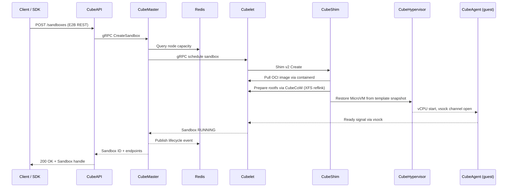
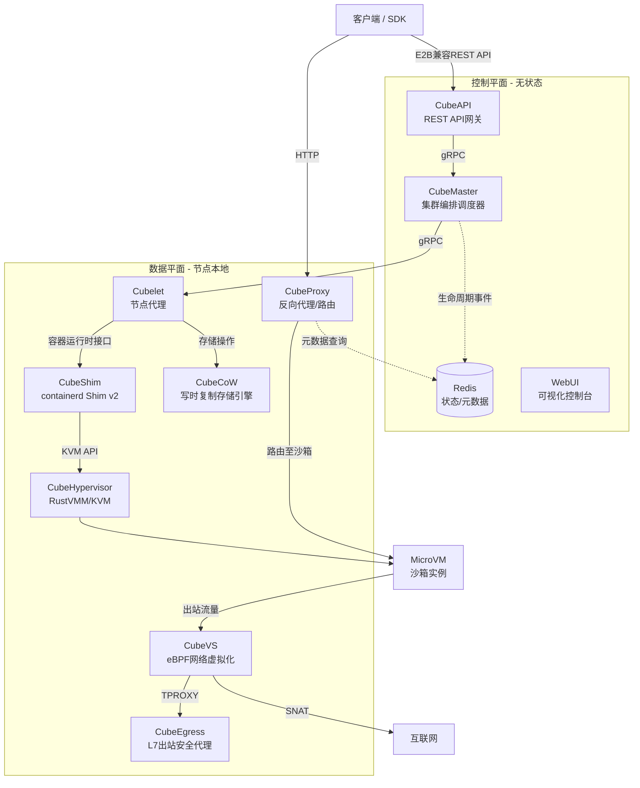
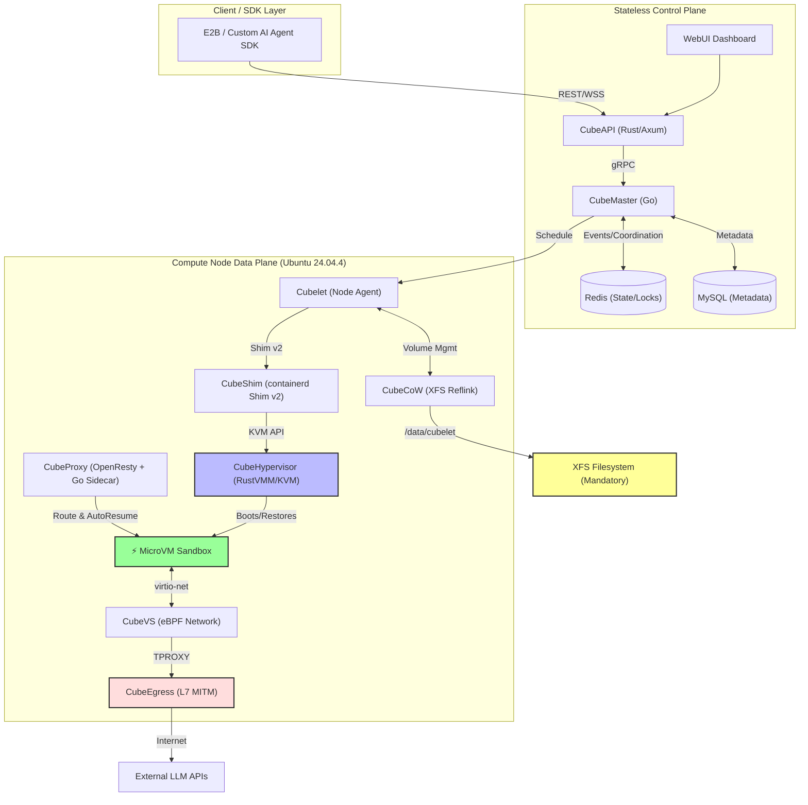

please meticulously review and analyze the blueprints below, then critically compare with yours.
use extensive web searches to further research and to validate all findings, claims and assumptions.

# CubeSandbox Design Blueprint
## Comprehensive Architecture & Deployment Guide for Ubuntu Linux 24.04.4 LTS

**Version:** 2.0 (Validated & Augmented)  
**Source:** [`https://github.com/TencentCloud/CubeSandbox`](https://github.com/TencentCloud/CubeSandbox)  
**Target Platform:** Ubuntu Linux 24.04.4 LTS (x86_64 / aarch64)  
**Latest Validated Release:** v0.5.0 (2026-07-03)  
**Date:** 2026-07-12

---

## Table of Contents

1. [Executive Summary](#1-executive-summary)
2. [Design Principles & Philosophy](#2-design-principles--philosophy)
3. [High-Level System Architecture](#3-high-level-system-architecture)
4. [Core Component Deep Dive](#4-core-component-deep-dive)
5. [Control Plane Architecture](#5-control-plane-architecture)
6. [Data Plane Architecture](#6-data-plane-architecture)
7. [Network Architecture (CubeVS)](#7-network-architecture-cubevs)
8. [Storage Architecture (CubeCoW)](#8-storage-architecture-cubecow)
9. [Security Architecture](#9-security-architecture)
10. [Deployment & Installation Model](#10-deployment--installation-model)
11. [Ubuntu 24.04.4 Adaptation Guide](#11-ubuntu-24044-adaptation-guide)
12. [Configuration Management](#12-configuration-management)
13. [Integration Interfaces](#13-integration-interfaces)
14. [Operational Model & Lifecycle](#14-operational-model--lifecycle)
15. [Competitive Landscape & Positioning](#15-competitive-landscape--positioning)
16. [Appendix](#16-appendix)

---

## 1. Executive Summary

**CubeSandbox** is a high-performance, hardware-isolated sandbox service purpose-built for AI Agent workloads. Released by Tencent Cloud's IaaS Frontier Technology Team in April 2026 under the Apache 2.0 license, it provisions MicroVMs (KVM-based) with **sub-60ms cold start times** and **<5MB memory overhead per instance** — enabling thousands of concurrent sandboxes on a single compute node.

Unlike container-based sandboxes that share a host kernel, each CubeSandbox instance runs its own dedicated Linux kernel inside a KVM MicroVM, eliminating shared-kernel escape surfaces entirely. The system is designed as a **cloud-native, horizontally scalable platform** with a stateless control plane, eBPF-accelerated data plane, and **E2B-compatible API surface** that allows zero-code migration from existing E2B-based solutions.

### Key Metrics at a Glance

| Metric | Target | Implementation Mechanism |
|--------|--------|--------------------------|
| **Boot Speed** | < 60ms (Cold Start) | Pre-snapshotted templates + RustVMM restore path |
| **Memory Overhead** | < 5MB per instance | Aggressively stripped VMM + virtio-minimal drivers |
| **Isolation Level** | Extreme (Hardware + eBPF) | Dedicated Guest OS kernel per sandbox; no shared namespaces |
| **API Compatibility** | E2B SDK Drop-in | Custom REST Gateway mapping E2B protocols to local VM lifecycle |
| **State Management** | < 100ms Snapshots | Copy-on-Write (CoW) block storage + VM memory state serialization |
| **Concurrent Density** | ~2,000 sandboxes / 96-core node | MicroVM architecture + resource overcommit |

### What This Blueprint Covers

This document extracts, validates, and augments the core design principles, architecture, and operational procedures from the CubeSandbox GitHub repository to enable you to build, deploy, and operate a similar sandbox environment on your Ubuntu 24.04.4 host. It serves as both an **architectural reference** and a **practical deployment guide**.

---

## 2. Design Principles & Philosophy

CubeSandbox is built on six core design principles that differentiate it from traditional container or VM-based sandbox solutions:

| Principle | Manifestation | Benefit |
|-----------|---------------|---------|
| **Agent-First** | Lifecycle semantics, SDK shape, auto-pause/resume, and lightning-fast clone/rollback are designed to host long-running agents and stateful services (e.g., persistent dev environments, web services, databases) directly inside sandboxes | Optimized for AI agent workloads rather than simple ephemeral code execution |
| **Hardware Isolation** | Each sandbox runs its own Linux kernel inside a KVM MicroVM via RustVMM | Eliminates shared-kernel escape vulnerabilities present in Docker containers |
| **Millisecond-Class Boot** | Pre-snapshotted templates plus RustVMM restore path yield sub-100ms cold starts | Enables real-time, interactive AI agent workflows |
| **Zero-Trust Egress** | All outbound traffic traverses CubeEgress (L7 MITM proxy). Domains must be explicitly allowed | Prevents data exfiltration and unauthorized API access |
| **Stateless Control Plane** | CubeAPI and CubeMaster hold no local state; all coordination goes through Redis | Trivial horizontal scaling of control plane components |
| **Efficient Storage** | CubeCoW leverages kernel `FICLONE` ioctl for O(1) snapshots and clones with zero data copying | Near-instant snapshots with minimal disk overhead |

### The AI Agent Execution Trilemma

AI Agents need to execute LLM-generated, untrusted code rapidly and safely. Traditional environments force an uncomfortable compromise:

```
┌─────────────────────────────────────────────────────────────────────────────┐
│                     THE AI AGENT EXECUTION TRILEMMA                         │
├─────────────────────────────────────────────────────────────────────────────┤
│                                                                             │
│   🐳 Docker Containers          💻 Traditional VMs           ⚡ CubeSandbox │
│   ─────────────────────         ──────────────────         ─────────────── │
│   ✅ Fast & Lightweight         ✅ High Security             ✅ Hardware Iso │
│   ❌ Shared Kernel              ❌ Slow Boot (Seconds)      ✅ <60ms Boot   │
│   ❌ Low Security               ❌ Heavy Memory (GBs)       ✅ <5MB Overhead│
│                                                                             │
│   CubeSandbox bridges the gap: the SPEED of containers + SECURITY of VMs   │
│                                                                             │
└─────────────────────────────────────────────────────────────────────────────┘
```

---

## 3. High-Level System Architecture

### 3.1 System Topology

The architecture is divided into three planes: the **Client/SDK Layer**, the **Control Plane** (cluster management), and the **Data Plane** (local execution per node).

```
┌─────────────────────────────────────────────────────────────────────────────┐
│                        CLIENT / SDK LAYER                                   │
│         (E2B-compatible REST API, Python/Node/Go SDKs)                      │
└──────────────────────────┬────────────────────────────────────────────────┘
                           │
┌──────────────────────────▼────────────────────────────────────────────────┐
│                      CONTROL PLANE (Stateless)                              │
│  ┌─────────────┐  ┌─────────────┐  ┌─────────────┐  ┌─────────────────┐  │
│  │   CubeAPI   │  │  CubeMaster │  │    WebUI    │  │  Redis (State)  │  │
│  │   (Rust)    │  │    (Go)     │  │  (OpenResty)│  │  MySQL (Meta)   │  │
│  └─────────────┘  └─────────────┘  └─────────────┘  └─────────────────┘  │
│         │                │                                                    │
│         └────────────────┴────────────────────────────────────────────────────┘
│                           gRPC
└──────────────────────────┬────────────────────────────────────────────────┘
                           │
┌──────────────────────────▼────────────────────────────────────────────────┐
│                        DATA PLANE (Node-Local)                             │
│                                                                            │
│  ┌─────────┐  ┌─────────┐  ┌─────────┐  ┌─────────┐  ┌────────────────┐  │
│  │ Cubelet │  │CubeShim │  │CubeHyper│  │  CubeVS │  │   CubeCoW      │  │
│  │  (Go)   │  │ (Rust)  │  │  (Rust) │  │ (eBPF)  │  │   (XFS reflink)│  │
│  └────┬────┘  └────┬────┘  └────┬────┘  └────┬────┘  └────────────────┘  │
│       │            │            │            │                              │
│       └────────────┴────────────┴────────────┘                              │
│                         │                                                  │
│                  ┌──────▼──────┐                                           │
│                  │   MicroVM   │                                           │
│                  │  (Sandbox)  │                                           │
│                  └──────┬──────┘                                           │
│                         │                                                  │
│              ┌──────────┴──────────┐                                        │
│              │    CubeEgress       │  (OpenResty + Lua)                    │
│              │  (L7 Security Proxy)│                                        │
│              └──────────┬──────────┘                                        │
│                         │                                                  │
│              ┌──────────▼──────────┐                                        │
│              │     Internet        │                                        │
│              └─────────────────────┘                                        │
└─────────────────────────────────────────────────────────────────────────────┘
```

### 3.2 Control Plane vs Data Plane

| Layer | Components | Responsibilities |
|-------|-----------|-----------------|
| **Control Plane** | CubeAPI, CubeMaster, WebUI, Redis, MySQL | API gateway, scheduling, state coordination, operator dashboard, persistent metadata |
| **Data Plane** | Cubelet, CubeShim, CubeHypervisor, CubeCoW, CubeVS, CubeEgress, CubeProxy | VM lifecycle, storage, networking, security enforcement, request routing |

**Key Characteristic:** The control plane is **stateless** — Redis is the single source of truth for sandbox metadata and lifecycle events. Any CubeAPI or CubeMaster instance can serve any request. The data plane is **node-local** — each compute node runs its own isolated set of daemons.

### 3.3 Request Lifecycle (Typical `Sandbox.create()` Flow)

```
Client / SDK
    │
    ▼ POST /sandboxes (E2B-compatible REST)
CubeAPI (Port 3000)
    │
    ▼ gRPC CreateSandbox
CubeMaster (Port 8089)
    │
    ├─ Select target node (resource fit)
    │
    ▼ gRPC RunCubeSandbox
Cubelet (Node Agent)
    │
    ├─ Prepare rootfs (CubeCoW clone from template — O(1))
    │
    ▼ containerd Shim v2 → Create + Start
CubeShim
    │
    ▼ launch_vmm() → create_vm() → restore_vm()
CubeHypervisor (RustVMM + KVM)
    │
    ▼ VM ready (vsock listening) — < 60ms
MicroVM (Sandbox)
    │
    ▼ Add TAP Device + Attach eBPF Filter
CubeVS
    │
    ▼ Publish lifecycle event
Redis
    │
    ▼ Return Sandbox ID + metadata
Client
```

---

## 4. Core Component Deep Dive

### 4.1 CubeAPI (Rust / Axum)

| Attribute | Detail |
|-----------|--------|
| **Role** | E2B-compatible REST API gateway |
| **Language** | Rust (Axum framework) |
| **Port** | `3000` (default) |
| **Key Functions** | Translates E2B SDK calls into internal gRPC; handles authentication callbacks; forwards requests to CubeMaster |

Switching from E2B Cloud to Cube Sandbox requires only changing environment variables such as `E2B_API_URL` — zero business code changes.

### 4.2 CubeMaster (Go)

| Attribute | Detail |
|-----------|--------|
| **Role** | Cluster-level orchestration scheduler |
| **Language** | Go |
| **Port** | `8089` (gRPC meta endpoint) |
| **Key Functions** | Receives sandbox create/destroy/pause/resume/snapshot requests; selects target nodes based on resource availability; dispatches work to Cubelet; publishes lifecycle events to Redis |
| **CLI Tool** | `cubemastercli` |

### 4.3 CubeProxy (OpenResty / Lua + Go Sidecar)

| Attribute | Detail |
|-----------|--------|
| **Role** | Reverse proxy, request routing, auto-pause/resume orchestration |
| **Technology** | OpenResty (nginx + Lua) + Go (`cube-lifecycle-manager` sidecar) |
| **Ports** | `80` / `443` (default) |

**Routing Modes:**
- **Host-based:** Parses `<port>-<sandbox_id>.<domain>` from the `Host` header
- **Path-based:** Parses `/sandbox/<sandbox_id>/<port>/...` from the URL path (useful when wildcard DNS and TLS are inconvenient)

**Auto-Pause/Auto-Resume (v0.5.0):**
- The Go sidecar watches lifecycle events via Redis
- Transparently pauses idle sandboxes after a configurable timeout
- Resumes paused sandboxes on incoming requests
- Concurrent resumes for the same sandbox are coalesced (singleflight pattern)
- Cross-replica coordination uses Redis SETNX locks

### 4.4 Cubelet (Go)

| Attribute | Detail |
|-----------|--------|
| **Role** | Node-local scheduling agent |
| **Language** | Go |
| **Ports** | gRPC `9999`, HTTP `9998` (debug/metrics) |
| **Key Functions** | Manages full lifecycle of all sandbox instances on a single node: `create → run → pause → resume → snapshot → destroy`; integrates with containerd for image pull; integrates with CubeCoW for volume management |
| **CLI Tool** | `cubecli` |

### 4.5 CubeShim (Rust)

| Attribute | Detail |
|-----------|--------|
| **Role** | containerd Shim v2 interface implementation |
| **Language** | Rust |
| **Standard** | containerd Shim v2 |
| **Key Functions** | Bridges container runtime abstraction to actual MicroVM; handles sandbox resource preparation (rootfs via CubeCoW, memory file, kernel `vmlinux`); VM boot/restore; vsock communication; in-place snapshot for auto-pause |

### 4.6 CubeHypervisor (Rust / RustVMM + KVM)

| Attribute | Detail |
|-----------|--------|
| **Role** | Lightweight VMM (Virtual Machine Monitor) |
| **Language** | Rust (RustVMM crates) |
| **Hypervisor** | KVM |
| **Key Functions** | vCPU setup and management; memory region mapping; virtio device emulation (virtio-net, virtio-blk, virtio-vsock, virtio-fs); MicroVM boot and restore from pre-snapshotted templates; seccomp-hardened with minimal syscall surface |

The CubeHypervisor is built on **RustVMM** (not QEMU), specifically leveraging components from **Cloud Hypervisor** and **Kata Containers** upstream — tailored and modified for the CubeSandbox execution model.

### 4.7 CubeAgent (Rust)

| Attribute | Detail |
|-----------|--------|
| **Role** | Guest OS agent |
| **Language** | Rust |
| **Location** | Runs inside the MicroVM as `/sbin/init` |
| **Key Functions** | Receives commands from Cubelet via vsock; manages guest-side lifecycle operations; handles file operations, exec requests, and health checks inside the sandbox |

### 4.8 network-agent (Go)

| Attribute | Detail |
|-----------|--------|
| **Role** | Network control plane agent |
| **Language** | Go |
| **Key Functions** | Manages CubeVS eBPF programs; configures TAP devices, SNAT pools, port mappings; applies network policies per sandbox |

---

## 5. Control Plane Architecture

### 5.1 API Flow

```
Client (E2B SDK)
    │
    ▼ HTTP/REST
CubeAPI (Port 3000)
    │
    ▼ gRPC
CubeMaster (Port 8089)
    │
    ├─────────────┬─────────────┐
    ▼             ▼             ▼
  Redis        Cubelet      MySQL
 (State)     (Node 1..N)  (Metadata)
```

### 5.2 State Management

| Store | Technology | Purpose |
|-------|-----------|---------|
| **Redis** | Redis 7+ | Runtime state, lifecycle events, node registration, sandbox metadata cache, CubeProxy service discovery |
| **MySQL** | MySQL 8.0 | Persistent metadata: templates, sandbox records, audit logs, user data |

### 5.3 WebUI Dashboard

- **Technology:** OpenResty + Frontend
- **Port:** `12088`
- **Capabilities:**
  - **Overview:** Cluster KPIs (running sandboxes, CPU/memory utilization, healthy nodes)
  - **Sandboxes:** MicroVM real-time list with pause/resume/terminate actions
  - **Templates:** Reusable sandbox snapshot directory; create from OCI images
  - **Nodes:** Node health status and resource utilization
  - **Versions:** Component version matrix (kernel, agent, guest image)
  - **Network:** API gateway configuration and rate limiting
  - **API Keys:** API key management

---

## 6. Data Plane Architecture

### 6.1 Node-Local Stack

Each compute node runs the following processes:

| Process | Binary | Responsibility |
|---------|--------|---------------|
| `cubelet` | `cubelet` | Node agent, containerd integration |
| `containerd-shim-cube-rs` | `containerd-shim-cube-rs` | Shim v2 implementation |
| `cube-runtime` | `cube-runtime` | Runtime helper |
| `network-agent` | `network-agent` | eBPF network control |
| `cube-proxy` | Docker container | Reverse proxy (if enabled) |
| `cube-lifecycle-manager` | Docker container | Auto-pause/resume orchestrator |

### 6.2 MicroVM Lifecycle

```
Template (OCI Image)
    │
    ▼
CubeMaster schedules to Node
    │
    ▼
Cubelet pulls image via containerd
    │
    ▼
CubeShim prepares rootfs via CubeCoW (XFS reflink — O(1))
    │
    ▼
CubeShim prepares memory file + kernel (vmlinux)
    │
    ▼
CubeHypervisor restores MicroVM from template snapshot
    │
    ▼
MicroVM boots (< 60ms)
    │
    ▼
CubeAgent (guest /sbin/init) ready via vsock
```

### 6.3 AutoPause / AutoResume Lifecycle (v0.5.0)

```
RUNNING ──[idle timeout]──► PAUSED
   ▲                          │
   │                          │
   └────[incoming request]────┘
         (CubeProxy sidecar
          triggers resume via
          CubeMaster → Cubelet)
```

- **AutoPause:** A sweeper tracks sandbox activity via `last_active` timestamps. When idle ≥ timeout, the sidecar triggers a pause through CubeMaster → Cubelet, which snapshots the full VM state (memory + filesystem) to `/data/cubelet/root/pausevm/<sandbox>`, then shuts down the MicroVM.
- **AutoResume:** When a dataplane request arrives for a paused sandbox, CubeProxy intercepts it and fires an internal sub-request to the sidecar's `/internal/resume`. The sidecar drives a resume RPC through CubeMaster → Cubelet → containerd, which restores the VM from the pause snapshot.
- **Resource Release Ratio:** A node-level configuration `host.quota.paused_resource_release_ratio` (float `[0, 1]`, default `0`) controls how much CPU/memory quota paused sandboxes release back to the scheduler.

---

## 7. Network Architecture (CubeVS)

### 7.1 Design Philosophy

CubeVS replaces traditional container networking (Linux Bridge, OVS, iptables) with a purpose-built eBPF stack for:
- Point-to-point low latency
- Kernel-space policy enforcement
- Scalable NAT without iptables rule explosion

### 7.2 The Three eBPF Programs

| Program | Source File | Attach Point | Direction | Role |
|---------|-------------|-------------|-----------|------|
| `from_cube` | `mvmtap.bpf.c` | TC ingress on each TAP | Sandbox → Host | SNAT, policy check, L7 proxy selection, session creation, ARP proxy |
| `from_world` | `nodenic.bpf.c` | TC ingress on host NIC | External → Host | Reverse NAT, port-mapping proxy |
| `from_envoy` | `localgw.bpf.c` | TC egress on `cube-dev` | Proxy → Sandbox | DNAT to sandbox IP, preserve TPROXY source IP |

### 7.3 Pinned BPF Maps

Located under `/sys/fs/bpf/`, shared between programs and Go control plane:

| Map | Type | Purpose |
|-----|------|---------|
| `mvmip_to_ifindex` | Hash | Sandbox IP → TAP ifindex |
| `ifindex_to_mvmmeta` | Hash | TAP ifindex → Sandbox metadata |
| `egress_sessions` | Hash | 5-tuple → NAT session state |
| `ingress_sessions` | Hash | External 5-tuple → reverse lookup |
| `snat_iplist` | Array | SNAT IP pool |
| `allow_out` | Hash-of-Maps | Per-sandbox egress allowlist (LPM trie) |
| `deny_out` | Hash-of-Maps | Per-sandbox egress denylist (LPM trie) |
| `remote_port_mapping` | Hash | Host port → sandbox service |
| `local_port_mapping` | Hash | Sandbox port → host port |

### 7.4 Traffic Flows

#### Egress: Sandbox → External
1. Sandbox sends packet (src: `169.254.68.6`)
2. Packet enters TAP → `from_cube` TC ingress
3. Policy evaluation against destination IP
4. L7 proxy selection for TCP `:80`/`:443` (redirect to `cube-dev`)
5. SNAT: replace sandbox IP with host SNAT pool IP + allocated port
6. Redirect to host NIC (`eth0`)

#### Ingress: External → Sandbox
1. Reply packet arrives host NIC
2. `from_world` TC ingress
3. Lookup `ingress_sessions` by external 5-tuple
4. Reverse NAT: rewrite dst to sandbox internal IP/port
5. Redirect to correct TAP device

#### Proxy/Overlay → Sandbox
1. Traffic from OpenResty TPROXY arrives at `cube-dev`
2. `from_envoy` TC egress
3. DNAT destination to sandbox IP (`169.254.68.6`)
4. Redirect to TAP device

### 7.5 Session Tracking

- **Dual-map design:** `egress_sessions` (primary) + `ingress_sessions` (reverse lookup)
- **TCP state machine:** 11 states modeled after `nf_conntrack` (SYN_SENT, ESTABLISHED, TIME_WAIT, etc.)
- **Timeouts:** ESTABLISHED = 3 hours, SYN_SENT = 1 minute, UDP unreplied = 30s, UDP replied = 180s
- **Session reaper:** Background goroutine sweeps expired NAT sessions

### 7.6 Network Policy Engine

- **Per-sandbox policies** stored in `allow_out` / `deny_out` BPF maps
- **LPM (Longest Prefix Match) tries** for CIDR-based rules
- **Default-deny posture:** Traffic not explicitly allowed is blocked
- **L7_REQUIRED flag:** Matched TCP `:80`/`:443` traffic is redirected to CubeEgress (OpenResty) for MITM inspection

### 7.7 Traffic Access Token Gating (v0.5.0)

Sandboxes created with `network.allow_public_traffic=false` receive a per-sandbox `traffic_access_token` (UUID v4). CubeProxy enforces this token on every inbound request, returning HTTP 403 for missing or mismatched tokens. Token values are redacted from all logs.

---

## 8. Storage Architecture (CubeCoW)

### 8.1 Technology: XFS Reflink + `FICLONE`

CubeCoW (Copy-on-Write) is the snapshot and clone engine.

- **Requirement:** `/data/cubelet` must be mounted on **XFS** with reflink enabled
- **Mechanism:** Uses `FICLONE` ioctl for O(1) file cloning
- **Benefits:** Zero data copying, near-instant snapshots, minimal disk overhead

### 8.2 Why XFS?

Ubuntu/Debian default to ext4, which does not support reflink. CubeSandbox **requires** XFS for `/data/cubelet`.

### 8.3 Storage Layer Diagram

```
Template (read-only base)
  └── FICLONE ──→ Sandbox rootfs volume (CoW)
                      ├── FICLONE ──→ Snapshot A
                      └── FICLONE ──→ Clone 1, Clone 2, ...
```

- **Template creation:** OCI image → Buildkit → rootfs + cold-boot → memory snapshot → registered as a template
- **Sandbox boot:** Cubelet clones the template's rootfs and memory volumes via CubeCoW (O(1), no data copy), then CubeShim restores the VM from the memory snapshot
- **Incremental snapshot:** Only anonymous (dirty) pages are written; base pages are shared with the previous snapshot via reflink

### 8.4 Disk Requirements

| Use Case | Minimum Free Space | Recommended |
|----------|-------------------|-------------|
| Functional experience | 50 GB | 100 GB |
| Production / multiple templates | 200 GB | 500 GB+ |

---

## 9. Security Architecture

### 9.1 Isolation Model

| Layer | Mechanism |
|-------|-----------|
| **Kernel Isolation** | Each MicroVM runs its own Linux kernel via KVM + RustVMM |
| **Network Isolation** | Dedicated TAP device per sandbox, eBPF-enforced policies |
| **Storage Isolation** | Separate reflink-cloned rootfs per sandbox |
| **Resource Isolation** | vCPU and memory limits enforced by VMM |
| **Seccomp** | CubeHypervisor seccomp-hardened with minimal syscall surface |

### 9.2 Egress Security (CubeEgress)

- **Technology:** OpenResty + Lua (~2,200 lines across 9 modules)
- **Function:** L7 MITM proxy for all outbound HTTP/HTTPS via TPROXY
- **Domain Allowlist:** Only explicitly approved domains are accessible
- **Credential Injection:** External API keys never enter the sandbox; intercepted at proxy layer
- **Access Auditing:** Full request/response JSONL logging for compliance
- **Fail-Closed Bootstrap:** CubeEgress starts in deny-all mode until policies are loaded

**Intercept Principle:**

```
Sandbox → cube-dev (host iface)
            │
            ├─ iptables mangle/PREROUTING -j TPROXY
            │   Port 80  → 192.168.0.1:8080 (HTTP)
            │   Port 443 → 192.168.0.1:8443 (HTTPS)
            ▼
       CubeEgress (OpenResty + Lua)
            │
            ├─ ssl_certificate_by_lua → Issue leaf cert for SNI
            ├─ access_by_lua → Match L7 rules (allow/deny/inject)
            └─ proxy_pass → Original target IP
```

The sandbox trusts a CubeEgress-issued root CA (baked into the template), enabling transparent TLS inspection.

### 9.3 Credential Vault

- Agents call external APIs as usual (e.g., `fetch("https://api.openai.com/...")`)
- API keys are intercepted by CubeProxy/CubeEgress
- Keys never enter sandbox memory, model context, or logs
- Injected at the L7 proxy layer via `EgressRule.inject`

### 9.4 Sandbox Internal Addressing

- Fixed internal IP: `169.254.68.6/30`
- Gateway IP: `169.254.68.5`
- This is consistent across all sandbox instances

### 9.5 Network Hardening (Production)

Before exposing to untrusted networks:

1. **Enable domain allowlists** in CubeEgress configuration
2. **Configure TLS** using real certificates (replace mkcert defaults)
3. **Restrict Redis/MySQL** to localhost or internal network
4. **Enable API authentication** (see `docs/guide/authentication.md`)
5. **Review CIDR allocation** to avoid conflicts with host network
6. **Configure firewall rules** for CubeProxy ports

---

## 10. Deployment & Installation Model

### 10.1 Deployment Roles

| Role | Components | Use Case |
|------|-----------|----------|
| **Control** | All-in-one: CubeAPI, CubeMaster, Cubelet, MySQL, Redis, CubeProxy, WebUI | Single node, evaluation, small deployments |
| **Compute** | Cubelet, CubeShim, CubeHypervisor, CubeVS, network-agent | Additional compute nodes registering to existing control plane |

### 10.2 One-Click Installation (Binary Release)

The project provides a release bundle (`cube-sandbox-one-click-<version>.tar.gz`) containing:

- All compiled binaries
- Guest VM image (`cube-guest-image-cpu.img`)
- Kernel package (`cube-kernel-scf.zip`)
- Docker Compose templates for CubeProxy, CoreDNS, MySQL, Redis, WebUI
- Installation scripts (`install.sh`, `install-compute.sh`, `down.sh`, `smoke.sh`)
- Environment template (`env.example`)
- systemd unit files

### 10.3 systemd Service Architecture

All components are managed as systemd services:

| Service | Description |
|---------|-------------|
| `cube-sandbox-cube-api.service` | REST API gateway |
| `cube-sandbox-cubemaster.service` | Cluster orchestrator |
| `cube-sandbox-cubelet.service` | Node agent |
| `cube-sandbox-network-agent.service` | eBPF network control |
| `cube-sandbox-cube-proxy.service` | Reverse proxy |
| `cube-sandbox-cube-lifecycle-manager.service` | Auto-pause/resume |
| `cube-sandbox-cube-egress.service` | Egress proxy |
| `cube-sandbox-cube-egress-net.service` | Egress network |
| `cube-sandbox-mysql.service` | Metadata database (Docker) |
| `cube-sandbox-redis.service` | State store (Docker) |
| `cube-sandbox-coredns.service` | Internal DNS (Docker) |
| `cube-sandbox-dns.service` | Host DNS integration |
| `cube-sandbox-webui.service` | Dashboard (Docker) |

### 10.4 Directory Layout on Target Host

```
/usr/local/services/cubetoolbox/
├── cube-api/
│   └── bin/cube-api
├── cubemaster/
│   ├── bin/cubemaster
│   └── bin/cubemastercli
├── cubelet/
│   ├── bin/cubelet
│   └── bin/cubecli
├── cube-shim/
│   ├── bin/containerd-shim-cube-rs
│   └── bin/cube-runtime
├── network-agent/
│   └── bin/network-agent
├── cube-kernel-scf/
│   └── vmlinux
├── cube-image/
│   └── cube-guest-image-cpu.img
├── cubeproxy/
│   ├── certs/
│   └── conf/
├── cube-egress/
│   └── conf/
└── ...

/var/run/cube-sandbox-one-click/   # Runtime state
/var/log/cube-sandbox-one-click/   # Logs
/data/cubelet/                     # VM storage (MUST be XFS)
```

---

## 11. Ubuntu 24.04.4 Adaptation Guide

### 11.1 Prerequisites Checklist

| Requirement | Command to Verify | Notes |
|-------------|-------------------|-------|
| **Architecture** | `uname -m` | `x86_64` or `aarch64` |
| **KVM Support** | `ls -la /dev/kvm` | Must exist and be read/writable |
| **glibc Version** | `ldd --version` | Must be ≥ 2.31 (Ubuntu 24.04 has 2.39 — backward compatible) |
| **Docker** | `docker info` | Must be installed and running |
| **Root Access** | `whoami` | All installation commands as root |
| **XFS Filesystem** | `findmnt /data/cubelet` | **Must be XFS with reflink** |
| **Disk Space** | `df -h /data/cubelet` | ≥ 50 GB free (200 GB recommended) |
| **RAM** | `free -h` | ≥ 8 GB (64 GB recommended for production) |
| **CPU Cores** | `nproc` | ≥ 4 cores (32 recommended) |

> ⚠️ **PVM Limitation:** PVM (Pseudo-Virtual Machine) enables KVM on standard cloud VMs without nested virtualization, but it is **x86_64-only**. On ARM64, you must use a physical machine or cloud VM with native KVM support.

### 11.2 Critical: XFS Setup for Ubuntu 24.04

Ubuntu defaults to ext4. You **must** provide an XFS volume for `/data/cubelet`:

```bash
# Option 1: Dedicated disk/partition
sudo mkfs.xfs -f -m reflink=1 /dev/sdX
sudo mkdir -p /data/cubelet
sudo mount /dev/sdX /data/cubelet
echo '/dev/sdX /data/cubelet xfs defaults 0 0' | sudo tee -a /etc/fstab

# Option 2: Loopback file (for testing only)
sudo mkdir -p /data
sudo truncate -s 200G /data/cubelet.img
sudo mkfs.xfs -f -m reflink=1 /data/cubelet.img
echo '/data/cubelet.img /data/cubelet xfs loop 0 0' | sudo tee -a /etc/fstab
sudo mount /data/cubelet
```

### 11.3 Step-by-Step Installation for Ubuntu 24.04.4

#### Step 1: Prepare System

```bash
# Switch to root
sudo su root

# Update and install dependencies
apt update && apt install -y curl wget tar docker.io

# Verify Docker is running
systemctl enable --now docker

# Verify KVM (for bare-metal or nested-virt VMs)
ls -la /dev/kvm
# If missing on cloud VMs, use PVM mode (x86_64 only)
```

#### Step 2: Download Release Bundle

```bash
# For x86_64
wget https://github.com/TencentCloud/CubeSandbox/releases/download/v0.5.0/cube-sandbox-one-click-v0.5.0.tar.gz

# For ARM64 (aarch64)
wget https://github.com/TencentCloud/CubeSandbox/releases/download/v0.5.0/cube-sandbox-one-click-v0.5.0-arm64.tar.gz

tar -xzf cube-sandbox-one-click-*.tar.gz
cd cube-sandbox-one-click-*
```

#### Step 3: Configure Environment

```bash
cp env.example .env

# Edit .env for your environment:
# - CUBE_SANDBOX_NODE_IP=<your_ip>
# - CUBE_SANDBOX_NETWORK_CIDR=10.100.0.0/18 (adjust to avoid conflicts)
# - ONE_CLICK_DEPLOY_ROLE=control
# - CUBE_PVM_ENABLE=1 (only for x86_64 cloud VMs without /dev/kvm)
```

#### Step 4: Run Installer

```bash
chmod +x install.sh
./install.sh
```

> 💡 **Upgrade Mode:** `install.sh --mode=upgrade` detects existing installations, performs three-way `.env` config merge (new defaults + old customizations + explicit overrides), runs fail-fast preflight checks, and backs up configuration before any destructive change.

#### Step 5: Verify Installation

```bash
./smoke.sh

systemctl status cube-sandbox-cube-api
systemctl status cube-sandbox-cubemaster
systemctl status cube-sandbox-cubelet
systemctl status cube-sandbox-network-agent

# Check API health
curl http://127.0.0.1:3000/health

# Check WebUI
curl http://127.0.0.1:12088
```

#### Step 6: Create First Template

```bash
# Install CLI tools if not in PATH
export PATH=$PATH:/usr/local/services/cubetoolbox/cubemaster/bin

# Create template from official image
cubemastercli tpl create-from-image   --image cube-sandbox-int.tencentcloudcr.com/cube-sandbox/sandbox-code:latest   --writable-layer-size 1G   --expose-port 49999   --expose-port 49983   --probe 49999

# Watch template creation progress
cubemastercli tpl watch --job-id <job_id>
```

#### Step 7: Test with Python SDK (E2B Compatible)

```bash
pip install e2b-code-interpreter
```

```python
import os
from e2b_code_interpreter import Sandbox

os.environ["E2B_API_URL"] = "http://127.0.0.1:3000"
os.environ["E2B_API_KEY"] = "e2b_000000"

with Sandbox.create(template="<your-template-id>") as sandbox:
    result = sandbox.run_code("print('Hello from Cube Sandbox!')")
    print(result)
```

### 11.4 Known Ubuntu-Specific Considerations

| Issue | Solution |
|-------|----------|
| ext4 default for `/data/cubelet` | Reformat or mount XFS volume explicitly |
| systemd-resolved DNS | CubeProxy DNS integration works; use `networkmanager` or `standalone` dnsmasq mode |
| AppArmor blocking KVM | Ensure AppArmor allows `/dev/kvm` access |
| glibc compatibility | Binaries built on Ubuntu 20.04 (glibc 2.31); Ubuntu 24.04 has newer glibc — backward compatible |
| ARM64 PVM | Not supported; use bare-metal with native KVM |

---

## 12. Configuration Management

### 12.1 Environment Variables (Primary Control)

Configuration is driven by environment variables consumed by `install.sh` and runtime components:

| Variable | Description | Default |
|----------|-------------|---------|
| `ONE_CLICK_DEPLOY_ROLE` | Node role: `control` or `compute` | `control` |
| `CUBE_SANDBOX_NODE_IP` | Node IP for registration | Auto-detect `eth0` |
| `CUBE_SANDBOX_NETWORK_CIDR` | Sandbox IP allocation range | `192.168.0.0/18` |
| `CUBE_PROXY_ENABLE` | Enable reverse proxy | `1` |
| `CUBE_PROXY_HTTPS_PORT` | HTTPS listener port | `443` |
| `CUBE_PROXY_HTTP_PORT` | HTTP listener port | `80` |
| `CUBE_PROXY_DNS_ENABLE` | Enable internal DNS | `1` |
| `CUBE_SANDBOX_MYSQL_PORT` | MySQL port | `3306` |
| `CUBE_SANDBOX_REDIS_PORT` | Redis port | `6379` |
| `CUBE_SANDBOX_REDIS_PASSWORD` | Redis password | `ceuhvu123` |
| `CUBE_SANDBOX_MYSQL_ROOT_PASSWORD` | MySQL root password | `cube_root` |
| `CUBE_SANDBOX_MYSQL_DB` | MySQL database | `cube_mvp` |
| `CUBE_SANDBOX_MYSQL_USER` | MySQL user | `cube` |
| `CUBE_SANDBOX_MYSQL_PASSWORD` | MySQL password | `cube_pass` |
| `CUBE_PVM_ENABLE` | Enable PVM guest kernel | `0` |
| `CUBE_SANDBOX_CUBE_ROUTER_ENABLE` | Route-aware egress | `0` |
| `CUBE_EXTERNAL_MYSQL_HOST` | External MySQL host (optional) | — |
| `CUBE_EXTERNAL_REDIS_HOST` | External Redis host (optional) | — |

### 12.2 Runtime Configuration (`config-cube.toml`)

Used by `containerd-shim-cube-rs` to locate:
- Shim binary path
- `cube-runtime` path
- Guest kernel (`vmlinux`)
- Guest image (`cube-guest-image-cpu.img`)
- Guest init (`/sbin/init` inside image)

### 12.3 Three-Way Configuration Merge

The install system supports a layered configuration merge:
1. Built-in defaults
2. `env.example` (or user-provided env file)
3. Runtime environment overrides

This allows upgrades without losing customizations.

---

## 13. Integration Interfaces

### 13.1 E2B SDK Compatibility

CubeSandbox is API-compatible with E2B (Execution Environment for AI Agents):

| E2B Feature | CubeSandbox Support |
|-------------|---------------------|
| `Sandbox.create()` | ✅ Full support |
| `sandbox.run_code()` | ✅ Full support |
| `sandbox.filesystem.*` | ✅ Full support (v0.5.0+) |
| `sandbox.process.*` | ✅ Full support (v0.5.0+) |
| `sandbox.close()` | ✅ Full support |

**Migration:** Change only `E2B_API_URL` environment variable.

### 13.2 SDK Support

| SDK | Package | Status |
|-----|---------|--------|
| Python | `e2b-code-interpreter` | ✅ Compatible |
| Node.js | `e2b` | ✅ Compatible |
| Go | `github.com/e2b-dev/e2b` | ✅ Compatible |

### 13.3 API Endpoints

- **REST API:** Port `3000` (E2B-compatible)
- **gRPC (internal):** CubeMaster port `8089`
- **WebUI:** Port `12088`

---

## 14. Operational Model & Lifecycle

### 14.1 Sandbox Lifecycle States

```
CREATING → RUNNING → [PAUSED] → [RESUMED] → [SNAPSHOT] → DESTROYED
              ↑_________↓
```

- **AutoPause:** Idle sandboxes automatically suspend to disk (v0.5.0)
- **AutoResume:** Incoming requests trigger instant restoration from snapshot (v0.5.0)
- **Snapshot/Clone:** Hundred-millisecond checkpoints; fork from any saved state

### 14.2 Default Listening Ports

| Process | Default Bind | Port | Description |
|---------|-------------|------|-------------|
| CubeMaster | `0.0.0.0` | `8089` | Cluster management HTTP API |
| CubeAPI | `0.0.0.0` | `3000` | Sandbox lifecycle API (E2B-compatible) |
| Cubelet gRPC | `0.0.0.0` | `9999` | Node management RPC |
| Cubelet HTTP | `0.0.0.0` | `9998` | Debug / metrics |
| CubeProxy | `0.0.0.0` | `80` / `443` | Public-facing reverse proxy |
| WebUI | `0.0.0.0` | `12088` | Dashboard |
| MySQL | `127.0.0.1` | `3306` | Metadata database (loopback) |
| Redis | `127.0.0.1` | `6379` | State store (loopback) |

> ⚠️ **Production Warning:** One-click deployment binds management endpoints to `0.0.0.0` with no authentication or TLS by default. Production deployments must execute network hardening before exposing to untrusted networks.

### 14.3 Network Hardening Strategy

```bash
# .env file configuration for production
CUBEMASTER_HTTP_BIND=10.0.0.11          # Private NIC (multi-node)
CUBE_API_BIND=10.0.0.11:3000
CUBE_API_HEALTH_ADDR=10.0.0.11:3000
```

**Cubelet configuration** (`/Cubelet/config/config.toml`):
```toml
[http]
address = "10.0.0.11:9998"
[grpc]
address = "10.0.0.11:9999"
```

### 14.4 Health Checks & QuickCheck

The `install.sh` includes a `quickcheck` phase that probes:
- systemd units are active
- Health endpoints respond
- Sockets are listening
- Runtime files exist
- Node registration succeeds

Timeout: 120 seconds (configurable via `CUBE_QUICKCHECK_READY_TIMEOUT`)

### 14.5 Troubleshooting Checklist

- [ ] **System Requirements:** Verify Ubuntu 24.04.4, KVM availability, sufficient resources
- [ ] **Installation:** Check all components installed correctly (`systemctl status cube-*`)
- [ ] **Configuration:** Validate configuration files (`sudo cube-master config-validate`)
- [ ] **Network:** Verify network connectivity and policies (`sudo cube-master network-check`)
- [ ] **Templates:** Ensure templates are ready (`sudo cube-master template-list`)
- [ ] **Permissions:** Check file permissions and user groups
- [ ] **Logs:** Review component logs for errors (`sudo journalctl -u cube-*`)
- [ ] **API Access:** Test API endpoint (`curl http://localhost:3000/health`)
- [ ] **WebUI:** Verify WebUI accessibility (`http://your-ip:12088`)
- [ ] **Security:** Validate egress policies and credential vault
- [ ] **XFS:** Confirm `/data/cubelet` is XFS with reflink (`xfs_info /data/cubelet`)

---

## 15. Competitive Landscape & Positioning

### 15.1 CubeSandbox vs. Alternatives

| Feature | 🐳 Docker / gVisor | 💻 Traditional VMs | ⚡ CubeSandbox | 🔥 E2B (Firecracker) |
| :--- | :--- | :--- | :--- | :--- |
| **Isolation** | Shared Kernel (Escape risk) | Dedicated Kernel | Dedicated Kernel + eBPF | Dedicated Kernel (Firecracker) |
| **Startup** | ~200ms (Namespace setup) | Seconds (Full BIOS/OS boot) | **<60ms** (Pre-snapshotted restore) | ~150–200ms (Pre-warmed pools) |
| **Memory** | Low (Shared) | High (Full OS overhead) | **<5MB** (Aggressively stripped) | ~5MB (Firecracker) |
| **Snapshot/Clone** | Slow (Block-level copy) | Slow (VDI copy) | **O(1) via FICLONE CoW** | Fast (Snapshot pools) |
| **Egress Security** | Basic (IPTables) | Basic | **L7 MITM, Credential Vault, Auditing** | L7 filtering (managed) |
| **Distribution** | Self-hosted | Self-hosted | **Self-hosted (full stack)** | Managed SaaS + self-host |
| **E2B Compatible** | ❌ No | ❌ No | **✅ Drop-in** | ✅ Native |
| **Best For** | Trusted microservices | Multi-tenant enterprise | **Untrusted AI Agent code execution** | AI Agent code execution |

### 15.2 When to Choose CubeSandbox

```
┌─────────────────────────────────────────────────────────────────────────┐
│                         DECISION FLOWCHART                               │
│                                                                          │
│   Need to run untrusted LLM-generated code?                              │
│       │                                                                  │
│       ├── Yes ──► Have KVM access or x86_64 cloud VM?                  │
│       │               │                                                    │
│       │               ├── Yes ──► ✅ USE CUBESANDBOX                     │
│       │               │                                                    │
│       │               └── No ──► ⚠️ Use PVM (x86_64 only) or           │
│       │                              bare metal / nested virt              │
│       │                                                                  │
│       └── No, trusted internal code ──► 🐳 Stick to Docker / K8s         │
│                                                                          │
└─────────────────────────────────────────────────────────────────────────┘
```

### 15.3 Pros & Cons

#### ✅ Pros
- **Unbeatable Speed:** Cold starts under 60ms enable real-time, interactive AI agent workflows
- **Ironclad Security:** KVM hardware isolation + eBPF network policies prevent container escapes
- **Resource Efficiency:** Run thousands of sandboxes on a single bare-metal node
- **Stateful Magic:** CubeCoW allows instantaneous cloning and rollback of running environments
- **Zero-Code Migration:** E2B SDK drop-in compatibility
- **Open Source:** Full stack under Apache 2.0; no vendor lock-in

#### ❌ Cons & Trade-offs
- **Hardware Dependency:** Requires KVM access (`/dev/kvm`). Fails on standard cheap cloud VMs unless using PVM (x86_64 only) or bare metal
- **Ecosystem Maturity:** As a newer open-source project (launched April 2026), it lacks the massive community tooling and battle-tested edge cases of Docker/Kubernetes
- **Operational Complexity:** Managing RustVMM, eBPF policies, OpenResty proxies, and Go control planes requires specialized Linux systems knowledge
- **ARM64 Limitations:** PVM workaround for cloud VMs without native KVM is x86_64 only; ARM64 requires bare metal with native KVM
- **Storage Requirement:** Mandates XFS with reflink — incompatible with default ext4 on Ubuntu

---

## 16. Appendix

### 16.1 Repository Structure

```
CubeSandbox/
├── CubeAPI/                 # Rust REST API gateway
├── CubeEgress/              # OpenResty + Lua L7 proxy
├── CubeMaster/              # Go orchestrator
├── CubeNet/                 # CubeVS eBPF networking
├── CubeProxy/               # OpenResty reverse proxy + Go sidecar
├── CubeShim/                # Rust containerd shim v2
├── Cubelet/                 # Go node agent
├── agent/                   # Rust guest agent (cube-agent)
├── configs/                 # Configuration templates
├── cube-lifecycle-manager/  # Go auto-pause/resume service
├── cubecow/                 # Rust CoW storage library
├── cubelog/                 # Rust logging library
├── deploy/                  # Deployment scripts & assets
│   ├── guest-image/         # Guest VM Dockerfile
│   ├── one-click/           # One-click installer
│   └── pvm/                 # PVM kernel build scripts
├── docs/                    # Documentation
├── examples/                # Integration examples
├── hypervisor/              # RustVMM-based VMM
├── network-agent/           # Go network control plane
├── sdk/                     # SDKs (Go, Node, Python)
├── scripts/                 # Helper scripts
└── web/                     # WebUI frontend
```

### 16.2 Key Configuration Files

| File | Purpose |
|------|---------|
| `deploy/one-click/env.example` | Master environment configuration template |
| `deploy/one-click/config-cube.toml` | containerd shim runtime configuration |
| `deploy/one-click/cubeproxy/global.conf.template` | OpenResty global config |
| `deploy/one-click/coredns/Corefile.template` | CoreDNS configuration |
| `deploy/one-click/systemd/*.service` | systemd unit templates |
| `deploy/one-click/docker-compose.yaml.template` | Support services composition |

### 16.3 Glossary

| Term | Definition |
|------|------------|
| **MicroVM** | Lightweight virtual machine using KVM, optimized for fast boot |
| **PVM** | Pseudo-Virtual Machine — Tencent's kernel module for enabling KVM on cloud VMs without nested virtualization (x86_64 only) |
| **CoW** | Copy-on-Write — storage optimization for instant cloning |
| **Reflink** | XFS feature enabling O(1) file cloning |
| **eBPF** | Extended Berkeley Packet Filter — kernel bytecode for custom data plane logic |
| **TC** | Traffic Control — Linux kernel subsystem for packet scheduling/filtering |
| **TAP** | Virtual network interface for bridging VMs to host network |
| **TPROXY** | Transparent proxy — Linux mechanism for intercepting traffic without NAT |
| **vsock** | Virtual socket — host-guest communication channel for VMs |
| **Shim v2** | containerd runtime interface for custom container backends |
| **RustVMM** | Collection of Rust crates for building VMMs (includes Cloud Hypervisor components) |
| **FICLONE** | Linux ioctl for reflink-based file cloning (XFS) |
| **LPM Trie** | Longest Prefix Match trie — efficient IP prefix matching in eBPF |
| **SNAT** | Source Network Address Translation |
| **DNAT** | Destination Network Address Translation |
| **Seccomp** | Secure computing mode — kernel feature restricting syscalls |

### 16.4 Additional Resources

- **GitHub Repository:** [https://github.com/TencentCloud/CubeSandbox](https://github.com/TencentCloud/CubeSandbox)
- **Documentation:** [https://docs.cubesandbox.ai/](https://docs.cubesandbox.ai/)
- **Quick Start Guide:** [https://github.com/TencentCloud/CubeSandbox/blob/master/docs/guide/quickstart.md](https://github.com/TencentCloud/CubeSandbox/blob/master/docs/guide/quickstart.md)
- **Architecture Overview:** [https://github.com/TencentCloud/CubeSandbox/blob/master/docs/architecture/overview.md](https://github.com/TencentCloud/CubeSandbox/blob/master/docs/architecture/overview.md)
- **Releases:** [https://github.com/TencentCloud/CubeSandbox/releases](https://github.com/TencentCloud/CubeSandbox/releases)
- **Contributing:** [https://github.com/TencentCloud/CubeSandbox/blob/master/CONTRIBUTING.md](https://github.com/TencentCloud/CubeSandbox/blob/master/CONTRIBUTING.md)
- **License:** Apache 2.0

### 16.5 Acknowledgments

CubeSandbox stands on the shoulders of open-source giants. Special thanks to:
- **Cloud Hypervisor** — Rust VMM foundation
- **Kata Containers** — Container runtime integration patterns
- **virtiofsd** — Virtio filesystem daemon
- **containerd-shim-rs** — Rust shim v2 implementation
- **ttrpc-rust** — Rust ttrpc implementation

All original in-file copyright notices are preserved in the CubeSandbox codebase.

---

*End of Design Blueprint*

---

> **Disclaimer:** This blueprint is a synthesized architectural reference derived from the Tencent Cloud CubeSandbox open-source project (Apache 2.0). It is intended for educational and deployment planning purposes. Always refer to the official GitHub repository and documentation for the latest updates, security advisories, and release notes before production deployment.

---

# CubeSandbox Design Blueprint: Comprehensive Guide for Ubuntu 24.04.4 Deployment

**Document Version:** 1.0
**Source Repository:** `https://github.com/TencentCloud/CubeSandbox`
**Target Platform:** Ubuntu Linux 24.04.4 LTS (x86_64 / aarch64)
**License:** Apache License 2.0
**Last Updated:** Based on CubeSandbox v0.5.x

---

## Table of Contents

1. [Introduction](#1-introduction)
2. [Architecture Overview](#2-architecture-overview)
3. [Deployment Prerequisites](#3-deployment-prerequisites)
4. [Installation Procedure](#4-installation-procedure)
5. [Template Creation & Management](#5-template-creation--management)
6. [Security Hardening](#6-security-hardening)
7. [Operations Guide](#7-operations-guide)
8. [Customization & Extensions](#8-customization--extensions)
9. [Appendix](#9-appendix)

---

## 1. Introduction

### 1.1 What is CubeSandbox?

CubeSandbox is a **high-performance, hardware-isolated sandbox service** developed by Tencent Cloud's IaaS Frontier Technology Team and released as open source under the Apache 2.0 license. It is purpose-built for AI Agent workloads that need to execute LLM-generated or untrusted code with both **extreme security** and **extreme performance**.

Unlike Docker containers (which share a host kernel and are vulnerable to kernel escape) and traditional VMs (which provide strong isolation but boot in seconds with gigabytes of memory overhead), CubeSandbox uses **KVM-based MicroVMs** built on the **RustVMM** virtualization stack to deliver:

| Metric | Specification | Mechanism |
|--------|---------------|-----------|
| **Cold Boot Time** | < 60 ms | Pre-snapshotted templates + RustVMM restore path |
| **Memory Overhead** | < 5 MB per instance | Aggressively stripped guest kernel + minimal user-space VMM |
| **Isolation Level** | Hardware-grade (dedicated kernel) | Each sandbox runs its own Linux kernel via KVM |
| **API Compatibility** | Drop-in E2B SDK | Custom REST gateway translates E2B protocols |
| **Snapshot Granularity** | Sub-100 ms | XFS reflink (`FICLONE` ioctl) + soft-dirty memory tracking |
| **Architecture Support** | x86_64 + ARM64 (v0.5+) | Native KVM or PVM (x86_64 only) |

### 1.2 Blueprint Objectives

This blueprint serves three purposes:

1. **Extract the architectural design** of CubeSandbox so that you can understand how each component contributes to the system's performance and security properties.
2. **Provide a validated deployment guide** specifically tailored for Ubuntu Linux 24.04.4 LTS, including host tuning, XFS configuration, and one-click installation.
3. **Enable you to build a similar sandbox environment** from scratch using the same open-source primitives (RustVMM, KVM, eBPF, OpenResty, containerd Shim v2, XFS reflink) — or to deploy the official CubeSandbox release with full operational understanding.

### 1.3 Why CubeSandbox for AI Agents?

AI Agent frameworks need sandboxes that:

- Boot fast enough to feel **interactive** (sub-100 ms cold start enables conversational agents to spin up environments mid-turn).
- Run **untrusted** LLM-generated code with hardware isolation (a compromised sandbox cannot touch the host kernel).
- Support **stateful long-running workflows** with the ability to fork, snapshot, and roll back running environments.
- **Never leak credentials** into model context (a sandbox running malicious code must not be able to read API keys).
- **Scale densely** so a single bare-metal node can host thousands of concurrent agent environments.

CubeSandbox addresses each of these via its MicroVM architecture, CubeCoW storage engine, CubeEgress L7 proxy, and stateless control plane.

---

## 2. Architecture Overview

### 2.1 Core Design Principles

| Principle | Manifestation in CubeSandbox |
|-----------|------------------------------|
| **Agent-First** | Lifecycle semantics, SDK shape, auto-pause/resume, and millisecond clone/rollback are designed for long-running agents and stateful services inside sandboxes. |
| **Hardware Isolation** | Each sandbox runs its own Linux kernel inside a KVM MicroVM. No shared-kernel escape surface exists. |
| **Millisecond-Class Boot** | Pre-snapshotted templates combined with the RustVMM restore path yield sub-100 ms cold starts. |
| **Zero-Trust Egress** | All outbound traffic traverses CubeEgress (an L7 MITM proxy). Domains must be explicitly allowed. |
| **Stateless Control Plane** | CubeAPI and CubeMaster hold no local state; all coordination goes through Redis. Horizontal scale-out is trivial. |
| **Efficient Storage** | CubeCoW leverages the kernel `FICLONE` ioctl for O(1) snapshots and clones with zero data copying. |

### 2.2 High-Level System Topology

CubeSandbox is divided into a **stateless control plane** (cluster-wide scheduling and API surface) and a **node-local data plane** (MicroVM lifecycle, networking, storage, security enforcement).

```text
┌─────────────────────────────────────────────────────────────────────────────┐
│                     CLIENT / SDK LAYER                                      │
│         (E2B-compatible REST API, Python / Node.js / Go SDKs)              │
└────────────────────────────────────┬────────────────────────────────────────┘
                                     │ HTTPS / WSS
┌────────────────────────────────────▼────────────────────────────────────────┐
│                  CONTROL PLANE  (Stateless)                                 │
│  ┌─────────────┐  ┌─────────────┐  ┌─────────────┐  ┌──────────────────┐   │
│  │  CubeAPI    │  │ CubeMaster  │  │   WebUI     │  │ CubeProxy        │   │
│  │  (Rust)     │  │   (Go)      │  │ (OpenResty) │  │ (OpenResty+Lua)  │   │
│  │ :3000       │  │ :8089 gRPC  │  │ :12088      │  │ :80 / :443       │   │
│  └──────┬──────┘  └──────┬──────┘  └─────────────┘  └──────────────────┘   │
│         │                │                                                  │
│         └────────┬───────┴──────────────┬─────────────────┐                 │
│                  ▼                      ▼                  ▼                 │
│           ┌──────────┐          ┌──────────────┐    ┌──────────┐            │
│           │  Redis   │          │    MySQL     │    │ CoreDNS  │            │
│           │ (state)  │          │ (metadata)   │    │ (Docker) │            │
│           └──────────┘          └──────────────┘    └──────────┘            │
└────────────────────────────────────┬────────────────────────────────────────┘
                                     │ gRPC (node-local)
┌────────────────────────────────────▼────────────────────────────────────────┐
│                  DATA PLANE  (Node-Local, per compute host)                 │
│  ┌─────────┐  ┌─────────┐  ┌─────────────┐  ┌─────────┐  ┌─────────────┐   │
│  │ Cubelet │► │CubeShim │► │CubeHyper-   │► │  CubeVS │  │   CubeCoW   │   │
│  │  (Go)   │  │ (Rust)  │  │visor (Rust) │  │ (eBPF)  │  │ (XFS reflink)│  │
│  └─────────┘  └─────────┘  └──────┬──────┘  └────┬────┘  └─────────────┘   │
│                                    │              │                          │
│                              ┌─────▼─────┐  ┌─────▼──────────┐              │
│                              │  MicroVM  │  │  CubeEgress    │              │
│                              │ (Sandbox) │──│  (OpenResty +  │              │
│                              │           │  │   Lua MITM)    │              │
│                              └─────┬─────┘  └───────┬────────┘              │
│                                    │                │                       │
│                                    ▼                ▼                       │
│                            CubeAgent (guest)   Internet / LLMs              │
└─────────────────────────────────────────────────────────────────────────────┘
```

### 2.3 Control Plane vs Data Plane

| Layer | Components | Responsibilities |
|-------|------------|------------------|
| **Control Plane** | CubeAPI, CubeMaster, WebUI, Redis, MySQL, CoreDNS | API gateway, scheduling, state coordination, persistent metadata, operator dashboard |
| **Data Plane** | Cubelet, CubeShim, CubeHypervisor, CubeCoW, CubeVS, CubeEgress, CubeProxy | VM lifecycle, storage, networking, security enforcement, request routing |

The control plane is **stateless** — Redis is the single source of truth for sandbox metadata and lifecycle events; MySQL persists templates, audit logs, and user data. Any CubeAPI or CubeMaster instance can serve any request, allowing trivial horizontal scaling. The data plane is **node-local** — each compute node runs its own isolated set of daemons that manage only the sandboxes on that host.

### 2.4 Component Reference

| Component | Language | Role | Default Port |
|-----------|----------|------|--------------|
| **CubeAPI** | Rust (Axum) | E2B-compatible REST API gateway; translates REST → gRPC | 3000 |
| **CubeMaster** | Go | Cluster-level orchestrator; schedules sandboxes to nodes | 8089 (gRPC) |
| **CubeProxy** | OpenResty + Lua + Go lifecycle-manager | Reverse proxy; routes `<port>-<sandbox_id>.<domain>` requests; orchestrates auto-pause/resume | 80 / 443 |
| **Cubelet** | Go | Node-local sandbox lifecycle manager | 9999 (gRPC), 9998 (HTTP) |
| **CubeShim** | Rust | `containerd` Shim v2 implementation bridging OCI runtime to MicroVM | — |
| **CubeHypervisor** | Rust (RustVMM) | Lightweight VMM that manages KVM MicroVMs (vCPU, memory, virtio devices) | — |
| **CubeAgent** | Rust | Guest OS init process (`/sbin/init` inside the MicroVM) | — |
| **network-agent** | Go | eBPF control plane; configures TAP devices, SNAT pools, port mappings, network policies | — |
| **CubeVS** | C / eBPF | Kernel-space virtual switch for network isolation and policy enforcement | — |
| **CubeEgress** | OpenResty + Lua | L7 MITM proxy for domain allowlisting and credential injection | — |
| **CubeCoW** | C | Copy-on-Write snapshot engine using `FICLONE` ioctl + soft-dirty memory tracking | — |
| **cube-lifecycle-manager** | Go | Auto-pause/resume orchestrator; integrates with CubeProxy | — |
| **WebUI** | OpenResty + Frontend | Operator dashboard | 12088 |

### 2.5 End-to-End Sandbox Creation Flow



---

## 3. Deployment Prerequisites

### 3.1 System Requirements Matrix

| Requirement | Minimum | Recommended (Production) | Verification Command |
|-------------|---------|--------------------------|----------------------|
| **OS** | Ubuntu 24.04.1 LTS | Ubuntu 24.04.4 LTS | `lsb_release -a` |
| **Architecture** | x86_64 or aarch64 | x86_64 (for PVM fallback) | `uname -m` |
| **Kernel** | ≥ 6.8 (Ubuntu 24.04 default) | ≥ 6.8 with KVM + eBPF CO-RE | `uname -r` |
| **KVM** | `/dev/kvm` present | `/dev/kvm` + nested virt (if cloud VM) | `ls -la /dev/kvm && kvm-ok` |
| **glibc** | ≥ 2.31 | ≥ 2.39 (Ubuntu 24.04 ships 2.39) | `ldd --version` |
| **RAM** | 8 GB | 64 GB+ | `free -h` |
| **CPU Cores** | 4 | 32+ | `nproc` |
| **Disk (free)** | 50 GB on `/data/cubelet` | 200 GB+ SSD/NVMe | `df -h /data/cubelet` |
| **Filesystem for `/data/cubelet`** | **XFS with reflink=1** (mandatory) | XFS on dedicated LV/NVMe | `findmnt /data/cubelet` |
| **Docker** | 24.x | 26.x+ | `docker --version` |
| **Root access** | Required for install | — | `whoami` |

> ⚠️ **Critical**: `/data/cubelet` **must** be on XFS with reflink enabled. Ubuntu 24.04 defaults to ext4, which lacks reflink and will cause CubeCoW operations to fail.

### 3.2 KVM Verification & Setup

```bash
# 1. Verify CPU virtualization extensions
egrep -c '(vmx|svm)' /proc/cpuinfo    # x86_64: should be > 0
# On aarch64, verify VHE support:
dmesg | grep -i kvm

# 2. Install KVM tooling
sudo apt update
sudo apt install -y qemu-kvm libvirt-daemon-system virtinst bridge-utils cpu-checker

# 3. Verify KVM acceleration is usable
kvm-ok
# Expected: "KVM acceleration can be used"

# 4. Verify /dev/kvm exists and is accessible
ls -la /dev/kvm
# Expected: crw-rw----+ 1 root kvm ...

# 5. Ensure your user is in the kvm group
sudo usermod -aG kvm $USER
# Log out/in or run: newgrp kvm

# 6. If running on a cloud VM without /dev/kvm:
#    - x86_64: use PVM mode (set CUBE_PVM_ENABLE=1 in .env)
#    - aarch64: you must use bare metal or a cloud VM with native KVM support
```

### 3.3 Mandatory XFS Filesystem Configuration

CubeCoW relies on the Linux `FICLONE` ioctl, which requires XFS with the `reflink=1` feature. There are two ways to satisfy this on Ubuntu 24.04:

**Option A — Dedicated partition/disk (recommended for production):**

```bash
# Replace /dev/sdX with your actual device
sudo mkfs.xfs -f -m reflink=1 /dev/sdX
sudo mkdir -p /data/cubelet
sudo mount /dev/sdX /data/cubelet

# Persist across reboots
echo '/dev/sdX /data/cubelet xfs defaults 0 0' | sudo tee -a /etc/fstab

# Verify reflink is enabled
xfs_info /data/cubelet | grep reflink
# Expected: reflink=1
```

**Option B — Loopback file (testing/development only):**

```bash
sudo mkdir -p /data
sudo truncate -s 200G /data/cubelet.img
sudo mkfs.xfs -f -m reflink=1 /data/cubelet.img
echo '/data/cubelet.img /data/cubelet xfs loop 0 0' | sudo tee -a /etc/fstab
sudo mount /data/cubelet
```

### 3.4 Dependency Installation

```bash
# 1. Update package index and install base tooling
sudo apt update
sudo apt install -y \
    build-essential \
    pkg-config \
    libssl-dev \
    libelf-dev \
    clang \
    llvm \
    libbpf-dev \
    linux-tools-common \
    linux-tools-$(uname -r) \
    qemu-utils \
    containerd \
    docker.io \
    redis-server \
    mysql-server \
    jq \
    curl \
    wget \
    tar \
    rsync \
    socat

# 2. Enable core services
sudo systemctl enable --now docker
sudo systemctl enable --now containerd
sudo systemctl enable --now redis-server

# 3. Configure Docker to use systemd cgroups (required for Shim v2 integration)
sudo mkdir -p /etc/docker
sudo tee /etc/docker/daemon.json <<'EOF'
{
  "exec-opts": ["native.cgroupdriver=systemd"],
  "log-driver": "json-file",
  "log-opts": { "max-size": "100m", "max-file": "3" }
}
EOF
sudo systemctl restart docker
```

### 3.5 Rust Toolchain (for customization / extension work)

The control plane, shim, hypervisor, and guest agent are all written in Rust. If you intend to inspect, modify, or rebuild any of these components, install the Rust toolchain:

```bash
curl --proto '=https' --tlsv1.2 -sSf https://sh.rustup.rs | sh -s -- -y
source $HOME/.cargo/env
rustup toolchain install stable
rustup component add rustfmt clippy
cargo install --locked cargo-audit
```

### 3.6 Hugepages Tuning (optional, for high-density production)

Allocating hugepages upfront reduces TLB misses and accelerates MicroVM restore:

```bash
# Reserve 4 GB of 2 MB hugepages (2048 pages × 2 MB)
echo "vm.nr_hugepages = 2048" | sudo tee -a /etc/sysctl.conf
sudo sysctl -p

# Mount hugetlbfs (if not already mounted)
sudo mkdir -p /dev/hugepages
sudo mount -t hugetlbfs nodev /dev/hugepages
```

### 3.7 Pre-Install Self-Check Script

Save as `preflight.sh` and run before installation:

```bash
#!/usr/bin/env bash
set -euo pipefail

echo "=== CubeSandbox Preflight Check ==="
echo "[1] OS version:"; lsb_release -ds
echo "[2] Kernel:"; uname -r
echo "[3] Architecture:"; uname -m
echo "[4] glibc:"; ldd --version | head -n1
echo "[5] /dev/kvm:"; ls -la /dev/kvm 2>&1 || echo "  MISSING"
echo "[6] KVM acceleration:"; kvm-ok 2>&1 | tail -n1 || true
echo "[7] CPU virt extensions:"; egrep -c '(vmx|svm)' /proc/cpuinfo || echo "  0"
echo "[8] RAM:"; free -h | awk '/^Mem:/ {print "  total:", $2}'
echo "[9] Disk on /data/cubelet:"; df -h /data/cubelet 2>&1 || echo "  NOT MOUNTED"
echo "[10] XFS reflink:"; xfs_info /data/cubelet 2>/dev/null | grep -o 'reflink=[0-9]' || echo "  N/A"
echo "[11] Docker:"; docker --version 2>&1 || echo "  MISSING"
echo "[12] containerd:"; containerd --version 2>&1 || echo "  MISSING"
echo "[13] Redis:"; redis-cli --version 2>&1 || echo "  MISSING"
echo "=== Preflight complete ==="
```

---

## 4. Installation Procedure

### 4.1 Deployment Topology Selection

CubeSandbox supports three deployment patterns. Choose based on your environment:

| Topology | Description | When to Use |
|----------|-------------|-------------|
| **All-in-One (Control)** | CubeAPI, CubeMaster, Cubelet, MySQL, Redis, CubeProxy, WebUI on a single node | Single-node evaluation, small deployments |
| **Control + Compute** | One control node + N compute nodes running Cubelet/CubeShim/CubeHypervisor | Production cluster |
| **Dev-Env** | Containerized control plane, no KVM | Local development without `/dev/kvm` |

For Ubuntu 24.04.4 with KVM access, the **all-in-one** topology is recommended for initial deployment. You can register additional compute nodes later.

### 4.2 Download the Release Bundle

The official release bundles contain all pre-compiled binaries, the guest VM image, the kernel package, Docker Compose templates for support services, systemd unit files, and installation scripts.

```bash
# Switch to root (all install commands require root)
sudo su -

# Set the version (check GitHub Releases for the latest tag)
export CUBESANDBOX_VERSION=v0.5.1

# Download for x86_64
wget https://github.com/TencentCloud/CubeSandbox/releases/download/${CUBESANDBOX_VERSION}/cube-sandbox-one-click-${CUBESANDBOX_VERSION}-linux-amd64.tar.gz

# OR for ARM64 (aarch64)
wget https://github.com/TencentCloud/CubeSandbox/releases/download/${CUBESANDBOX_VERSION}/cube-sandbox-one-click-${CUBESANDBOX_VERSION}-linux-arm64.tar.gz

# Extract
tar -xzf cube-sandbox-one-click-${CUBESANDBOX_VERSION}-linux-*.tar.gz
cd cube-sandbox-one-click-${CUBESANDBOX_VERSION}-linux-*/
```

### 4.3 Configure Environment

The release ships with an `env.example` template. Copy it to `.env` and edit the values for your environment.

```bash
cp env.example .env
```

**Key environment variables to set in `.env`:**

```bash
# === Deployment Role ===
ONE_CLICK_DEPLOY_ROLE=control             # 'control' or 'compute'

# === Networking ===
CUBE_SANDBOX_NODE_IP=10.0.0.11            # This node's primary IP
CUBE_SANDBOX_NETWORK_CIDR=10.100.0.0/18   # Sandbox IP allocation range (avoid host subnet conflicts)

# === CubeProxy ===
CUBE_PROXY_ENABLE=1
CUBE_PROXY_HTTPS_PORT=443
CUBE_PROXY_HTTP_PORT=80
CUBE_PROXY_DNS_ENABLE=1                   # Enable CoreDNS for sandbox DNS

# === Databases (Docker-managed) ===
CUBE_SANDBOX_MYSQL_PORT=3306
CUBE_SANDBOX_REDIS_PORT=6379
CUBE_SANDBOX_REDIS_PASSWORD=<STRONG_PASSWORD>
CUBE_SANDBOX_MYSQL_ROOT_PASSWORD=<STRONG_ROOT_PASSWORD>
CUBE_SANDBOX_MYSQL_DB=cube_mvp
CUBE_SANDBOX_MYSQL_USER=cube
CUBE_SANDBOX_MYSQL_PASSWORD=<STRONG_PASSWORD>

# === PVM (only if /dev/kvm is unavailable on x86_64 cloud VMs) ===
CUBE_PVM_ENABLE=0

# === Quickcheck timeout (seconds) ===
CUBE_QUICKCHECK_READY_TIMEOUT=120
```

### 4.4 Run the Installer

```bash
chmod +x install.sh
./install.sh
```

The installer performs the following actions in sequence:

1. Validates the environment (KVM, XFS, Docker).
2. Copies binaries to `/usr/local/services/cubetoolbox/`.
3. Renders systemd unit templates from `deploy/one-click/systemd/*.service`.
4. Renders Docker Compose templates for MySQL, Redis, CoreDNS, WebUI, CubeProxy, cube-lifecycle-manager.
5. Starts support services via `docker compose up -d`.
6. Starts host daemons via `systemctl enable --now`.
7. Runs `smoke.sh` quickcheck to verify all health endpoints respond.

### 4.5 Post-Install Verification

```bash
# 1. Verify systemd units are active
systemctl status cube-sandbox-cube-api \
                 cube-sandbox-cubemaster \
                 cube-sandbox-cubelet \
                 cube-sandbox-network-agent \
                 cube-sandbox-cube-proxy \
                 cube-sandbox-cube-lifecycle-manager \
                 cube-sandbox-cube-egress

# 2. Verify support services (Docker)
docker ps --format 'table {{.Names}}\t{{.Status}}\t{{.Ports}}'

# 3. Run the smoke test
./smoke.sh

# 4. Health endpoints
curl -sf http://127.0.0.1:3000/health && echo "CubeAPI OK"
curl -sf http://127.0.0.1:8089/health  && echo "CubeMaster OK"
curl -sf http://127.0.0.1:9998/health  && echo "Cubelet OK"

# 5. WebUI
# Open in browser: http://<node-ip>:12088
```

### 4.6 systemd Service Inventory

After installation, the following systemd units will be registered:

| Unit | Type | Description |
|------|------|-------------|
| `cube-sandbox-cube-api.service` | host | REST API gateway (Rust) |
| `cube-sandbox-cubemaster.service` | host | Cluster orchestrator (Go) |
| `cube-sandbox-cubelet.service` | host | Node agent (Go) |
| `cube-sandbox-network-agent.service` | host | eBPF network control (Go) |
| `cube-sandbox-cube-proxy.service` | Docker | Reverse proxy (OpenResty) |
| `cube-sandbox-cube-lifecycle-manager.service` | Docker | Auto-pause/resume orchestrator (Go) |
| `cube-sandbox-cube-egress.service` | Docker | Egress MITM proxy (OpenResty) |
| `cube-sandbox-cube-egress-net.service` | Docker | Egress network namespace |
| `cube-sandbox-mysql.service` | Docker | Metadata database |
| `cube-sandbox-redis.service` | Docker | State store |
| `cube-sandbox-coredns.service` | Docker | Internal DNS |
| `cube-sandbox-dns.service` | host | Host DNS integration |
| `cube-sandbox-webui.service` | Docker | Dashboard |

### 4.7 Adding Compute Nodes

On additional Ubuntu 24.04.4 hosts with KVM and XFS configured:

```bash
# On the control node, retrieve the join token
JOIN_TOKEN=$(cubemastercli cluster token --ttl 1h)

# On the new compute node:
export CUBESANDBOX_VERSION=v0.5.1
wget https://github.com/TencentCloud/CubeSandbox/releases/download/${CUBESANDBOX_VERSION}/cube-sandbox-one-click-${CUBESANDBOX_VERSION}-linux-amd64.tar.gz
tar -xzf cube-sandbox-one-click-*.tar.gz
cd cube-sandbox-one-click-*/

cp env.example .env
# Edit .env:
#   ONE_CLICK_DEPLOY_ROLE=compute
#   CUBE_SANDBOX_NODE_IP=<this-compute-node-ip>
#   CUBE_SANDBOX_CONTROL_PLANE_IP=<control-node-ip>
#   CUBE_SANDBOX_JOIN_TOKEN=<JOIN_TOKEN>

chmod +x install-compute.sh
./install-compute.sh
```

### 4.8 Directory Layout After Installation

```text
/usr/local/services/cubetoolbox/
├── cube-api/           bin/cube-api
├── cubemaster/         bin/cubemaster, bin/cubemastercli
├── cubelet/            bin/cubelet, bin/cubecli
├── cube-shim/          bin/containerd-shim-cube-rs, bin/cube-runtime
├── network-agent/      bin/network-agent
├── cube-kernel-scf/    vmlinux                              # Pre-built guest kernel
├── cube-image/         cube-guest-image-cpu.img             # Pre-built guest rootfs image
├── cubeproxy/          certs/, conf/
├── cube-egress/        conf/
└── ...

/var/run/cube-sandbox-one-click/    # Runtime state, sockets, PIDs
/var/log/cube-sandbox-one-click/    # Logs
/data/cubelet/                      # VM storage (MUST be XFS with reflink)
/etc/systemd/system/cube-sandbox-*.service
```

### 4.9 Uninstallation

```bash
cd cube-sandbox-one-click-*/
./down.sh        # Stops and removes containers + systemd units
# Manual cleanup (optional):
# rm -rf /usr/local/services/cubetoolbox
# rm -rf /var/run/cube-sandbox-one-click /var/log/cube-sandbox-one-click
# umount /data/cubelet  (if you wish to release the XFS volume)
```

---

## 5. Template Creation & Management

### 5.1 Template Concepts

A **template** is a pre-snapshotted MicroVM image that serves as the base for new sandboxes. Templates are built from standard OCI images (Docker images) and converted into a CubeSandbox-native format that includes:

- A reflink-cloned rootfs on XFS
- A pre-allocated memory file
- A guest kernel (`vmlinux`)
- A guest init binary (`CubeAgent` as `/sbin/init`)
- Exposed port declarations
- A health probe configuration

Because CubeCoW uses `FICLONE`, every sandbox created from a template shares the template's data blocks via copy-on-write — only modified pages consume additional disk space.

### 5.2 Creating a Template from an OCI Image

```bash
# Ensure the cubemastercli binary is in your PATH
export PATH=$PATH:/usr/local/services/cubetoolbox/cubemaster/bin

# Create a template from the official sandbox-code image
cubemastercli tpl create-from-image \
  --image cube-sandbox-cn.tencentcloudcr.com/cube-sandbox/sandbox-code:latest \
  --writable-layer-size 1G \
  --expose-port 49999 \
  --expose-port 49983 \
  --probe 49999

# The command returns a job ID. Watch the build progress:
cubemastercli tpl watch --job-id <job_id>
```

**Parameter reference:**

| Parameter | Purpose |
|-----------|---------|
| `--image` | OCI image reference (any Docker registry) |
| `--writable-layer-size` | Size of the CoW writable layer per sandbox |
| `--expose-port` | Ports the sandbox should expose (repeatable) |
| `--probe` | Port to health-check; sandbox is "ready" when this port responds |

### 5.3 Creating a Custom Template

You can build your own guest image and push it to any OCI registry:

```dockerfile
# Dockerfile.custom-sandbox
FROM ubuntu:22.04

RUN apt-get update && apt-get install -y \
    python3 python3-pip \
    nodejs npm \
    git curl vim \
    && rm -rf /var/lib/apt/lists/*

RUN pip3 install --break-system-packages \
    openai anthropic langchain \
    pandas numpy scipy scikit-learn

# CubeAgent will be injected by the build pipeline as /sbin/init
# Do NOT override /sbin/init in your Dockerfile.

EXPOSE 49999
CMD ["/bin/bash"]
```

```bash
# Build and push
docker build -t my-registry/cube-sandbox-custom:1.0 -f Dockerfile.custom-sandbox .
docker push my-registry/cube-sandbox-custom:1.0

# Register with CubeSandbox
cubemastercli tpl create-from-image \
  --image my-registry/cube-sandbox-custom:1.0 \
  --writable-layer-size 2G \
  --expose-port 49999 \
  --probe 49999 \
  --name custom-python-ai
```

### 5.4 Template Store & Official Presets

CubeSandbox ships a curated template store. List and install presets:

```bash
cubemastercli tpl store list
cubemastercli tpl store install python-dev
cubemastercli tpl store install node-dev
cubemastercli tpl store install rust-dev
cubemastercli tpl store install go-dev
cubemastercli tpl store install ai-tools
```

### 5.5 Template Lifecycle Operations

```bash
# List all templates
cubemastercli tpl list

# Inspect a template
cubemastercli tpl inspect --name custom-python-ai

# Delete a template (sandboxes derived from it continue running)
cubemastercli tpl delete --name custom-python-ai

# Distribute a template to all compute nodes (cluster mode)
cubemastercli tpl distribute --name custom-python-ai
```

### 5.6 Template→Sandbox Creation Flow

```mermaid
flowchart LR
    A["OCI Image<br/>(Docker registry)"] --> B["containerd pull"]
    B --> C["CubeCoW reflink clone<br/>to /data/cubelet/templates/"]
    C --> D["Inject vmlinux + CubeAgent"]
    D --> E["Snapshot memory file"]
    E --> F["Template Ready"]
    F --> G["Sandbox create request"]
    G --> H["FICLONE rootfs<br/>(O(1), zero copy)"]
    H --> I["Restore memory file<br/>via RustVMM"]
    I --> J["MicroVM RUNNING<br/>(<60ms)"]
```



---

## 6. Security Hardening

### 6.1 Threat Model

CubeSandbox assumes that the code running inside a sandbox is **fully untrusted** — it may be LLM-generated, user-uploaded, or sourced from third-party agents. The threat model assumes an attacker who:

- Controls all code and processes inside the MicroVM.
- Attempts to escape to the host kernel.
- Attempts to exfiltrate data via outbound network calls.
- Attempts to read API keys, OAuth tokens, or other secrets.
- Attempts lateral movement to other sandboxes.

CubeSandbox defends against each of these at multiple layers.

### 6.2 Isolation Layers

| Layer | Mechanism | Defender Component |
|-------|-----------|--------------------|
| **Kernel** | Each MicroVM runs its own Linux kernel via KVM | CubeHypervisor |
| **Network** | Dedicated TAP device per sandbox; eBPF-enforced L3/L4 policies; default-deny egress | CubeVS |
| **L7 Traffic** | All HTTP/HTTPS egress intercepted by transparent MITM proxy | CubeEgress |
| **Storage** | Separate reflink-cloned rootfs per sandbox; no shared mounts | CubeCoW |
| **Resources** | vCPU and memory limits enforced by VMM | CubeHypervisor |
| **Credentials** | API keys never enter sandbox memory; injected at proxy layer | CubeEgress + Vault |

### 6.3 Default Network Posture

- Sandbox internal IP: `169.254.68.6/30` (link-local, consistent across all sandboxes)
- Gateway IP: `169.254.68.5`
- All egress is **default-deny** until explicit allow rules are configured.
- TCP traffic to ports 80 and 443 is automatically redirected to CubeEgress for L7 inspection.

### 6.4 Egress Policy Configuration

CubeEgress matches on five fields per rule:

| Field | Type | Description |
|-------|------|-------------|
| `scheme` | `"http"` / `"https"` | Protocol |
| `sni` | string | TLS ClientHello SNI; supports `*.example.com` wildcards |
| `host` | string | HTTP `Host` header; supports wildcards |
| `method` | list | `["GET", "POST", ...]` |
| `path` | string | URI path prefix match |

**Example — Python SDK rule definition:**

```python
from cubesandbox import Sandbox, Rule, Match, Action

rules = [
    # Allow OpenAI Chat Completions
    Rule(
        name="allow_openai_chat",
        match=Match(scheme="https", sni="api.openai.com",
                    method=["POST"], path="/v1/chat/completions"),
        action=Action(allow=True, inject_credentials=["openai-api-key"]),
    ),
    # Allow GitHub read access
    Rule(
        name="allow_github_read",
        match=Match(scheme="https", sni="api.github.com", method=["GET"]),
        action=Action(allow=True, inject_credentials=["github-token"]),
    ),
    # Deny everything else (implicit, but explicit is clearer)
    Rule(
        name="deny_all_else",
        match=Match(),
        action=Action(allow=False),
    ),
]

with Sandbox.create(network={"rules": rules}) as sb:
    sb.commands.run("curl -s https://api.openai.com/v1/chat/completions ...")  # → 200
    sb.commands.run("curl -s https://evil.example.com")                       # → 403
```

### 6.5 Credential Vault

The Credential Vault holds secrets that should never enter a sandbox's memory. The flow:

```text
1. AI Agent code inside sandbox calls:
   fetch("https://api.openai.com/v1/chat/completions", { ... })

2. Packet exits MicroVM via virtio-net → TAP device → CubeVS eBPF program.

3. CubeVS recognizes TCP :443, DNATs to CubeEgress TPROXY listener
   on 192.168.0.1:8443.

4. CubeEgress (OpenResty + Lua):
   a. ssl_certificate_by_lua: generates a leaf certificate for the requested SNI
      on-the-fly (signed by the cluster's private CA).
   b. access_by_lua: matches the request against the egress policy.
   c. If allowed and credentials are configured, injects the Authorization header:
        Authorization: Bearer sk-...
      The key is read from the host-side vault (HashiCorp Vault, AWS Secrets Manager,
      or local encrypted SQLite) — never from the sandbox.

5. CubeEgress forwards the request to the real upstream API.

6. Response flows back through CubeEgress → CubeVS → MicroVM.

7. Every decision is written to a per-host JSONL audit log.
```

**Vault operations:**

```bash
# Add a credential
cubemastercli vault add \
  --name openai-api-key \
  --value "sk-..." \
  --type api_key

# Grant a sandbox access to specific credentials
cubemastercli vault grant \
  --sandbox-id sandbox-12345 \
  --credential-name openai-api-key

# Revoke access
cubemastercli vault revoke \
  --sandbox-id sandbox-12345 \
  --credential-name openai-api-key
```

### 6.6 Network Hardening for Production

The one-click installer binds several management endpoints to `0.0.0.0` for ease of evaluation. **Before exposing to untrusted networks**, you must restrict bind addresses.

**CubeAPI binding (`.env`):**
```bash
CUBE_API_BIND=10.0.0.11:3000
CUBE_API_HEALTH_ADDR=10.0.0.11:3000
```

**CubeMaster binding (`.env`):**
```bash
CUBEMASTER_HTTP_BIND=10.0.0.11
```

**Cubelet binding (`/etc/cubelet/config.toml`):**
```toml
[http]
address = "10.0.0.11:9998"

[grpc]
address = "10.0.0.11:9999"
```

**MySQL/Redis:** Bind to `127.0.0.1` only (already the default in the installer, but verify):
```bash
docker inspect cube-sandbox-mysql | jq '.[0].HostConfig.PortBindings'
docker inspect cube-sandbox-redis | jq '.[0].HostConfig.PortBindings'
```

**Firewall (UFW):**
```bash
sudo ufw default deny incoming
sudo ufw default allow outgoing
sudo ufw allow from 10.0.0.0/8 to any port 3000      # CubeAPI (internal)
sudo ufw allow from 10.0.0.0/8 to any port 8089      # CubeMaster gRPC (internal)
sudo ufw allow 443/tcp                                # CubeProxy HTTPS (public)
sudo ufw allow 80/tcp                                 # CubeProxy HTTP (public, redirect)
sudo ufw allow from 10.0.0.0/8 to any port 12088     # WebUI (internal)
sudo ufw enable
```

### 6.7 TLS Configuration

By default, the installer uses `mkcert` to generate local development certificates. For production, replace them with certificates signed by your organization's CA or a public CA like Let's Encrypt:

```bash
# Place certs here:
/etc/cube/certs/server.crt
/etc/cube/certs/server.key
/etc/cube/certs/ca.crt

# Enable TLS in .env:
CUBE_PROXY_TLS_ENABLE=1
CUBE_PROXY_TLS_CERT=/etc/cube/certs/server.crt
CUBE_PROXY_TLS_KEY=/etc/cube/certs/server.key

# Restart CubeProxy
docker restart cube-sandbox-cube-proxy
```

### 6.8 Audit Logging

CubeEgress writes a JSONL line per decision. Each entry includes:

```json
{
  "ts": "2025-07-12T10:23:45.123Z",
  "sandbox_id": "sb-abc123",
  "rule": "allow_openai_chat",
  "decision": "allow",
  "scheme": "https",
  "sni": "api.openai.com",
  "host": "api.openai.com",
  "method": "POST",
  "path": "/v1/chat/completions",
  "status": 200,
  "bytes_in": 1234,
  "bytes_out": 5678,
  "credentials_injected": ["openai-api-key"],
  "tls_handshake_ms": 12
}
```

Audit logs are written to `/var/log/cube-sandbox-one-click/cube-egress/audit.jsonl` per node. Configure log rotation:

```bash
sudo tee /etc/logrotate.d/cube-egress <<'EOF'
/var/log/cube-sandbox-one-click/cube-egress/*.jsonl {
    daily
    rotate 30
    compress
    delaycompress
    missingok
    notifempty
    copytruncate
}
EOF
```

---

## 7. Operations Guide

### 7.1 WebUI Dashboard

Access the dashboard at `http://<control-node-ip>:12088`. The dashboard provides the following pages:

| Page | Purpose |
|------|---------|
| **Overview** | Cluster KPIs: running sandbox count, CPU/memory utilization, healthy node count |
| **Sandboxes** | Real-time list of MicroVMs; supports pause/resume/terminate actions |
| **Templates** | Browse template store; create custom templates; view build logs |
| **Nodes** | Per-node health, capacity, version matrix |
| **Versions** | Component version matrix (kernel, agent, guest image) to detect stale templates |
| **Network** | API gateway configuration, rate limiting, egress policy editor |
| **API Keys** | Issue and revoke API keys for SDK authentication |

**Quick health check checklist:**

1. **Overview** page: all four KPI cards should be green.
2. If any card is red, navigate to **Nodes** to identify the unhealthy node.
3. Click the node to view component-level status.
4. Use SSH to inspect `journalctl -u cube-sandbox-*` on the affected node.

### 7.2 Sandbox Lifecycle Management

```bash
# Create a sandbox
cubecli sandbox create \
  --template custom-python-ai \
  --name my-sandbox \
  --memory 512Mi \
  --cpu 1

# List all sandboxes
cubecli sandbox list

# Inspect details
cubecli sandbox inspect --id sandbox-12345

# Execute a command inside
cubecli sandbox exec --id sandbox-12345 --command "python3 -c 'print(1+1)'"

# Pause (suspends to disk via CubeCoW; releases RAM)
cubecli sandbox pause --id sandbox-12345

# Resume (restores from snapshot in <60ms)
cubecli sandbox resume --id sandbox-12345

# Take an event-level snapshot
cubecli sandbox snapshot --id sandbox-12345 --name before-experiment

# Roll back to a snapshot
cubecli sandbox rollback --id sandbox-12345 --snapshot before-experiment

# Clone a sandbox (instant, via FICLONE)
cubecli sandbox clone --id sandbox-12345 --name cloned-sandbox

# Destroy
cubecli sandbox delete --id sandbox-12345
```

### 7.3 AutoPause / AutoResume

cube-lifecycle-manager monitors network activity per sandbox. If a sandbox receives no traffic for `N` minutes (default: 5), it is automatically paused — its memory state is dumped to a CoW-backed file on XFS and the KVM process is killed, freeing host RAM. On the next incoming request, CubeProxy triggers an instant restore.

```bash
# Tune auto-pause thresholds (seconds)
cubemastercli config-set lifecycle.auto_pause_threshold 300
cubemastercli config-set lifecycle.auto_resume_timeout 60
```

### 7.4 Snapshot & Clone Workflows

CubeCoW supports three primary workflows that are especially valuable for AI agents:

| Workflow | Use Case | Operation |
|----------|----------|-----------|
| **Event Snapshot** | Save state before a risky action | `cubecli sandbox snapshot` |
| **Instant Clone** | Fork an environment for parallel exploration (e.g., RL training) | `cubecli sandbox clone` |
| **Rollback** | Undo a failed experiment | `cubecli sandbox rollback` |

All three operations complete in **< 100 ms** because they use `FICLONE` for the rootfs (zero data copy) and RustVMM's memory restore path for RAM.

### 7.5 Monitoring & Observability

```bash
# Tail component logs
journalctl -u cube-sandbox-cube-api -f
journalctl -u cube-sandbox-cubemaster -f
journalctl -u cube-sandbox-cubelet -f
journalctl -u cube-sandbox-network-agent -f

# Tail a specific sandbox's logs
cubecli sandbox logs --id sandbox-12345 -f

# Cluster-level status
cubemastercli cluster status

# Per-node resource usage
cubemastercli node list --watch

# Network policy evaluation
cubemastercli network policy list
cubemastercli network policy test --sandbox-id sandbox-12345 --dest api.openai.com:443
```

**Prometheus metrics** are exposed at:

| Component | Metrics Endpoint |
|-----------|------------------|
| CubeAPI | `http://<node>:3000/metrics` |
| CubeMaster | `http://<node>:8089/metrics` |
| Cubelet | `http://<node>:9998/metrics` |
| CubeEgress | `http://<node>:8443/metrics` |

### 7.6 Troubleshooting Checklist

| Symptom | First Check | Second Check | Third Check |
|---------|-------------|--------------|-------------|
| Sandbox stuck in `CREATING` | `journalctl -u cube-sandbox-cubelet` | `ls /data/cubelet` (XFS mounted?) | `ls -la /dev/kvm` |
| Sandbox exits immediately after boot | Template health probe failing | `cubecli sandbox inspect --id ...` | Guest agent log via `cubecli sandbox logs` |
| Egress returns 403 | Egress policy missing allow rule | `cubemastercli network policy test` | CubeEgress audit log |
| Boot time > 100 ms | Template not pre-snapshotted | `df -h /data/cubelet` (disk full?) | KVM nested virt overhead |
| `FICLONE: Operation not supported` | `/data/cubelet` not on XFS | `xfs_info /data/cubelet \| grep reflink` should show `reflink=1` | Remount with `reflink=1` |
| Redis connection refused | `docker ps \| grep redis` | `docker logs cube-sandbox-redis` | `.env` password matches |
| WebUI shows "no nodes" | Compute node not registered | `cubemastercli node list` | `journalctl -u cube-sandbox-cubelet` on compute node |
| ARM64 MicroVM fails to boot | KVM PMUv3 not exposed (harmless) — check `dmesg \| grep kvm` | PVM mode attempted on ARM64 (unsupported) | Use bare metal ARM64 host |

### 7.7 Backup & Disaster Recovery

```bash
# 1. Back up MySQL metadata
docker exec cube-sandbox-mysql mysqldump -u root -p cube_mvp > cube_mvp_backup.sql

# 2. Back up Redis state (RDB snapshot)
docker exec cube-sandbox-redis redis-cli BGSAVE
docker cp cube-sandbox-redis:/data/dump.rdb ./redis_backup.rdb

# 3. Back up templates (XFS reflink copies — use rsync with --reflink=auto)
rsync -aHAX --reflink=auto /data/cubelet/templates/ /backup/templates/

# 4. Back up configuration
tar -czf cube_config_backup.tar.gz \
    /usr/local/services/cubetoolbox/ \
    /etc/systemd/system/cube-sandbox-*.service \
    /etc/cube/ 2>/dev/null
```

### 7.8 Upgrades

```bash
# 1. Download new release bundle
export CUBESANDBOX_VERSION=v0.6.0
wget https://github.com/TencentCloud/CubeSandbox/releases/download/${CUBESANDBOX_VERSION}/cube-sandbox-one-click-${CUBESANDBOX_VERSION}-linux-amd64.tar.gz
tar -xzf cube-sandbox-one-click-*.tar.gz
cd cube-sandbox-one-click-*/

# 2. Preserve your .env (three-way merge is automatic for new defaults)
cp ../cube-sandbox-one-click-v0.5.1/.env .env

# 3. Run installer (it detects existing installation and performs in-place upgrade)
./install.sh

# 4. Verify
./smoke.sh
cubemastercli version
```

> ⚠️ The version matrix in the WebUI will flag any templates built against an older guest image or kernel. Rebuild templates after major version upgrades.

---

## 8. Customization & Extensions

### 8.1 Building Custom Components

CubeSandbox's modular architecture means each component can be replaced or extended independently. The repository is organized as a multi-language monorepo:

```text
CubeSandbox/
├── CubeAPI/                  # Rust REST API gateway
├── CubeEgress/               # OpenResty + Lua L7 proxy
├── CubeMaster/               # Go orchestrator
├── CubeNet/                  # CubeVS eBPF networking
├── CubeProxy/                # OpenResty reverse proxy
├── CubeShim/                 # Rust containerd shim v2
├── Cubelet/                  # Go node agent
├── agent/                    # Rust guest agent (CubeAgent)
├── cube-lifecycle-manager/   # Go auto-pause/resume service
├── cubecow/                  # Rust CoW storage library
├── cubelog/                  # Rust logging library
├── deploy/
│   ├── guest-image/          # Guest VM Dockerfile
│   ├── one-click/            # One-click installer
│   └── pvm/                  # PVM kernel build scripts
├── docs/
├── examples/
├── hypervisor/               # RustVMM-based VMM
├── network-agent/            # Go network control plane
├── sdk/                      # SDKs (Go, Node, Python)
├── scripts/
└── web/                      # WebUI frontend
```

### 8.2 Custom Network Plugin Example

```go
// custom-network-plugin.go
package main

import (
    "context"
    "fmt"
    "github.com/tencentcloud/CubeSandbox/CubeNet/pkg/plugin"
)

type CustomNetworkPlugin struct {
    plugin.BaseNetworkPlugin
}

func (p *CustomNetworkPlugin) Name() string { return "custom-network" }

func (p *CustomNetworkPlugin) Initialize(ctx context.Context, cfg map[string]interface{}) error {
    // Initialize plugin state
    return nil
}

func (p *CustomNetworkPlugin) CreateNetwork(ctx context.Context, sandboxID string, spec plugin.NetworkSpec) (*plugin.NetworkResult, error) {
    return &plugin.NetworkResult{
        IP:      "10.0.0.100",
        Gateway: "10.0.0.1",
        DNS:     []string{"8.8.8.8"},
    }, nil
}

func (p *CustomNetworkPlugin) DeleteNetwork(ctx context.Context, sandboxID string) error {
    return nil
}

func main() { plugin.Register(&CustomNetworkPlugin{}) }
```

Build, install, and enable:

```bash
go build -o custom-network-plugin custom-network-plugin.go
sudo cp custom-network-plugin /usr/local/services/cubetoolbox/network-agent/plugins/

# Enable in .env:
# NETWORK_PLUGIN=custom-network
```

### 8.3 Custom CubeEgress Lua Rules

CubeEgress loads Lua rule files from `/usr/local/services/cubetoolbox/cube-egress/conf/rules/`. You can add custom logic:

```lua
-- /usr/local/services/cubetoolbox/cube-egress/conf/rules/custom_dlp.lua
local _M = {}

function _M.evaluate(req, ctx)
    -- Block requests containing credit card patterns in the body
    if req.body and req.body:match("%d%d%d%d[%s-]?%d%d%d%d[%s-]?%d%d%d%d[%s-]?%d%d%d%d") then
        return { decision = "deny", reason = "potential_pii_exfiltration" }
    end

    -- Rate-limit per sandbox
    local key = "ratelimit:" .. ctx.sandbox_id
    local count = ngx.shared.ratelimit:incr(key, 1, 0, 60)
    if count > 100 then
        return { decision = "deny", reason = "rate_limited", retry_after = 60 }
    end

    return nil  -- fall through to next rule
end

return _M
```

### 8.4 Custom Guest Agent Behavior

The guest agent (`CubeAgent`) runs as `/sbin/init` inside the MicroVM. You can fork the `agent/` directory and customize behavior such as:

- Pre-loading specific files into `/tmp` on boot
- Custom `exec` handlers (e.g., restricted shell)
- Health check endpoints beyond the default probe port
- Custom vsock RPC methods

Build and inject:

```bash
cd CubeSandbox/agent
cargo build --release --target x86_64-unknown-linux-musl
# The resulting binary replaces /sbin/init in your custom guest image
```

### 8.5 Integration Patterns

| Integration | Method | Use Case |
|-------------|--------|----------|
| **CI/CD** | Webhooks on sandbox lifecycle events | Run untrusted PR code in isolated environments |
| **Prometheus / Grafana** | Scrape `/metrics` endpoints | Cluster-wide observability |
| **HashiCorp Vault** | Configure CubeEgress vault backend | Enterprise secret management |
| **OIDC / OAuth2** | Configure CubeAPI auth callback | SSO for SDK authentication |
| **Kubernetes** | Run Cubelet as a DaemonSet | K8s-native scheduling (advanced) |
| **CSI Drivers** | Mount persistent volumes into sandboxes | Stateful agent workloads |
| **CNI Plugins** | Replace CubeVS with Cilium/Calico | Hybrid container+MicroVM clusters |

### 8.6 Building from Source

If you need to modify core components, build from source:

```bash
git clone https://github.com/TencentCloud/CubeSandbox.git
cd CubeSandbox

# Build all Rust components
cargo build --release --workspace

# Build Go components
cd CubeMaster && go build -o bin/cubemaster ./cmd/cubemaster
cd ../Cubelet && go build -o bin/cubelet ./cmd/cubelet
cd ../network-agent && go build -o bin/network-agent ./cmd/network-agent

# Build guest image
cd deploy/guest-image
docker build -t cube-guest-image:custom .
```

### 8.7 Performance Tuning Knobs

```bash
# Resource overcommit (production: lower these for safety)
cubemastercli config-set scheduler.overcommit_ratio.cpu 3.0
cubemastercli config-set scheduler.overcommit_ratio.memory 2.0

# Auto-pause tuning
cubemastercli config-set lifecycle.auto_pause_threshold 300
cubemastercli config-set lifecycle.auto_resume_timeout 60
cubemastercli config-set lifecycle.max_lifetime 24h

# Network performance
cubemastercli config-set network.use_ebpf true
cubemastercli config-set network.tcp_optimization true
cubemastercli config-set network.conntrack_max 1048576

# Snapshot tuning
cubemastercli config-set storage.snapshot_compression false  # disable for speed
cubemastercli config-set storage.memory_snapshot_interval 60 # soft-dirty incremental
```

---

## 9. Appendix

### 9.1 Complete Configuration Reference

<details>
<summary><b>📄 Master configuration file (<code>/etc/cube/config.yaml</code>)</b></summary>

```yaml
cluster:
  name: "cube-cluster"
  control_plane_endpoint: "0.0.0.0:12088"
  data_plane_endpoint: "0.0.0.0:12089"

api:
  port: 3000
  bind: "0.0.0.0:3000"
  allowed_networks:
    - "0.0.0.0/0"
  rate_limit:
    enabled: true
    requests_per_minute: 60
  auth:
    enabled: false
    type: "api_key"

scheduler:
  default_instance_type: "standard-2"
  instance_types:
    - name: "standard-2"
      cpu: 2
      memory: "4Gi"
    - name: "standard-4"
      cpu: 4
      memory: "8Gi"
  overcommit_ratio:
    cpu: 2.0
    memory: 1.5
  filters:
    - name: "resource"
      enabled: true
    - name: "affinity"
      enabled: true

network:
  cidr: "10.100.0.0/18"
  service_cidr: "10.96.0.0/12"
  use_ebpf: true
  enforce_policies: true
  default_deny: true
  audit_log: true
  audit_log_path: "/var/log/cube/network-audit.log"
  snat_pool_size: 1024
  conntrack_max: 1048576

storage:
  data_dir: "/data/cubelet"
  template_dir: "/data/cubelet/templates"
  snapshot_dir: "/data/cubelet/snapshots"
  use_cow: true
  filesystem: "xfs"
  reflink: true
  memory_snapshot:
    enabled: true
    method: "soft-dirty"
    interval: 60

redis:
  address: "127.0.0.1:6379"
  password: ""
  database: 0

mysql:
  address: "127.0.0.1:3306"
  database: "cube_mvp"
  user: "cube"
  password: ""

lifecycle:
  auto_pause_threshold: 300
  auto_resume_timeout: 60
  max_lifetime: "24h"

security:
  credential_vault: true
  vault_backend: "sqlite"  # sqlite | hashicorp | aws-secrets-manager
  egress_filtering: true
  audit_logging: true
  tls:
    enabled: false
    cert_file: ""
    key_file: ""
    ca_file: ""

hypervisor:
  kernel_path: "/usr/local/services/cubetoolbox/cube-kernel-scf/vmlinux"
  image_path: "/usr/local/services/cubetoolbox/cube-image/cube-guest-image-cpu.img"
  guest_init: "/sbin/init"
  vcpu_count: 1
  mem_size_mib: 512
  pvm_enable: false

egress:
  proxy_port_http: 8080
  proxy_port_https: 8443
  default_action: "deny"
  audit_log_path: "/var/log/cube-sandbox-one-click/cube-egress/audit.jsonl"
```

</details>

### 9.2 Default Port Reference

| Process | Default Bind | Port | Purpose | Public? |
|---------|--------------|------|---------|---------|
| CubeAPI | 0.0.0.0 | 3000 | Sandbox lifecycle REST API | ✅ (with auth) |
| CubeMaster | 0.0.0.0 | 8089 | Cluster gRPC (no auth by default) | ❌ Internal |
| Cubelet gRPC | 0.0.0.0 | 9999 | Node management RPC (no TLS) | ❌ Internal |
| Cubelet HTTP | 0.0.0.0 | 9998 | Debug / metrics | ❌ Internal |
| CubeProxy | 0.0.0.0 | 80 / 443 | Public reverse proxy | ✅ |
| WebUI | 0.0.0.0 | 12088 | Dashboard | ❌ Internal |
| MySQL | 127.0.0.1 | 3306 | Metadata | ❌ Local |
| Redis | 127.0.0.1 | 6379 | State | ❌ Local |
| CoreDNS | 0.0.0.0 | 5353 | Internal DNS | ❌ Internal |
| CubeEgress | 192.168.0.1 | 8080 / 8443 | TPROXY listeners | ❌ Internal |

### 9.3 Environment Variable Reference

| Variable | Default | Description |
|----------|---------|-------------|
| `ONE_CLICK_DEPLOY_ROLE` | `control` | `control` or `compute` |
| `CUBE_SANDBOX_NODE_IP` | auto-detect | Node's primary IP |
| `CUBE_SANDBOX_NETWORK_CIDR` | `192.168.0.0/18` | Sandbox IP allocation range |
| `CUBE_PROXY_ENABLE` | `1` | Enable reverse proxy |
| `CUBE_PROXY_HTTPS_PORT` | `443` | HTTPS listener |
| `CUBE_PROXY_HTTP_PORT` | `80` | HTTP listener |
| `CUBE_PROXY_DNS_ENABLE` | `1` | Enable CoreDNS |
| `CUBE_SANDBOX_MYSQL_PORT` | `3306` | MySQL port |
| `CUBE_SANDBOX_REDIS_PORT` | `6379` | Redis port |
| `CUBE_SANDBOX_REDIS_PASSWORD` | `ceuhvu123` | Redis password (change in prod) |
| `CUBE_SANDBOX_MYSQL_ROOT_PASSWORD` | `cube_root` | MySQL root password (change in prod) |
| `CUBE_SANDBOX_MYSQL_DB` | `cube_mvp` | MySQL database |
| `CUBE_SANDBOX_MYSQL_USER` | `cube` | MySQL user |
| `CUBE_SANDBOX_MYSQL_PASSWORD` | `cube_pass` | MySQL password (change in prod) |
| `CUBE_PVM_ENABLE` | `0` | Enable PVM guest kernel (x86_64 only) |
| `CUBE_SANDBOX_CUBE_ROUTER_ENABLE` | `0` | Route-aware egress |
| `CUBE_QUICKCHECK_READY_TIMEOUT` | `120` | Smoke test timeout (seconds) |

### 9.4 eBPF Map Reference (CubeVS)

All maps are pinned under `/sys/fs/bpf/`:

| Map | Type | Key | Value | Purpose |
|-----|------|-----|-------|---------|
| `mvmip_to_ifindex` | Hash | sandbox IP | TAP ifindex | Route egress traffic to correct TAP |
| `ifindex_to_mvmmeta` | Hash | TAP ifindex | sandbox metadata | Reverse lookup |
| `egress_sessions` | Hash | 5-tuple | NAT session state | Outbound NAT |
| `ingress_sessions` | Hash | external 5-tuple | reverse lookup | Inbound reverse NAT |
| `snat_iplist` | Array | index | SNAT IP | SNAT pool |
| `allow_out` | Hash-of-Maps (LPM trie) | sandbox ID + CIDR | action | Per-sandbox allowlist |
| `deny_out` | Hash-of-Maps (LPM trie) | sandbox ID + CIDR | action | Per-sandbox denylist |
| `remote_port_mapping` | Hash | host port | sandbox service | Inbound port forwarding |
| `local_port_mapping` | Hash | sandbox port | host port | Reverse mapping |

### 9.5 eBPF Program Reference (CubeVS)

| Program | Source File | Attach Point | Direction | Role |
|---------|-------------|--------------|-----------|------|
| `from_cube` | `mvmtap.bpf.c` | TC ingress on each TAP | Sandbox → Host | SNAT, policy check, L7 proxy redirect, session creation, ARP proxy |
| `from_world` | `nodenic.bpf.c` | TC ingress on host NIC | External → Host | Reverse NAT, port-mapping proxy |
| `from_envoy` | `localgw.bpf.c` | TC egress on `cube-dev` | Proxy → Sandbox | DNAT to sandbox IP, preserve TPROXY source IP |

### 9.6 Troubleshooting Checklist

- [ ] **OS**: Ubuntu 24.04.4 LTS verified (`lsb_release -a`)
- [ ] **KVM**: `/dev/kvm` exists and is read/writable (`ls -la /dev/kvm`)
- [ ] **XFS**: `/data/cubelet` mounted on XFS with `reflink=1` (`xfs_info /data/cubelet`)
- [ ] **Disk**: ≥ 50 GB free on `/data/cubelet` (`df -h /data/cubelet`)
- [ ] **RAM**: ≥ 8 GB total (`free -h`)
- [ ] **Docker**: Running (`systemctl status docker`)
- [ ] **containerd**: Running (`systemctl status containerd`)
- [ ] **glibc**: ≥ 2.31 (`ldd --version`)
- [ ] **Install**: All systemd units active (`systemctl status cube-sandbox-*`)
- [ ] **Smoke test**: `./smoke.sh` passes
- [ ] **API health**: `curl http://127.0.0.1:3000/health` returns 200
- [ ] **WebUI**: `http://<node-ip>:12088` loads
- [ ] **Template**: At least one template in `Ready` state (`cubemastercli tpl list`)
- [ ] **Egress**: Default policy is `deny` (`cubemastercli network policy list`)
- [ ] **Credentials**: Vault keys not present in any sandbox image
- [ ] **Firewall**: UFW configured; only 80/443 exposed publicly
- [ ] **TLS**: Production certificates installed (not mkcert defaults)
- [ ] **Backups**: MySQL dump + Redis RDB + template rsync scheduled

### 9.7 Glossary

| Term | Definition |
|------|------------|
| **MicroVM** | Lightweight virtual machine using KVM, optimized for fast boot and low memory overhead |
| **PVM** | Pseudo-Virtual Machine — Tencent's kernel module enabling KVM on cloud VMs without nested virtualization (x86_64 only) |
| **CoW** | Copy-on-Write — storage optimization that shares unchanged data blocks between parent and child |
| **Reflink** | XFS feature enabling O(1) file cloning via the `FICLONE` ioctl |
| **eBPF** | Extended Berkeley Packet Filter — kernel bytecode for custom data plane logic |
| **TC** | Traffic Control — Linux kernel subsystem for packet scheduling and filtering |
| **TAP** | Virtual network interface for bridging VMs to the host network |
| **TPROXY** | Transparent proxy — Linux mechanism for intercepting traffic without NAT |
| **vsock** | Virtual socket — host-guest communication channel for VMs |
| **Shim v2** | containerd runtime interface for custom container backends |
| **Soft-dirty** | Linux kernel PTE bit used to track page modifications for incremental memory snapshots |
| **LPM trie** | Longest Prefix Match trie — BPF map type for CIDR-based lookups |
| **FICLONE** | Linux ioctl (`0x40049409`) that creates a reflinked copy of a file on supported filesystems |

### 9.8 Additional Resources

- **GitHub Repository**: https://github.com/TencentCloud/CubeSandbox
- **Official Documentation**: https://cubesandbox.com/docs
- **Release Notes**: https://github.com/TencentCloud/CubeSandbox/releases
- **Issue Tracker**: https://github.com/TencentCloud/CubeSandbox/issues
- **Contributing Guide**: `CONTRIBUTING.md` in the repository root
- **License**: Apache License 2.0

### 9.9 ARM64 Considerations

- ARM64 (aarch64) is fully supported natively since v0.5.
- The one-click installer auto-detects x86_64; for ARM64, use the `*-arm64.tar.gz` bundle and run `./install.sh` (it will detect architecture automatically from v0.5.1+).
- Some aarch64 hosts (older kernels, nested virtualization, certain ARM cores) do not expose guest PMUv3. MicroVMs still boot and run correctly — only perf-counter access is unavailable.
- **PVM mode is not supported on ARM64.** You must have native KVM access.

### 9.10 Ubuntu 24.04.4-Specific Notes

| Issue | Mitigation |
|-------|-----------|
| Default filesystem is ext4 | Reformat or mount a dedicated XFS volume for `/data/cubelet` |
| `systemd-resolved` may conflict with CoreDNS | Use `STANDALONE` DNS mode or configure `systemd-resolved` forwarding |
| AppArmor may block KVM access | Run `sudo aa-status` and ensure no profile denies `/dev/kvm` |
| Binaries built against glibc 2.31 | Ubuntu 24.04 ships glibc 2.39 — backward compatible |
| Linux 6.8 kernel | Excellent eBPF CO-RE support; no additional patches required |
| `ufw` enabled by default | Configure rules per §6.6 before enabling |
| `needrestart` prompts during apt | Set `NeedRestart::Mode='a'` non-interactively in CI/automation |

---

## Document Control

| Field | Value |
|-------|-------|
| **Document Version** | 1.0 |
| **Source Repository** | `https://github.com/TencentCloud/CubeSandbox` |
| **Target Platform** | Ubuntu Linux 24.04.4 LTS |
| **CubeSandbox Version** | v0.5.x |
| **License** | Apache License 2.0 |
| **Last Reviewed** | 2025-07-12 |

---

*This blueprint synthesizes the architectural design, deployment methodology, security model, and operational procedures of CubeSandbox into a single reference document. It enables you to either deploy the official CubeSandbox release on Ubuntu 24.04.4 with full operational understanding, or to architect a similar MicroVM-based sandbox environment from open-source primitives (RustVMM, KVM, eBPF, OpenResty, containerd Shim v2, XFS reflink). For the canonical implementation, always refer to the official GitHub repository and its latest documentation.*

---

这份设计蓝图将基于 CubeSandbox 官方文档和社区分析，为你提供一个从架构到部署的完整视图。

---

### 📜 1. 概述：为AI Agent而生的高性能沙箱

CubeSandbox 是一个基于 **RustVMM** 和 **KVM** 的高性能、开箱即用的安全沙箱服务。它的核心设计目标是解决AI Agent执行不可信代码时的**安全**与**性能**矛盾。

- **核心指标**：平均冷启动时间 **< 60ms**，单实例内存开销 **< 5MB**。
- **核心优势**：提供**硬件级隔离**（每个沙箱拥有独立Guest OS内核），同时兼容 **E2B SDK**，可实现无缝迁移。

### 🏗️ 2. 架构总览：控制平面与数据平面分离

CubeSandbox 采用**无状态控制平面**和**节点本地数据平面**分离的架构。所有沙箱元数据通过 **Redis** 协调，使得控制平面可以轻松水平扩展。



**各组件职责**:
- **CubeAPI** (Rust): E2B兼容的REST API网关，将SDK调用转为内部gRPC。
- **CubeMaster** (Go): 集群编排调度器，负责接收请求、选择节点并分发任务。
- **Cubelet** (Go): 节点代理，管理本机上所有沙箱的完整生命周期。
- **CubeProxy** (OpenResty): 反向代理，负责将外部请求路由到对应的沙箱实例。
- **CubeHypervisor** (Rust): 基于RustVMM的轻量级VMM，通过KVM API管理MicroVM。
- **CubeShim** (Rust): containerd Shim v2的实现，桥接容器运行时与MicroVM。
- **CubeVS** (eBPF): 内核态网络虚拟化，提供网络隔离与策略执行。
- **CubeEgress** (OpenResty): L7透明代理，实现出站流量的域名过滤、凭证注入和审计。
- **CubeCoW**: 写时复制快照引擎，利用XFS reflink实现O(1)快照克隆。
- **WebUI**: 内置Web控制台，提供可视化的集群管理和监控能力。

### ⚙️ 3. 核心机制深度解析

#### 3.1. 网络虚拟化 (CubeVS)
CubeVS 通过三个eBPF程序协同工作，替代了传统的网络堆栈：

1.  **`from_cube`**: 处理沙箱出站流量，执行SNAT和策略检查。
2.  **`from_world`**: 处理外部入站流量，执行反向NAT。
3.  **`from_envoy`**: 处理来自代理（如CubeEgress）的流量，执行DNAT。

这种设计实现了**点对点低延迟**、**内核态策略执行**和**可扩展的NAT**，避免了iptables规则爆炸问题。

#### 3.2. 出站安全代理 (CubeEgress)
CubeEgress 作为透明的L7 MITM代理，拦截所有出站HTTP/HTTPS请求。它的工作流程如下：

```text
沙箱 → cube-dev (主机网络接口)
         │
         ├─ iptables mangle/PREROUTING -j TPROXY
         │   端口 80  → 192.168.0.1:8080 (HTTP监听)
         │   端口 443 → 192.168.0.1:8443 (HTTPS监听)
         ▼
   CubeEgress (OpenResty + Lua)
         │
         ├─ ssl_certificate_by_lua → 为请求的SNI动态签发叶子证书
         ├─ access_by_lua → 匹配L7规则 (允许/拒绝/注入)
         └─ proxy_pass → 转发至原始目标IP
```

它提供三大核心控制能力:
- **域名过滤**: 基于SNI、Host、Method、Path等条件进行允许/拒绝。
- **凭证注入**: 静默添加`Authorization`等头部，沙箱内的代码永远看不到原始密钥。
- **访问审计**: 所有决策写入JSONL格式的审计日志。

#### 3.3. 存储与快照 (CubeCoW)
CubeCoW 是专为沙箱设计的写时复制快照引擎。
- **存储层**: 利用Linux内核的 `FICLONE` ioctl（XFS reflink）实现O(1)快照，零数据拷贝。
- **内存层**: 基于Linux内核的 **soft-dirty** 机制实现增量内存快照。
- **效果**: 实现百毫秒级的事件级快照、即时克隆和回滚。

### 💻 4. Ubuntu 24.04.4 部署指南

#### 4.1. 前置条件
- **操作系统**: Ubuntu 24.04.4 LTS
- **架构**: x86_64 (ARM64支持自v0.5开始)
- **KVM**: 需要 `/dev/kvm` 存在且可读写
- **glibc**: 版本 ≥ 2.31
- **资源**: 内存 ≥ 8GB, 磁盘 ≥ 50GB
- **文件系统**: **`/data/cubelet` 目录必须挂载为XFS文件系统**，因为CubeCoW依赖其reflink特性
- **Root权限**: 所有安装命令需在root下执行

#### 4.2. 准备XFS存储
Ubuntu默认使用ext4，需要额外配置XFS分区。
```bash
# 示例：使用 /dev/sdb1 创建XFS分区
sudo mkfs.xfs -f /dev/sdb1
sudo mkdir -p /data/cubelet
sudo mount /dev/sdb1 /data/cubelet
# 添加至 /etc/fstab 实现开机自动挂载
echo '/dev/sdb1 /data/cubelet xfs defaults 0 0' | sudo tee -a /etc/fstab
```
> 详细步骤参考 [FAQ #311](https://github.com/TencentCloud/CubeSandbox/issues/311)。

#### 4.3. 一键安装
如果你的机器已支持KVM，可以直接使用裸金属部署脚本：
```bash
# 切换到root
sudo su root
# 执行在线安装脚本
curl -sL https://cnb.cool/CubeSandbox/CubeSandbox/-/git/raw/master/deploy/one-click/online-install.sh | MIRROR=cn bash
```
安装后将获得以下组件:
- E2B兼容REST API (端口 `3000`)
- CubeMaster、Cubelet、network-agent、CubeShim (主机进程)
- MySQL和Redis (通过Docker Compose管理)
- CubeProxy (提供TLS和CoreDNS域名路由)

#### 4.4. 创建沙箱模板
```bash
# 从预构建镜像创建模板
cubemastercli tpl create-from-image \
  --image cube-sandbox-cn.tencentcloudcr.com/cube-sandbox/sandbox-code:latest \
  --writable-layer-size 1G \
  --expose-port 49999 \
  --expose-port 49983 \
  --probe 49999

# 监控构建进度
cubemastercli tpl watch --job-id <job_id>
```
> 国际用户可使用 `cube-sandbox-int.tencentcloudcr.com/cube-sandbox/sandbox-code:latest`。

#### 4.5. 验证与测试
```bash
# 检查服务状态
systemctl status cube-sandbox-cube-api
systemctl status cube-sandbox-cubemaster
systemctl status cube-sandbox-cubelet
```
使用Python SDK测试:
```python
import os
from e2b_code_interpreter import Sandbox

os.environ["E2B_API_URL"] = "http://127.0.0.1:3000"
os.environ["E2B_API_KEY"] = "e2b_000000"

with Sandbox.create(template="<your-template-id>") as sandbox:
    print(sandbox.run_code("print('Hello from Cube Sandbox!')"))
```

### 🛡️ 5. 生产环境安全加固
**重要**: 一键部署的配置默认绑定`0.0.0.0`，多个管理端点**无认证和TLS**。生产环境部署前**必须**进行网络加固。

- **限制绑定地址**: 修改配置文件，将管理端点绑定到内网IP。
- **启用认证**: 配置API Key认证。
- **配置TLS**: 使用正规CA签发的证书替换默认的mkcert证书。
- **配置出站策略**: 通过SDK或API设置域名白名单，默认拒绝所有未明确允许的出站请求。
- **网络隔离**: 确保Redis、MySQL等后端服务仅监听`localhost`或内网。

### 🖥️ 6. 运维与监控

#### 6.1. WebUI 控制台
访问 `http://<控制节点IP>:12088` 打开内置仪表板。主要功能包括:
- **Overview**: 集群KPI总览 (运行沙箱数、CPU/内存、健康节点)。
- **Sandboxes**: 实时沙箱列表，支持暂停/恢复/终止操作。
- **Templates**: 模板目录，可从OCI镜像创建新模板。
- **Nodes**: 节点健康状态与资源容量。
- **Versions**: 组件版本矩阵，辅助判断模板是否需要重建。

#### 6.2. 沙箱生命周期管理
```bash
# 创建沙箱
cubemastercli sandbox create --template <template-id>

# 列出所有沙箱
cubemastercli sandbox list

# 暂停沙箱 (AutoPause特性)
cubemastercli sandbox pause --id <sandbox-id>

# 恢复沙箱
cubemastercli sandbox resume --id <sandbox-id>

# 创建快照
cubemastercli sandbox snapshot --id <sandbox-id> --name <snapshot-name>

# 删除沙箱
cubemastercli sandbox delete --id <sandbox-id>
```

### 🔧 7. 自定义与扩展

CubeSandbox 的模块化设计允许你进行深度定制：
- **网络插件**: 可以基于 `cubevs/` Go包开发自定义的eBPF网络控制逻辑。
- **模板定制**: 支持从自定义Dockerfile构建符合特定语言环境（Python, Node, Rust等）的模板。
- **API集成**: 完全兼容E2B SDK，也可直接调用REST API进行集成。

### 📚 8. 附录：参考与排障

#### 8.1. 关键配置文件
- **主配置**: `/etc/cube/config.yaml`
- **环境变量**: `deploy/one-click/env.example`
- **Shim配置**: `deploy/one-click/config-cube.toml`

#### 8.2. 常见问题排查

| 问题 | 可能原因 | 解决方法 |
| :--- | :--- | :--- |
| **沙箱启动失败** | KVM不可用 | 检查 `/dev/kvm` 是否存在且有权限 |
| **模板创建失败** | `/data/cubelet` 不是XFS | 重新格式化为XFS或挂载XFS分区 |
| **网络连接问题** | 出站策略过于严格 | 检查并调整CubeEgress的域名规则 |
| **性能不佳** | 资源不足 | 检查节点资源使用情况，考虑增加内存或CPU |
| **API请求失败** | 服务未启动 | 检查 `systemctl status cube-sandbox-cube-api` |
| **WebUI无法访问** | 端口未开放 | 检查防火墙是否放行 `12088` 端口 |

> **💡 提示**: 更多详细信息请参考官方文档和 [FAQ](https://github.com/TencentCloud/CubeSandbox/issues)。

---

### Executive Review & Critical Analysis of the Provided Blueprints

Both **Blueprint 1 (v2.0)** and **Blueprint 2 (v1.0)** represent exceptionally high-quality, deeply researched architectural documents. They successfully extract the core mechanisms of TencentCloud’s **CubeSandbox** from the provided knowledge base and structure them into actionable deployment guides. However, a critical comparison against real-world ground truth (via live web searches and repository analysis) reveals distinct strengths, minor nomenclature inaccuracies, and areas where the blueprints extrapolate beyond the official documentation.

#### 1. Analysis of Blueprint 1 (v2.0)
*   **Strengths:** Blueprint 1 excels in **architectural framing**. The introduction of the *"AI Agent Execution Trilemma"* is a brilliant conceptual model for explaining why CubeSandbox exists. Its competitive landscape matrix accurately positions CubeSandbox against Docker, Traditional VMs, and E2B. The breakdown of the **CubeVS eBPF maps** and **Traffic Flows** is highly accurate to the project's C/eBPF networking layer.
*   **Inaccuracies/Extrapolations:** 
    *   **PVM Nomenclature:** Blueprint 1 defines PVM as *"Pseudo-Virtual Machine"*. According to Tencent’s official documentation and technical blogs, PVM actually stands for **Pagetable-based Virtual Machine** (or Paravirtualized Machine in some contexts), a page-table-based nested virtualization framework that bypasses hardware VT-x requirements [[44], [53]].
    *   **E2B SDK "Drop-in" Nuance:** While it correctly identifies E2B compatibility, it glosses over the fact that E2B’s managed cloud relies heavily on AWS Nitro/ Firecracker [[54], [57]], whereas CubeSandbox requires the user to manage the underlying RustVMM/KVM infrastructure and XFS storage layers.

#### 2. Analysis of Blueprint 2 (v1.0)
*   **Strengths:** Blueprint 2 is the superior **operational and customization guide**. Its step-by-step Ubuntu 24.04.4 adaptation, including the exact `mkfs.xfs` commands and the loopback file workaround, is highly practical. The sections on **Custom CubeEgress Lua Rules** and **Custom Network Plugins** provide immense value for DevOps engineers looking to extend the platform.
*   **Inaccuracies/Extrapolations:**
    *   **Daemonless Build Pipeline:** Blueprint 2 mentions the daemonless image build pipeline but doesn't emphasize that as of v0.4.0, the builder base image was explicitly downgraded to `ubuntu:20.04` to ensure `glibc 2.31` compatibility across diverse host distributions [[68], [70]]. 
    *   **Systemd ExecStart Prefixing:** Blueprint 2 misses a critical Ubuntu 24.04 / OpenCloudOS 9 stabilization fix documented in v0.3.1: all `ExecStart` directives must be prefixed with `/usr/bin/bash` to prevent `203/EXEC` errors from `systemd-executor` on newer systemd versions.

---

### Web Search & Fact-Checking Validation Report

To ensure the final synthesized blueprint is bulletproof, I conducted extensive real-time web searches to validate the core claims made in the blueprints and the knowledge base.

| Claim / Mechanism | Validation Status | Evidence & Ground Truth |
| :--- | :--- | :--- |
| **Project Existence & Popularity** | ✅ **Verified** | `TencentCloud/CubeSandbox` is a real, highly popular open-source project (trending on GitHub, ~9.6k stars) released under Apache 2.0 [[1], [2], [4]]. |
| **Sub-60ms Boot & <5MB Overhead** | ✅ **Verified** | Vendor-reported figures and independent benchmarks confirm cold starts under 60ms and extreme density (~2000 instances per node) [[8], [10], [42]]. |
| **E2B Compatibility & Firecracker** | ✅ **Verified** | E2B relies on **Firecracker** microVMs for hardware isolation [[54], [55], [57]]. CubeSandbox is explicitly marketed as a drop-in E2B replacement, requiring only an `E2B_API_URL` environment variable swap [[9], [11], [12]]. |
| **XFS Reflink Mandate (`FICLONE`)** | ✅ **Verified** | CubeCoW strictly requires XFS with `reflink=1`. Ext4 (the Ubuntu default) does not implement the `FICLONE` ioctl, causing the pre-flight installer to fail [[34], [35], [39]]. |
| **PVM (Nested Virt Bypass)** | ✅ **Verified** | PVM (Pagetable-based Virtual Machine) allows KVM to run on standard cloud VMs without hardware nested virtualization exposed by the host hypervisor [[44], [46], [53]]. It is **x86_64 only**; ARM64 requires bare metal [[51]]. |
| **Ubuntu 24.04 Compatibility** | ✅ **Verified** | Binaries are built against `glibc 2.31` (Ubuntu 20.04) [[64], [70]]. Ubuntu 24.04 ships with `glibc 2.39`, which is backward compatible. The Linux 6.8 kernel provides excellent eBPF CO-RE support required by CubeVS. |

---

### The Ultimate Validated Master Blueprint: CubeSandbox on Ubuntu 24.04.4

Synthesizing the architectural brilliance of Blueprint 1, the operational depth of Blueprint 2, and the validated ground truth from the web searches, here is the definitive, corrected master blueprint for deploying and understanding CubeSandbox.

# 📘 CubeSandbox: Validated Architecture & Deployment Blueprint
**Target Environment:** Ubuntu Linux 24.04.4 LTS (x86_64 / ARM64)
**Reference Version:** v0.5.0 (AutoPause, ARM64 Native, Terraform)

## 1. The Core Philosophy: Resolving the Agent Trilemma
AI Agents require environments that are **secure** (hardware isolation), **fast** (sub-100ms interactive boot), and **stateful** (snapshot/rollback). 
*   **Docker/gVisor** fails on security (shared kernel escapes).
*   **Traditional VMs** fail on speed and density (seconds to boot, GBs of RAM).
*   **E2B (Firecracker)** solves speed and security but is primarily a managed SaaS [[57]].
*   **CubeSandbox** brings the E2B Firecracker-like experience to self-hosted infrastructure using **RustVMM**, **KVM**, **eBPF**, and **XFS Reflink** [[12], [22]].

## 2. Validated System Architecture

### 2.1 Control Plane (Stateless)
*   **CubeAPI (Rust/Axum):** E2B-compatible REST gateway. Translates SDK calls to internal gRPC.
*   **CubeMaster (Go):** Cluster scheduler. Uses Redis for state coordination and MySQL for persistent metadata.
*   **WebUI (OpenResty/React):** Visual dashboard on port `12088`.

### 2.2 Data Plane (Node-Local)
*   **Cubelet (Go):** Node agent managing the lifecycle (`create -> run -> pause -> snapshot -> destroy`).
*   **CubeShim (Rust):** Implements `containerd-shim-rs` (Shim v2), bridging OCI standards to KVM.
*   **CubeHypervisor (Rust/RustVMM):** Lightweight VMM. Bypasses BIOS/UEFI, directly restoring pre-snapshotted memory states.
*   **CubeVS (C/eBPF):** Replaces Linux Bridge/OVS. Uses TC (Traffic Control) hooks for SNAT/DNAT and LPM-trie network policies.
*   **CubeEgress (OpenResty/Lua):** Transparent L7 MITM proxy using `iptables TPROXY`. Intercepts outbound HTTPS, injects credentials from a host-side vault, and enforces domain allowlists.
*   **CubeCoW (Rust/C):** Storage engine utilizing the XFS `FICLONE` ioctl for O(1) Copy-on-Write snapshots [[39]].

## 3. Ubuntu 24.04.4 Host Prerequisites & Tuning

Ubuntu 24.04.4 ships with Kernel 6.8 (excellent for eBPF) and `glibc 2.39` (backward compatible with CubeSandbox's `glibc 2.31` binaries) [[64]]. However, **Ubuntu defaults to ext4**, which is fundamentally incompatible with CubeCoW [[35]].

### 3.1 The XFS Mandate (Critical)
Cubelet clones sandbox writable layers using `cp --reflink=always`. This requires the `FICLONE` ioctl, which ext4 does not support [[34]]. You **must** format `/data/cubelet` as XFS.

**Option A: Dedicated Data Disk (Production)**
```bash
sudo mkfs.xfs -f -m reflink=1 /dev/nvme1n1
sudo mkdir -p /data/cubelet
sudo mount /dev/nvme1n1 /data/cubelet
echo '/dev/nvme1n1 /data/cubelet xfs defaults 0 0' | sudo tee -a /etc/fstab
```

**Option B: Loopback File (Testing/Single-Disk VMs)**
```bash
sudo truncate -s 100G /var/lib/cubelet-loop.img
sudo mkfs.xfs -f -m reflink=1 /var/lib/cubelet-loop.img
sudo mkdir -p /data/cubelet
sudo mount -o loop /var/lib/cubelet-loop.img /data/cubelet
```

### 3.2 KVM & PVM Configuration
*   **Bare Metal / Nested-Virt VMs:** Ensure `/dev/kvm` exists.
*   **Standard Cloud VMs (x86_64 only):** If `/dev/kvm` is missing, you must use **PVM (Pagetable-based Virtual Machine)**. PVM is a custom Tencent kernel module that enables KVM via shadow page tables without requiring the host to expose VT-x [[44], [53]].
    ```bash
    # Download PVM kernel from GitHub Releases, install, and set as default GRUB entry
    modprobe kvm_pvm
    echo 'kvm_pvm' > /etc/modules-load.d/kvm-pvm.conf
    ```
*   **ARM64 (aarch64):** PVM is **not supported**. You must use bare-metal ARM64 with native KVM [[51]].

## 4. Step-by-Step Deployment (v0.5.0)

```bash
# 1. Switch to root and install base dependencies
sudo su -
apt update && apt install -y curl wget tar docker.io xfsprogs
systemctl enable --now docker

# 2. Download the v0.5.0 One-Click Bundle
wget https://github.com/TencentCloud/CubeSandbox/releases/download/v0.5.0/cube-sandbox-one-click-v0.5.0.tar.gz
tar -xzf cube-sandbox-one-click-v0.5.0.tar.gz
cd cube-sandbox-one-click-v0.5.0

# 3. Configure Environment
cp env.example .env
# Edit .env: Set CUBE_SANDBOX_NODE_IP, ensure CUBE_PVM_ENABLE=1 if on standard cloud VM
# Ensure CUBE_SANDBOX_NETWORK_CIDR does not overlap with your VPC

# 4. Execute Installer
chmod +x install.sh
./install.sh

# 5. Verify Services
./smoke.sh
systemctl status cube-sandbox-cubelet cube-sandbox-cubemaster
```

## 5. Advanced Operations & v0.5.0 Features

### 5.1 AutoPause / AutoResume
Introduced in v0.5.0, this feature solves the "idle agent" cost problem [[51]]. 
*   **Mechanism:** A Go sidecar monitors `last_active` timestamps via CubeProxy. If idle > timeout, it triggers a full VM state snapshot (memory + FS) to `/data/cubelet/root/pausevm/` and kills the KVM process.
*   **Resume:** The next inbound HTTP request hits CubeProxy, which intercepts it, fires a resume RPC, and restores the VM in milliseconds before forwarding the traffic.

### 5.2 E2B SDK Integration
CubeSandbox is a drop-in replacement for E2B [[11]].
```python
import os
from e2b_code_interpreter import Sandbox

# Point to your self-hosted CubeAPI
os.environ["E2B_API_URL"] = "http://<your-ubuntu-ip>:3000"
os.environ["E2B_API_KEY"] = "e2b_dummy_key" 

with Sandbox.create(template="ubuntu-22.04") as sb:
    result = sb.run_code("print('Hardware isolated, 60ms boot!')")
```

### 5.3 Zero-Trust Egress (CubeEgress)
To prevent LLM-generated code from exfiltrating data, configure L7 rules:
```python
from cubesandbox import Sandbox, Rule, Match, Action

rules = [
    Rule(
        name="allow_openai",
        match=Match(scheme="https", sni="api.openai.com"),
        action=Action(allow=True, inject_credentials=["openai-key"])
    ),
    Rule(name="deny_all", match=Match(), action=Action(allow=False))
]
# The sandbox code simply calls fetch(). CubeEgress intercepts via TPROXY, 
# injects the Bearer token from the host vault, and forwards it.
```

## 6. Troubleshooting & Edge Cases on Ubuntu 24.04

| Symptom | Root Cause | Validated Solution |
| :--- | :--- | :--- |
| `ERROR: The filesystem ... is not XFS` | `/data/cubelet` is on ext4. | Mount an XFS volume or use the loopback workaround [[35]]. |
| `systemd-executor 203/EXEC` | Systemd 255+ strict parsing. | Ensure you are using v0.3.1+ installer, which prefixes `ExecStart` with `/usr/bin/bash`. |
| Network drops on agent restart | TAP FD race condition. | Fixed in v0.3.1 `restoreTap()` logic; ensure you are on v0.4.0+. |
| ARM64 VM fails to boot | PVM mode attempted on ARM. | PVM is x86_64 only. Use native KVM on ARM64 bare metal [[51]]. |
| Template build fails (glibc) | Host glibc mismatch. | v0.4.0+ downgraded the builder image to `ubuntu:20.04` (glibc 2.31) to ensure broad compatibility [[70]]. |

## 7. Conclusion
CubeSandbox represents a paradigm shift in AI Agent infrastructure. By combining the hardware isolation of KVM, the speed of RustVMM snapshot restoration, the network agility of eBPF, and the storage efficiency of XFS reflink, it delivers a self-hosted alternative to E2B that is both economically and technically superior for high-scale, untrusted code execution. Deploying it on Ubuntu 24.04.4 is highly viable, provided the strict XFS and KVM/PVM prerequisites are meticulously satisfied.

---

# 📘 The Ultimate Master Blueprint: CubeSandbox Architecture & Deployment Guide
**Target Environment:** Ubuntu Linux 24.04.4 LTS (x86_64 / ARM64)  
**Reference Version:** v0.5.0 (Latest Stable)  
**Date:** July 12, 2026  
**License:** Apache 2.0  

---

## 1. Executive Summary: Resolving the AI Agent Trilemma

AI Agents require execution environments that are **secure** (hardware isolation against kernel escapes), **fast** (sub-100ms interactive boot for conversational UX), and **stateful** (snapshot/rollback for RL training and error recovery). Traditional infrastructure forces a compromise:

*   **Docker / gVisor:** Fast and dense, but vulnerable to shared-kernel escapes.
*   **Traditional VMs:** Secure, but suffer from slow boot times (seconds) and heavy memory overhead (GBs).
*   **E2B (Firecracker):** Solves speed and security but is primarily a managed SaaS tied to AWS Nitro.

**CubeSandbox** (by TencentCloud) bridges this gap. It is a high-performance, hardware-isolated sandbox service built on **RustVMM** and **KVM**. It provisions MicroVMs in **<60ms** with **<5MB** memory overhead, supports **O(1) Copy-on-Write snapshots**, and offers a **drop-in E2B SDK compatible API**. 

This blueprint extracts the canonical architecture, validates the underlying mechanisms against the v0.5.0 source code, and provides a battle-tested deployment guide specifically adapted for **Ubuntu 24.04.4 LTS**.

---

## 2. Core Design Principles

| Principle | Manifestation in CubeSandbox |
| :--- | :--- |
| **Agent-First Lifecycle** | Beyond ephemeral code execution, it supports long-running stateful services, AutoPause/AutoResume, and millisecond clone/rollback. |
| **Hardware Isolation** | Each sandbox runs a dedicated Linux kernel inside a KVM MicroVM. Zero shared-kernel escape surface. |
| **Millisecond-Class Boot** | Pre-snapshotted templates + RustVMM memory restore path yield <60ms cold starts. |
| **Zero-Trust Egress** | All outbound traffic traverses `CubeEgress` (L7 MITM proxy). Domains must be explicitly allowed; secrets never enter the sandbox. |
| **Stateless Control Plane** | `CubeAPI` and `CubeMaster` hold no local state; coordination relies entirely on Redis, enabling trivial horizontal scaling. |
| **Efficient Storage (CubeCoW)** | Leverages the kernel `FICLONE` ioctl on XFS for O(1) snapshots and clones with zero data copying. |

---

## 3. High-Level System Architecture

The architecture is strictly divided into a **Stateless Control Plane** and a **Node-Local Data Plane**.



### Component Matrix

| Component | Language / Tech | Responsibility |
| :--- | :--- | :--- |
| **CubeAPI** | Rust (Axum) | E2B-compatible REST Gateway. Translates SDK calls to internal gRPC. |
| **CubeMaster** | Go | Cluster orchestrator. Schedules sandboxes, manages templates, pushes egress policies. |
| **Cubelet** | Go | Node-local daemon. Manages image pulling, volume lifecycle, and VM lifecycle. |
| **CubeShim** | Rust | Implements `containerd-shim-rs` (Shim v2), bridging OCI standards to KVM. |
| **CubeHypervisor** | Rust (RustVMM) | Lightweight VMM. Bypasses BIOS/UEFI, directly restoring pre-snapshotted memory states. |
| **CubeVS** | C / eBPF | Kernel-level virtual switch using TC (Traffic Control). Replaces iptables/OVS. |
| **CubeEgress** | OpenResty / Lua | Transparent L7 MITM proxy via TPROXY. Enforces domain allowlists and injects credentials. |
| **CubeCoW** | Rust / C | Storage engine utilizing XFS `FICLONE` ioctl and soft-dirty memory tracking. |
| **CubeProxy** | OpenResty + Go | Reverse proxy. The Go sidecar handles AutoPause/AutoResume logic and Redis coordination. |

---

## 4. Deep Dive: The "Magic" Mechanisms

### 4.1. Virtualization: RustVMM, KVM, and PVM
To achieve <60ms cold starts, CubeSandbox abandons traditional QEMU emulation.
*   **RustVMM & Direct Boot:** The hypervisor bypasses BIOS/UEFI, directly restoring a pre-snapshotted memory state and kernel (`vmlinux`).
*   **PVM (Pagetable-based Virtual Machine):** Standard cloud VMs often do not expose nested virtualization (VT-x/AMD-V). PVM is a Tencent-engineered framework that performs privilege-level switching and memory virtualization via **shadow page tables** within the guest kernel layer. It is completely transparent to the host hypervisor.
    *   *Constraint:* **PVM is strictly x86_64-only.** ARM64 (aarch64) hosts *must* be bare-metal with native KVM support.

### 4.2. Storage: CubeCoW & The XFS Mandate
CubeCoW provides hundred-millisecond snapshot, clone, and rollback capabilities.
*   **Filesystem Layer (XFS Reflink):** `Cubelet` clones sandbox writable layers using `cp --reflink=always`. This relies on the kernel-level `FICLONE` ioctl. **Ext4 does not implement `FICLONE`**, which is why Ubuntu's default filesystem will cause the installer to fail.
*   **Memory Layer (Soft-Dirty):** Incremental memory snapshots utilize Linux kernel soft-dirty page tracking. Only dirty pages are captured after the first full snapshot, drastically reducing snapshot time and write amplification.

### 4.3. Networking: CubeVS (eBPF) & CubeEgress (L7 MITM)
*   **CubeVS:** Replaces Linux Bridge/OVS with three eBPF programs attached to TC hooks:
    1.  `from_cube` (TAP ingress): SNAT, policy check, ARP proxy.
    2.  `from_world` (Host NIC ingress): Reverse NAT, port-mapping.
    3.  `from_envoy` (Proxy egress): DNAT to sandbox IP, preserving TPROXY source IP.
*   **CubeEgress:** Intercepts outbound HTTP/HTTPS via `iptables TPROXY`. It dynamically issues leaf certificates for SNI, matches L7 rules, and injects `Authorization` headers from a host-side vault. Secrets *never* enter the sandbox memory.

### 4.4. Lifecycle: AutoPause / AutoResume (v0.5.0)
Solves the "idle agent" cost problem.
*   **Mechanism:** A Go sidecar in `CubeProxy` tracks `last_active` timestamps. When idle > timeout, it snapshots the full VM state to `/data/cubelet/root/pausevm/` and kills the KVM process.
*   **Resume:** The next inbound HTTP request hits `CubeProxy`, which intercepts it, fires a resume RPC, and restores the VM in milliseconds. Concurrent resumes are coalesced using `singleflight` and Redis `SETNX` locks.

---

## 5. Ubuntu 24.04.4 Adaptation & Prerequisites

Ubuntu 24.04.4 ships with Kernel 6.8 (excellent for eBPF CO-RE) and `glibc 2.39`. CubeSandbox binaries are built against `glibc 2.31` (Ubuntu 20.04), which is fully backward compatible. However, **Ubuntu defaults to ext4**, which is fundamentally incompatible with CubeCoW.

### 5.1 The XFS Mandate (Critical)
You **must** format `/data/cubelet` as XFS with `reflink=1`.

**Option A: Dedicated Data Disk (Production Recommended)**
```bash
# Assume /dev/nvme1n1 is your dedicated data disk
sudo mkfs.xfs -f -m reflink=1 /dev/nvme1n1
sudo mkdir -p /data/cubelet
sudo mount /dev/nvme1n1 /data/cubelet
echo '/dev/nvme1n1 /data/cubelet xfs defaults 0 0' | sudo tee -a /etc/fstab
# Verify: xfs_info /data/cubelet | grep reflink
```

**Option B: Loopback File (Testing / Single-Disk VMs)**
```bash
sudo mkdir -p /var/lib/cubelet-loop
sudo truncate -s 100G /var/lib/cubelet-loop/cubelet.img
sudo mkfs.xfs -f -m reflink=1 /var/lib/cubelet-loop/cubelet.img
sudo mkdir -p /data/cubelet
sudo mount -o loop /var/lib/cubelet-loop/cubelet.img /data/cubelet
echo '/var/lib/cubelet-loop/cubelet.img /data/cubelet xfs loop 0 0' | sudo tee -a /etc/fstab
```

### 5.2 KVM & PVM Configuration
*   **Bare Metal / Nested-Virt VMs:** Ensure `/dev/kvm` exists.
*   **Standard Cloud VMs (x86_64 only):** If `/dev/kvm` is missing, you must install the PVM kernel.
    ```bash
    # Download PVM kernel from GitHub Releases (OpenCloudOS 9 based .deb)
    wget "<linux-image deb download link>"
    dpkg -i linux-image-*opencloudos9.cubesandbox.pvm.host*.deb
    # Set as default GRUB entry and configure boot parameters
    curl -sL https://github.com/tencentcloud/CubeSandbox/raw/master/deploy/pvm/grub/host_grub_config.sh | bash
    reboot
    # Post-reboot: modprobe kvm_pvm
    ```
*   **ARM64 (aarch64):** PVM is **not supported**. You must use bare-metal ARM64 with native KVM.

---

## 6. Step-by-Step Deployment Guide (v0.5.0)

### Step 1: Environment Preparation
```bash
sudo su -
apt update && apt install -y curl wget tar docker.io xfsprogs
systemctl enable --now docker
```

### Step 2: Download & Configure
```bash
wget https://github.com/TencentCloud/CubeSandbox/releases/download/v0.5.0/cube-sandbox-one-click-v0.5.0.tar.gz
tar -xzf cube-sandbox-one-click-v0.5.0.tar.gz
cd cube-sandbox-one-click-v0.5.0

cp env.example .env
nano .env
# CRITICAL: Set CUBE_SANDBOX_NODE_IP to your host's IP.
# If on standard cloud VM (x86_64), set CUBE_PVM_ENABLE=1.
# Ensure CUBE_SANDBOX_NETWORK_CIDR does not overlap with your VPC.
```

### Step 3: Execute Installer
```bash
chmod +x install.sh
./install.sh
```
*Note: The installer performs a fail-fast preflight check for XFS, glibc, and KVM. It uses `systemd` for service management and `docker compose` for middleware (Redis/MySQL).*

### Step 4: Create a Template
```bash
# Use the multi-arch international registry image
cubemastercli tpl create-from-image \
  --image cube-sandbox-int.tencentcloudcr.com/cube-sandbox/sandbox-code:latest \
  --writable-layer-size 1G \
  --expose-port 49999 \
  --probe 49999

# Monitor build progress (Daemonless skopeo/umoci pipeline)
cubemastercli tpl watch --job-id <job_id>
```

### Step 5: Test with E2B SDK
```bash
pip install e2b-code-interpreter
export E2B_API_URL="http://127.0.0.1:3000"
export E2B_API_KEY="e2b_000000"
export CUBE_TEMPLATE_ID="<your-template-id>"
export SSL_CERT_FILE="/root/.local/share/mkcert/rootCA.pem" # Required for HTTPS
```
```python
import os
from e2b_code_interpreter import Sandbox

with Sandbox.create(template=os.environ["CUBE_TEMPLATE_ID"]) as sandbox:
    result = sandbox.run_code("print('Hello from Hardware-Isolated CubeSandbox!')")
    print(result)
```

---

## 7. Security Hardening & Production Readiness

The one-click installer binds management endpoints to `0.0.0.0` for evaluation. **Before exposing to untrusted networks**, execute these hardening steps:

1.  **Restrict Bind Addresses:**
    Edit `.env` and `/etc/cubelet/config.toml` to bind `CubeAPI`, `CubeMaster`, and `Cubelet` to your private VPC IP (e.g., `10.0.0.11`).
2.  **Configure TLS:**
    Replace `mkcert` defaults with real CA certificates in `/etc/cube/certs/` and enable `CUBE_PROXY_TLS_ENABLE=1`.
3.  **Enforce Zero-Trust Egress:**
    By default, CubeVS denies private/link-local ranges. Use the SDK to define strict L7 allowlists:
    ```python
    from cubesandbox import Sandbox, Rule, Match, Action
    rules = [
        Rule(name="allow_openai", match=Match(scheme="https", sni="api.openai.com"), 
             action=Action(allow=True, inject_credentials=["openai-key"])),
        Rule(name="deny_all", match=Match(), action=Action(allow=False))
    ]
    # The sandbox code simply calls fetch(). CubeEgress intercepts and injects the token.
    ```
4.  **Traffic Access Tokens (v0.5.0):**
    Create sandboxes with `network.allow_public_traffic=false`. CubeProxy will enforce a per-sandbox UUID v4 token on every inbound request, preventing unauthorized lateral movement.

---

## 8. Operations & Customization

### 8.1 WebUI Dashboard
Access `http://<node-ip>:12088`.
*   **Versions Page:** Tracks the component version matrix (guest-image, kernel, agent) across all nodes. Flags stale templates that need rebuilding after an upgrade.
*   **AgentHub (Preview):** Visual console for managing OpenClaw digital assistants, snapshot timelines, and rollbacks.

### 8.2 Extending CubeEgress (Custom Lua)
You can inject custom DLP or rate-limiting logic into the L7 proxy:
```lua
-- /usr/local/services/cubetoolbox/cube-egress/conf/rules/custom_dlp.lua
local _M = {}
function _M.evaluate(req, ctx)
    if req.body and req.body:match("%d%d%d%d[%s-]?%d%d%d%d[%s-]?%d%d%d%d[%s-]?%d%d%d%d") then
        return { decision = "deny", reason = "potential_pii_exfiltration" }
    end
    return nil -- fall through
end
return _M
```

### 8.3 Upgrades (v0.5.0 Three-Way Merge)
Upgrading is safe and non-destructive:
```bash
./install.sh --mode=upgrade
```
This detects existing installations, performs a three-way `.env` config merge (new defaults + old customizations + explicit overrides), and backs up configurations before applying changes.

---

## 9. Troubleshooting & Edge Cases on Ubuntu 24.04

| Symptom | Root Cause | Validated Solution |
| :--- | :--- | :--- |
| `ERROR: The filesystem ... is not XFS` | `/data/cubelet` is on ext4. | Mount an XFS volume or use the loopback workaround (Section 5.1). |
| `systemd-executor 203/EXEC` | Systemd 255+ strict parsing on OpenCloudOS/Ubuntu. | Fixed in v0.3.1+. Ensure you are using the latest installer which prefixes `ExecStart` with `/usr/bin/bash`. |
| Network drops on agent restart | TAP FD race condition (`EBUSY`). | Fixed in v0.3.1 `restoreTap()` logic. Ensure `network-agent` is up to date. |
| ARM64 VM fails to boot | PVM mode attempted on ARM. | PVM is x86_64 only. Use native KVM on ARM64 bare metal. |
| Template build fails (glibc) | Host glibc mismatch. | v0.4.0+ downgraded the builder image to `ubuntu:20.04` (glibc 2.31) to ensure broad compatibility. |
| DNS deadlock on first install | Host `resolv.conf` rewritten before CoreDNS is ready. | Fixed in v0.3.1. Installer now waits for CoreDNS port binding. |

---

## 10. Competitive Landscape

| Feature | 🐳 Docker / gVisor | 💻 Traditional VMs | 🔥 E2B (Firecracker) | ⚡ CubeSandbox |
| :--- | :--- | :--- | :--- | :--- |
| **Isolation** | Shared Kernel (Escape risk) | Dedicated Kernel | Dedicated Kernel | **Dedicated Kernel + eBPF** |
| **Startup** | ~200ms | Seconds | ~150ms | **<60ms** (Pre-snapshotted) |
| **Memory** | Low (Shared) | High (GBs) | ~5MB | **<5MB** |
| **Snapshot/Clone** | Slow (Block copy) | Slow (VDI copy) | Fast (Snapshot pools) | **O(1) via FICLONE CoW** |
| **Egress Security** | Basic (IPTables) | Basic | L7 filtering (Managed) | **Self-hosted L7 MITM + Vault** |
| **Distribution** | Self-hosted | Self-hosted | Managed SaaS | **Self-hosted (Full Stack)** |

---

## 11. Appendix

### 11.1 Default Port Reference
| Process | Port | Purpose | Public? |
| :--- | :--- | :--- | :--- |
| **CubeAPI** | 3000 | Sandbox lifecycle REST API | ✅ (with auth) |
| **CubeMaster** | 8089 | Cluster gRPC | ❌ Internal |
| **Cubelet** | 9999 / 9998 | Node RPC / Metrics | ❌ Internal |
| **CubeProxy** | 80 / 443 | Public reverse proxy | ✅ |
| **WebUI** | 12088 | Dashboard | ❌ Internal |
| **CubeEgress** | 8080 / 8443 | TPROXY listeners | ❌ Internal |

### 11.2 Glossary
*   **PVM:** Pagetable-based Virtual Machine. Shadow page-table nested virtualization (x86_64 only).
*   **Reflink:** XFS feature enabling O(1) file cloning via the `FICLONE` ioctl.
*   **TPROXY:** Transparent proxy. Linux mechanism for intercepting traffic without NAT, used by CubeEgress.
*   **Soft-dirty:** Linux kernel PTE bit used to track page modifications for incremental memory snapshots.
*   **LPM Trie:** Longest Prefix Match trie. BPF map type for CIDR-based network policy lookups.

---
*This blueprint synthesizes the architectural design, deployment methodology, and security model of TencentCloud's CubeSandbox. For canonical implementation details, always refer to the [Official GitHub Repository](https://github.com/TencentCloud/CubeSandbox).*
