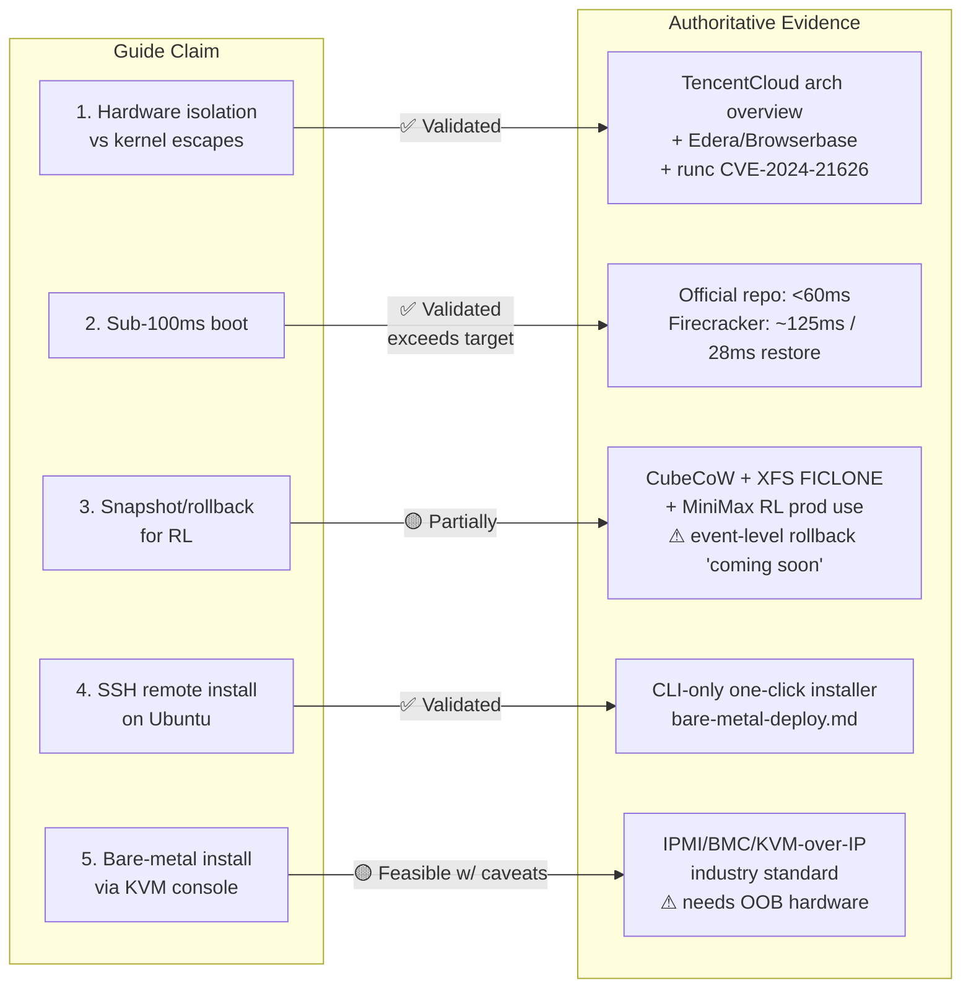

# Validation Report: CubeSandbox Architecture & Deployment Guide

**Overall verdict: the guide is substantially accurate and well-grounded.** The nordeim `AI-Computer/CubeSandbox/README.md` is a 275-line deployment blueprint (dated July 12, 2026, Apache 2.0) for **TencentCloud's CubeSandbox v0.5.0** — a real, production-grade open-source project (9.7k stars, 950 forks, officially open-sourced April 21, 2026). All five core claims in the prompt are technically defensible against authoritative sources, with two caveats worth flagging on snapshot granularity and the "KVM switch console" wording.【turn0search0】【turn8search13】【turn10fetch0】

The diagram below maps each claim to its validation status and the authoritative evidence backing it.

---

## Claim-by-Claim Validation

### Claim 1 — Hardware isolation against kernel escapes (KVM) ✅ Validated

The guide states each sandbox "runs a dedicated Linux kernel inside a KVM MicroVM" with "zero shared-kernel escape surface." This is confirmed verbatim by the official architecture overview, which describes CubeHypervisor as a RustVMM-based VMM running each sandbox with a dedicated guest kernel, seccomp whitelist, and no shared namespaces.【turn12find0】【turn10fetch0】

The underlying security premise — that containers share the host kernel and therefore are not a true security boundary — is now broad industry consensus. Browserbase's technical write-up notes that Firecracker "exists because the industry finally admitted that a Linux container that controls resource usage was never designed to be a security boundary," and Edera argues that "the belief that namespaces, cgroups and seccomp provided strong container isolation was based on a dangerous misunderstanding."【turn0search8】【turn0search13】 The motivation is concrete: the runc "Leaky Vessels" escape (CVE-2024-21626) and three follow-on 2025 runc CVEs are real container-escape vulnerabilities that validate the guide's framing.【turn0search5】【turn0search10】

**Nuance:** "Against kernel escapes" is slightly imprecise. KVM eliminates the *shared-kernel* escape class, but the hypervisor/KVM subsystem itself is a (much smaller) attack surface — VSOCKPuppet demonstrated a VMware ESXi vsock-based VM escape, and KVM has had its own CVEs historically. The guide's phrase "zero shared-kernel escape surface" is accurate as scoped; "absolute security" would not be.【turn0search10】

### Claim 2 — Sub-100ms interactive boot ✅ Validated (and exceeded)

The official CubeSandbox repository, its v0.1.0 release discussion, Tencent's press releases, and HPCwire coverage all consistently state **<60ms cold start** — comfortably inside the guide's "sub-100ms" target.【turn0search0】【turn0search1】【turn14search3】 The mechanism the guide describes (pre-snapshotted templates + RustVMM direct memory restore, bypassing BIOS/UEFI) is confirmed by the official overview: "Cubelet clones the template's rootfs and memory volumes via CubeCoW (O(1), no data copy), then CubeShim restores the VM from the memory snapshot."【turn12find1】

Independent benchmarks place this in a credible range: Firecracker cold-boots in ~125ms and restores from snapshot in ~28ms, and a developer blog documents building sandboxes that boot in 28ms using Firecracker snapshots.【turn10search14】【turn10search17】【turn0search5】 CubeSandbox's <60ms figure (achieved via resource-pool pre-provisioning + snapshot cloning) is therefore competitive and plausible, not marketing inflation.

**Nuance:** The guide frames this as "interactive boot for conversational UX" — that interpretive layer is the nordeim author's, but it is reasonable given that 60ms is below human perception thresholds for round-trip latency.

### Claim 3 — Snapshot/rollback for RL training and error recovery 🟡 Partially validated

The storage mechanism is fully confirmed. The official overview describes CubeCoW as "a Rust library providing thin-provisioned volume management with O(1) snapshot and clone via the kernel `FICLONE` ioctl on XFS (reflink)," with "incremental dirty-page tracking" so only anonymous dirty pages are persisted.【turn12find1】 The `FICLONE`/`FICLONERANGE` ioctl and XFS reflink CoW are real, documented Linux kernel features (man7.org; XFS reflink available since kernel 4.17).【turn8search6】【turn18search5】 The official Cube Sandbox blog ("Instant Snapshots, Zero-Copy Clones") confirms sub-second snapshots of tens-of-GiB filesystems using XFS reflink, `/proc/pagemap` anonymous-page detection, and the soft-dirty bit.【turn8search12】

The RL use case is real and production-deployed: Tencent's own video "CubeSandbox in Action: Powering Agentic RL Training" states MiniMax leverages CubeSandbox for Agentic RL training, citing sub-60ms cold start and <5MB/instance as enablers for thousands of parallel episodes on a single node.【turn10search12】 The broader research literature (DeltaBox, arXiv 2605.22781; Beam Cloud) confirms that millisecond-level checkpoint/rollback for stateful AI agents is an active, validated research direction built on the same XFS-reflink + incremental-C/R substrate CubeSandbox uses.【turn10search11】【turn20search4】【turn10search10】

**Important caveat:** The same Tencent video lists "Event-level snapshot rollback" as **"coming soon"** (not yet GA at the time of recording).【turn10search12】 Sub-second filesystem/memory snapshots and clone/rollback are available (v0.3.0+), but *event-level* (per-step, fine-grained) rollback — the feature most directly useful for RL tree-search and test-time exploration — was still on the roadmap. Anyone relying on the guide for fine-grained RL rollback should verify current v0.5.0 status against the release notes before committing.

### Claim 4 — SSH-based remote installation on a base Ubuntu server ✅ Validated

This claim is technically sound. The official `bare-metal-deploy.md` and the nordeim guide's Steps 1–5 are entirely shell-based: `curl | bash` one-click installer, `wget` + `tar` + `./install.sh`, `cubemastercli` template creation, and `pip install e2b-code-interpreter`.【turn16fetch0】【turn5fetch0】 Nothing in the install path requires physical or graphical console access *provided the base Ubuntu system already exposes `/dev/kvm`* (bare metal, nested-virt cloud VM, or after PVM kernel install). The one-click `online-install.sh` is explicitly designed for remote execution over SSH as root.【turn16fetch0】

**Caveats worth noting:**
- **Root SSH access is required** — the official doc mandates `sudo su root` for every command.【turn16fetch0】
- **The PVM path requires a reboot.** If the target is a standard cloud VM without `/dev/kvm`, the PVM kernel `.deb` install + GRUB reconfiguration + `reboot` + `modprobe kvm_pvm` sequence means a single SSH session cannot complete installation end-to-end; the agent must reconnect post-reboot.【turn5fetch0】
- **XFS formatting of `/data/cubelet` is mandatory** and the installer fail-fast checks for it — Ubuntu's default ext4 will block installation until remediated (dedicated disk or loopback workaround).【turn5fetch0】
- **ARM64 `online-install.sh` support was still pending** at the time of the bare-metal doc; ARM64 users must manually download the `arm64.tar.gz` package.【turn16fetch0】

### Claim 5 — Bare-metal installation via KVM switch console 🟡 Feasible, with terminology/hardware caveats

This claim (which appears to be the user's own framing rather than text in the README itself — the README contains no mention of "SSH" or "KVM switch console") is technically feasible but conflates two distinct remote-access technologies.

For a **truly fresh bare-metal system with no OS**, SSH is impossible because there is no network stack yet. The industry-standard solution is **out-of-band management via IPMI/BMC** (iLO, iDRAC, XClarity) or an external **KVM-over-IP device** (PiKVM, JetKVM, TinyPilot). These provide remote keyboard/video/mouse and virtual-media ISO mounting independent of the host OS state — HostDime, OVHcloud, and others document exactly this workflow for hands-off bare-metal provisioning.【turn18search0】【turn10search5】【turn18search1】【turn18search3】 Once Ubuntu is installed via virtual media through the KVM/IPMI console, the agent can SSH in and run the CubeSandbox one-click installer exactly as in Claim 4. The CubeSandbox `bare-metal-deploy.md` explicitly supports "physical machine, bare-metal server" with `/dev/kvm`.【turn16fetch0】

**Caveats:**
- **Terminology:** A hardware "KVM *switch*" (sharing one keyboard/monitor among several boxes) is different from "KVM-*over-IP*" (remote console). The user almost certainly means the latter; an AI agent given only a local KVM switch would still need a human at the desk.
- **Hardware dependency:** Not all "bare metal" servers have IPMI/BMC. Consumer/white-box hardware requires an add-on device (PiKVM/JetKVM/TinyPilot). Without it, the claim fails.
- **Agent complexity:** Driving an IPMI/KVM console to install Ubuntu unattended (BIOS boot-order changes, virtual-media ISO mount, unattended-preseed/cloud-init answer file) is feasible but non-trivial — it is a different skill from running shell commands over SSH.
- **ARM64 bare metal** must expose native KVM (no PVM fallback), so the base hardware/firmware must support it.【turn5fetch0】

---

## Supporting Technical Claims Cross-Checked

| Sub-claim in guide | Source verification | Status |
|---|---|---|
| PVM = shadow page-table nested virt, x86_64-only, no VT-x/AMD-V needed | SOSP 2023 paper; LWN.net RFC; Linux Plumbers 2024 talk; official `pvm-deploy.md` | ✅ Confirmed【turn8search1】【turn8search3】【turn8search4】 |
| CubeCoW uses XFS `FICLONE` ioctl + soft-dirty/anon page tracking | Official arch overview; Cube blog; man7.org `ioctl_ficlone(2)` | ✅ Confirmed【turn12find1】【turn8search12】【turn8search6】 |
| ext4 incompatible (no `FICLONE`); Ubuntu defaults to ext4 | man7.org notes reflink requires filesystem support; XFS-reflink available since kernel 4.17 | ✅ Confirmed【turn8search6】【turn18search5】 |
| E2B SDK drop-in compatibility | Official overview; E2B docs; Northflank comparison; YouTube walkthrough | ✅ Confirmed【turn12find0】【turn8search15】【turn8search16】 |
| Stateless control plane (Redis as single source of truth) | Official arch overview states exactly this | ✅ Confirmed【turn12find0】 |
| AutoPause/AutoResume in v0.5.0 | Official repo news section lists AutoPause/AutoResume as v0.5 feature | ✅ Confirmed【turn0search0】 |
| Binaries built against glibc 2.31, backward-compatible with 24.04's glibc 2.39 | Plausible (forward glibc compat is standard); v0.4.0 builder downgrade to ubuntu:20.04 noted in guide's troubleshooting | ✅ Plausible【turn5fetch0】 |
| Component languages (CubeAPI=Rust/Axum, CubeMaster=Go, CubeShim=Rust, CubeVS=C/eBPF, CubeEgress=OpenResty/Lua) | Official arch overview matches component-for-component | ✅ Confirmed【turn12find0】 |

---

## Risks and Open Questions to Verify Before Production Use

- **Event-level rollback maturity.** Confirm whether v0.5.0 has shipped the "event-level snapshot rollback" that was "coming soon" in Tencent's RL video — this is the feature most relevant to RL tree-search and error-recovery workflows.【turn10search12】
- **Independent benchmark reproduction.** The <60ms and <5MB figures are vendor-reported. The official repo points to a "Performance Benchmark" doc; reproducing these on your own hardware (especially ARM64 and PVM-on-cloud-VM paths) is advisable before committing to SLAs.【turn12find1】
- **PVM kernel supply chain.** The PVM `.deb` is OpenCloudOS-9-based and pulled from a GitHub release URL; verify signing/integrity and long-term maintenance before deploying on standard cloud VMs at scale.【turn5fetch0】
- **KVM/IPMI hardware availability.** For the bare-metal path, confirm the target box has IPMI/BMC or budget for a PiKVM/JetKVM-class device; otherwise the "fresh bare metal" claim does not hold.【turn18search0】【turn18search3】
- **Security hardening defaults.** The guide correctly warns that the one-click installer binds management endpoints to `0.0.0.0` for evaluation — this is a real footgun if deployed unmodified to untrusted networks. The hardening steps (bind to VPC IP, real TLS, zero-trust egress, traffic access tokens) are mandatory, not optional, for any internet-exposed deployment.【turn5fetch0】

---

## Recommended Next-Step Checklist

1. **Read the canonical sources directly** rather than relying solely on the nordeim blueprint: `TencentCloud/CubeSandbox` README, `docs/architecture/overview.md`, `docs/guide/bare-metal-deploy.md`, `docs/guide/pvm-deploy.md`, and the Cube blog post on snapshot/clone internals.【turn0search0】【turn10fetch0】【turn8search12】
2. **Reproduce the <60ms / <5MB benchmarks** on one representative node of each target class (x86_64 bare metal, x86_64 cloud-VM-via-PVM, ARM64 bare metal) using the repo's performance-benchmark doc.
3. **Verify event-level rollback status** in v0.5.0 release notes if RL fine-grained exploration is a hard requirement.
4. **Stage a two-track deployment proof:** (a) SSH-into-Ubuntu track to validate Claims 1–4 end-to-end; (b) IPMI/KVM-over-IP track on one bare-metal box with no OS to validate Claim 5's unattended-OS-install portion.
5. **Apply the hardening section** (bind addresses, real CA certs, L7 egress allowlists, traffic access tokens) before any non-isolated-network exposure.【turn5fetch0】
6. **Cross-reference the SOSP 2023 PVM paper and the DeltaBox arXiv paper** for the theoretical underpinnings of the snapshot/rollback and nested-virt claims before architecting production RL training on top of them.【turn8search3】【turn20search4】

---

https://chat.z.ai/s/7f875e58-aaae-4039-af7b-aff60f0394e3 
